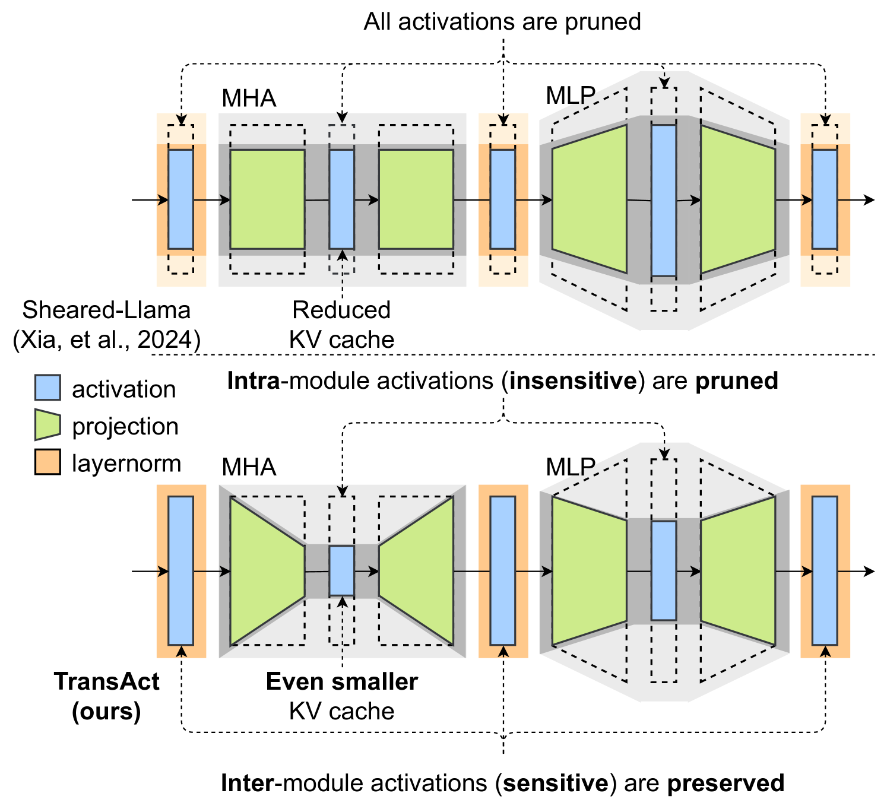
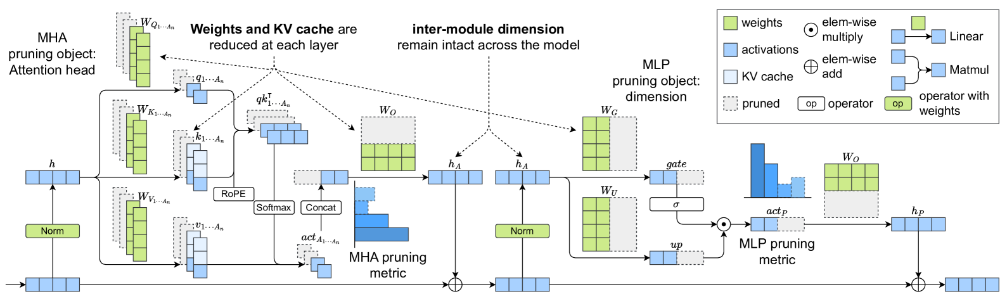
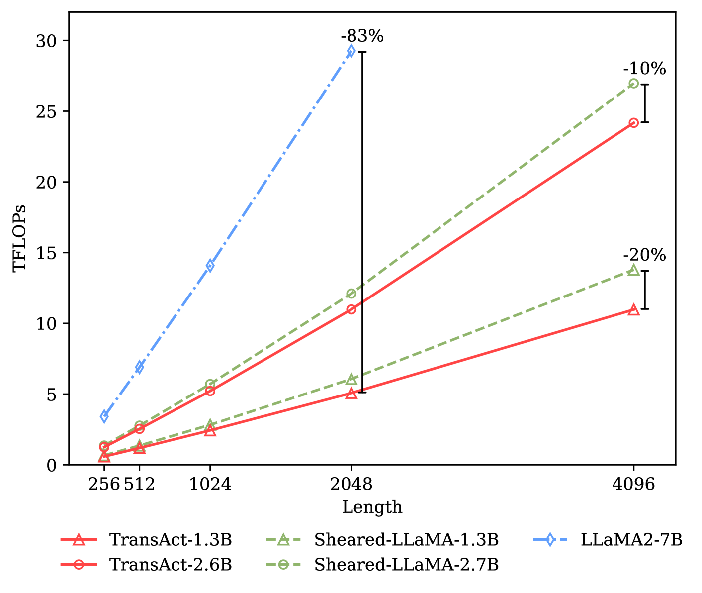
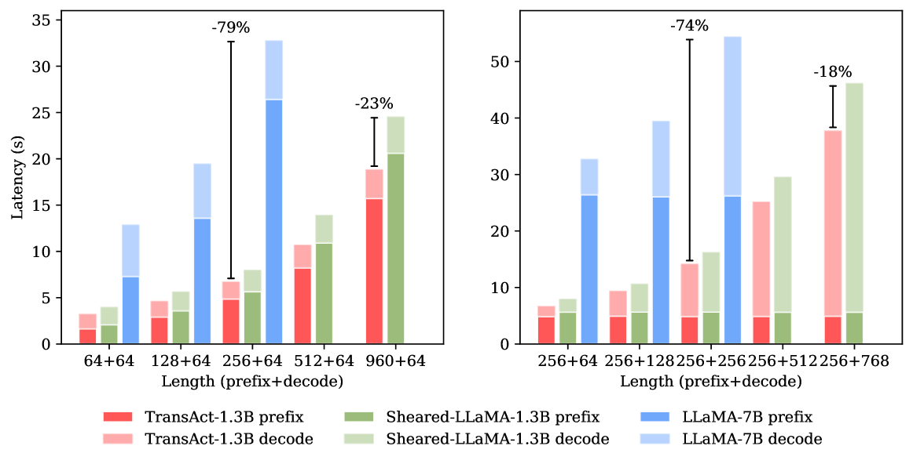
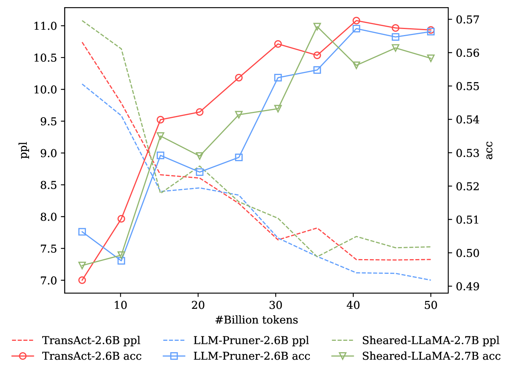
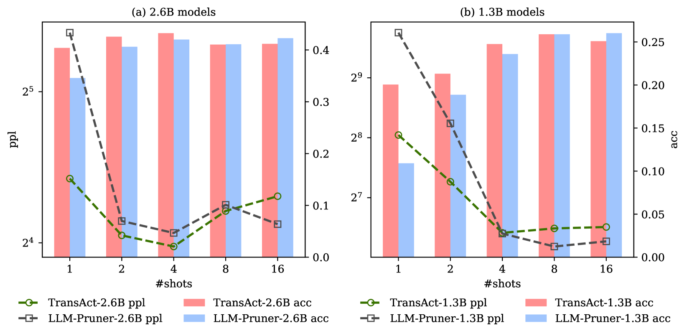
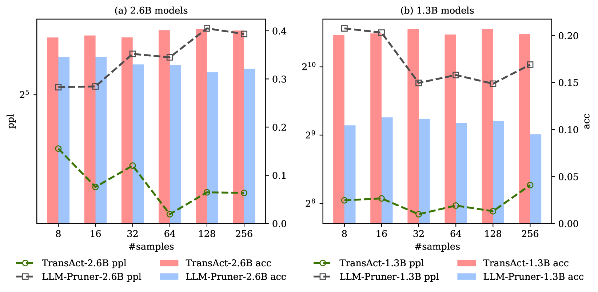
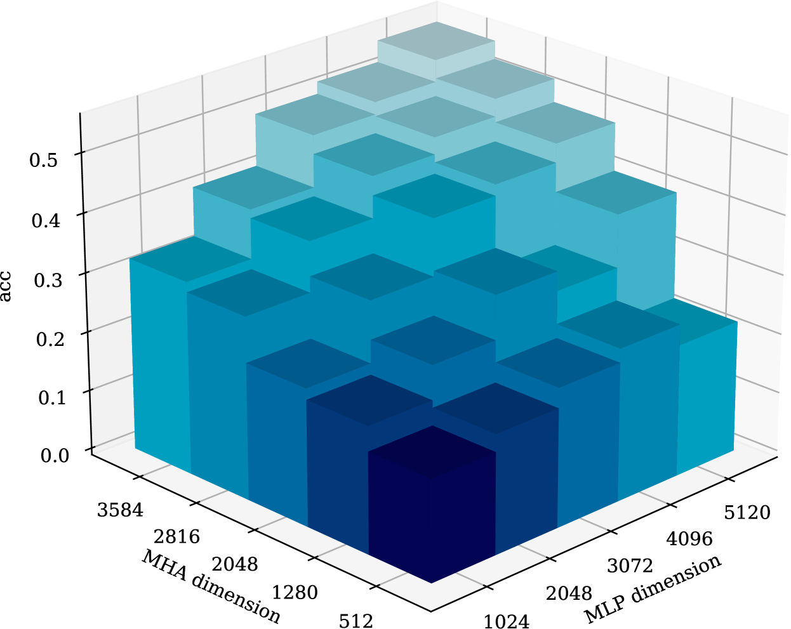

# 精简大型语言模型至模块内低秩结构，结合过渡激活技术

发布时间：2024年07月08日

`LLM理论` `计算机科学` `人工智能`

> Pruning Large Language Models to Intra-module Low-rank Architecture with Transitional Activations

# 摘要

> 结构化剪枝技术有效降低了大型语言模型的计算和内存负担，为终端部署提供了可行方案。剪枝后的模型保持高密度和高精度，便于后续调优和压缩。然而，粗粒度剪枝对模型的损害较大，实现高压缩比仍具挑战。本文提出了一种任务无关的结构化剪枝方法TransAct，结合紧凑Transformer架构，减少MHA和MLP模块内的激活，同时保护模块间敏感激活。这使得LLM转化为低秩架构，大幅减少权重和计算。在LLaMA模型上的实验表明，TransAct在保持高效性和性能的同时，实现了高压缩比。消融研究进一步证实了激活引导剪枝的有效性，并分析了MHA和MLP模块的冗余。

> Structured pruning fundamentally reduces computational and memory overheads of large language models (LLMs) and offers a feasible solution for end-side LLM deployment. Structurally pruned models remain dense and high-precision, highly compatible with further tuning and compression. However, as the coarse-grained structured pruning poses large damage to the highly interconnected model, achieving a high compression ratio for scaled-up LLMs remains a challenge. In this paper, we introduce a task-agnostic structured pruning approach coupled with a compact Transformer architecture design. The proposed approach, named TransAct, reduces transitional activations inside multi-head attention (MHA) and multi-layer perceptron (MLP) modules, while preserving the inter-module activations that are sensitive to perturbations. Hence, the LLM is pruned into an intra-module low-rank architecture, significantly reducing weights, KV Cache and attention computation. TransAct is implemented on the LLaMA model and evaluated on downstream benchmarks. Results verify the optimality of our approach at high compression with respect to both efficiency and performance. Further, ablation studies reveal the strength of activation-guided iterative pruning and provide experimental analysis on the redundancy of MHA and MLP modules.

[Arxiv](https://arxiv.org/abs/2407.05690)