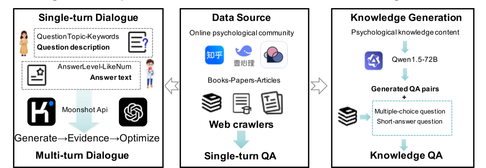
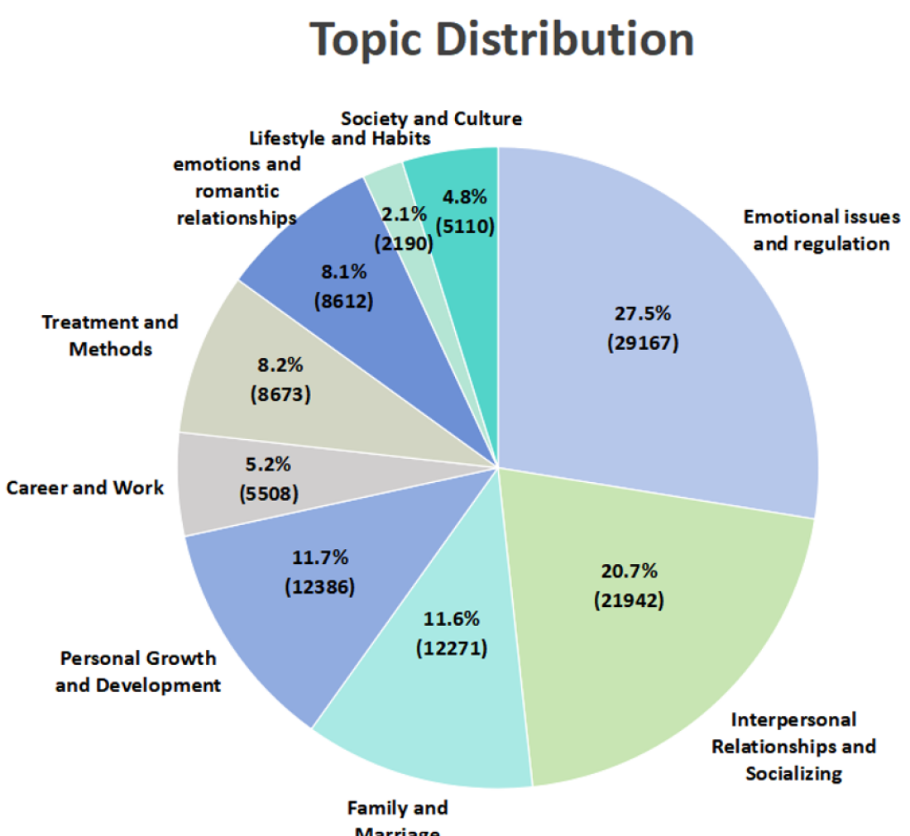
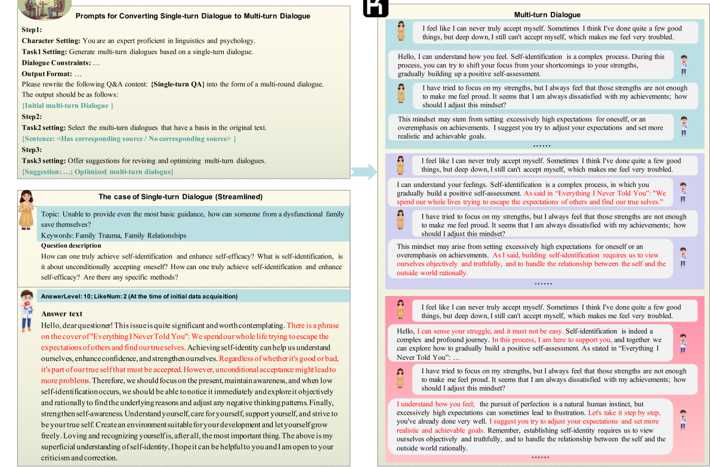

# PsycoLLM：提升 LLM 的心理理解和评估能力

发布时间：2024年07月08日

`LLM应用` `心理健康` `人工智能`

> PsycoLLM: Enhancing LLM for Psychological Understanding and Evaluation

# 摘要

> 近年来，心理健康备受瞩目，LLM凭借其出色的文本理解和对话能力，成为缓解这一问题的有力工具。然而，现有研究常因数据集缺乏关键先验知识、评估方法不全面而受限。为此，我们推出了PsycoLLM，一款专为心理学设计的大型语言模型，它基于一个精心构建的高质量心理学数据集进行训练，涵盖单轮问答、多轮对话及富含先验知识的问答。为评估PsycoLLM的性能，我们依据中国权威心理咨询考试，打造了一个全面的心理学基准，包括专业伦理、理论熟练度和案例分析的考核。实验结果表明，PsycoLLM在各项测试中表现卓越，远超其他LLM。

> Mental health has attracted substantial attention in recent years and LLM can be an effective technology for alleviating this problem owing to its capability in text understanding and dialogue. However, existing research in this domain often suffers from limitations, such as training on datasets lacking crucial prior knowledge and evidence, and the absence of comprehensive evaluation methods. In this paper, we propose a specialized psychological large language model (LLM), named PsycoLLM, trained on a proposed high-quality psychological dataset, including single-turn QA, multi-turn dialogues enriched with prior knowledge and knowledge-based QA. Additionally, to compare the performance of PsycoLLM with other LLMs, we develop a comprehensive psychological benchmark based on authoritative psychological counseling examinations in China, which includes assessments of professional ethics, theoretical proficiency, and case analysis. The experimental results on the benchmark illustrates the effectiveness of PsycoLLM, which demonstrates superior performance compared to other LLMs.

[Arxiv](https://arxiv.org/abs/2407.05721)