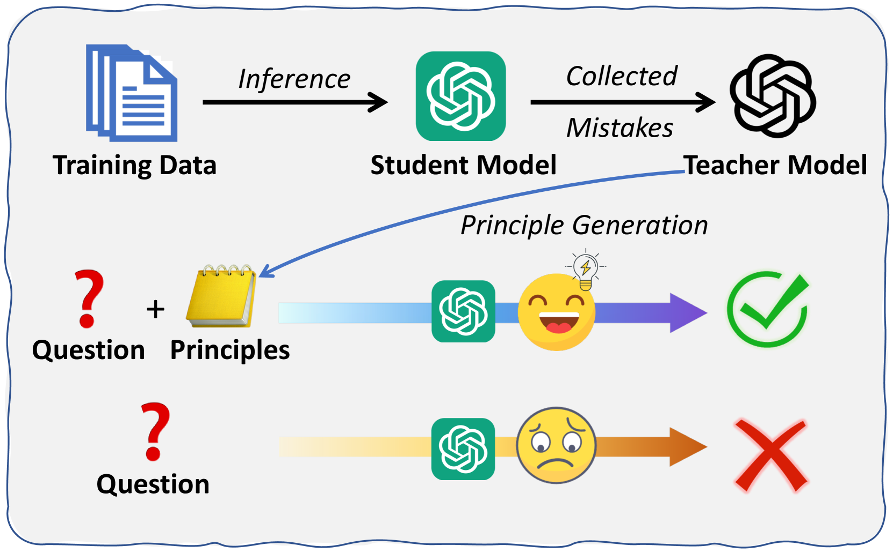
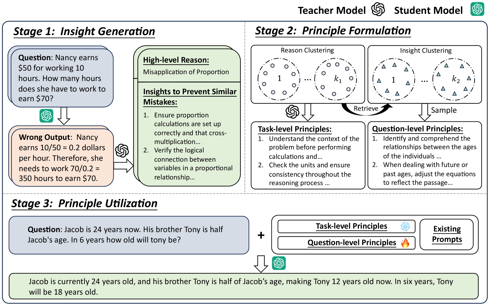
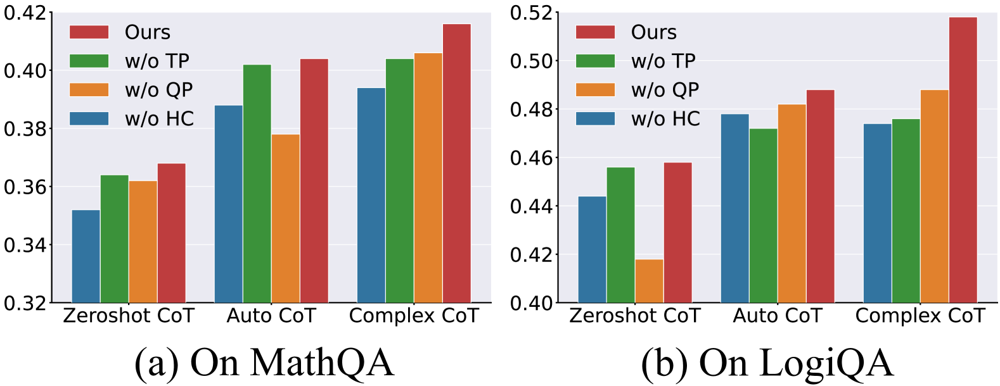
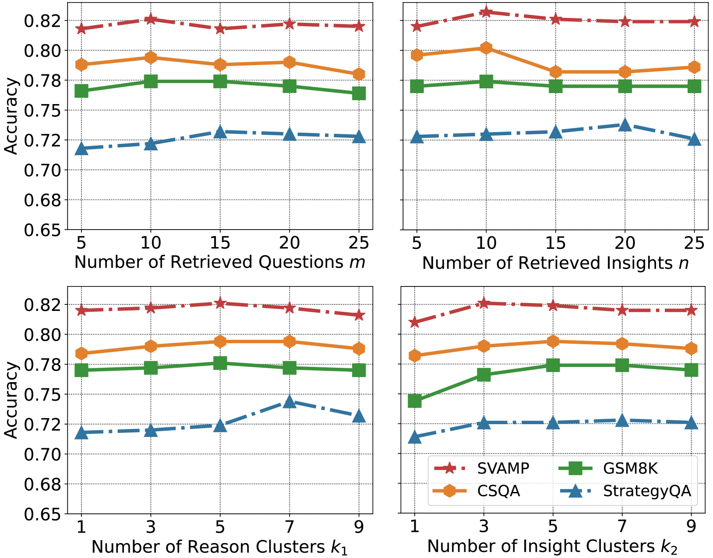
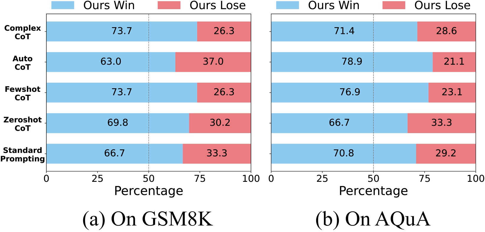
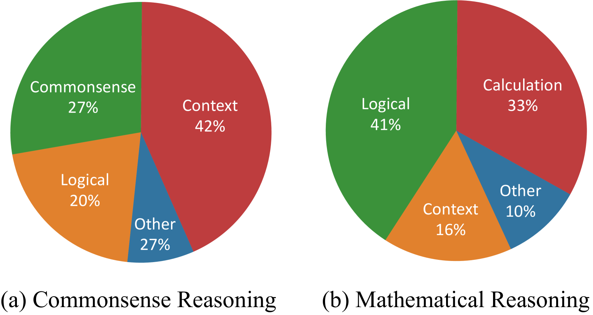

# 汲取过往失误中的上下文原则

发布时间：2024年07月08日

`LLM应用` `人工智能`

> Retrieved In-Context Principles from Previous Mistakes

# 摘要

> In-context learning (ICL) 在 LLM 适应下游任务中扮演关键角色，但现有方法在定制化和错误覆盖上存在不足。为此，我们引入了 Retrieval In-Context Principles (RICP)，一个创新的师生框架。RICP 通过教师模型分析学生模型的错误，生成针对性的改进建议，并根据错误原因进行分类，提升原则的错误覆盖率。在推理时，系统会为每个问题定制相关原则，无需教师模型介入。实验表明，RICP 能有效提升多种提示策略的性能，跨越七个推理基准。

> In-context learning (ICL) has been instrumental in adapting Large Language Models (LLMs) to downstream tasks using correct input-output examples. Recent advances have attempted to improve model performance through principles derived from mistakes, yet these approaches suffer from lack of customization and inadequate error coverage. To address these limitations, we propose Retrieved In-Context Principles (RICP), a novel teacher-student framework. In RICP, the teacher model analyzes mistakes from the student model to generate reasons and insights for preventing similar mistakes. These mistakes are clustered based on their underlying reasons for developing task-level principles, enhancing the error coverage of principles. During inference, the most relevant mistakes for each question are retrieved to create question-level principles, improving the customization of the provided guidance. RICP is orthogonal to existing prompting methods and does not require intervention from the teacher model during inference. Experimental results across seven reasoning benchmarks reveal that RICP effectively enhances performance when applied to various prompting strategies.

[Arxiv](https://arxiv.org/abs/2407.05682)