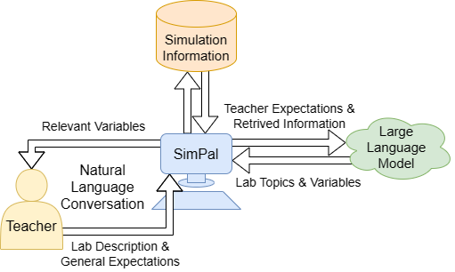

# SimPal：构建元对话框架，深入解析 K-12 物理教学中教师的指导目标

发布时间：2024年07月08日

`Agent` `人工智能`

> SimPal: Towards a Meta-Conversational Framework to Understand Teacher's Instructional Goals for K-12 Physics

# 摘要

> 在小学科学教育中，模拟教学广受欢迎，常辅以对话式AI代理，为学生提供实时实验支持。然而，每个AI代理都针对特定模拟定制，预设教学目标（IGs）固定，教师难以调整，且对新模拟持保留态度。为此，我们研发了SimPal，一款基于大型语言模型的元对话代理，旨在弥合AI与教学法间的鸿沟。教师通过与SimPal的自然交流，阐述期望的IGs，SimPal据此识别相关物理变量及其关系，构建符号表示，进而优化原始AI代理的提示设计，以更精准地匹配期望IGs。我们通过ChatGPT-3.5和PaLM 2对63个物理模拟进行了实证测试，并利用TELeR分类法探究了提示技术对LLM性能的影响。结果显示，SimPal在明确提示下能高效准确地完成任务。

> Simulations are widely used to teach science in grade schools. These simulations are often augmented with a conversational artificial intelligence (AI) agent to provide real-time scaffolding support for students conducting experiments using the simulations. AI agents are highly tailored for each simulation, with a predesigned set of Instructional Goals (IGs), making it difficult for teachers to adjust IGs as the agent may no longer align with the revised IGs. Additionally, teachers are hesitant to adopt new third-party simulations for the same reasons. In this research, we introduce SimPal, a Large Language Model (LLM) based meta-conversational agent, to solve this misalignment issue between a pre-trained conversational AI agent and the constantly evolving pedagogy of instructors. Through natural conversation with SimPal, teachers first explain their desired IGs, based on which SimPal identifies a set of relevant physical variables and their relationships to create symbolic representations of the desired IGs. The symbolic representations can then be leveraged to design prompts for the original AI agent to yield better alignment with the desired IGs. We empirically evaluated SimPal using two LLMs, ChatGPT-3.5 and PaLM 2, on 63 Physics simulations from PhET and Golabz. Additionally, we examined the impact of different prompting techniques on LLM's performance by utilizing the TELeR taxonomy to identify relevant physical variables for the IGs. Our findings showed that SimPal can do this task with a high degree of accuracy when provided with a well-defined prompt.

[Arxiv](https://arxiv.org/abs/2407.06241)