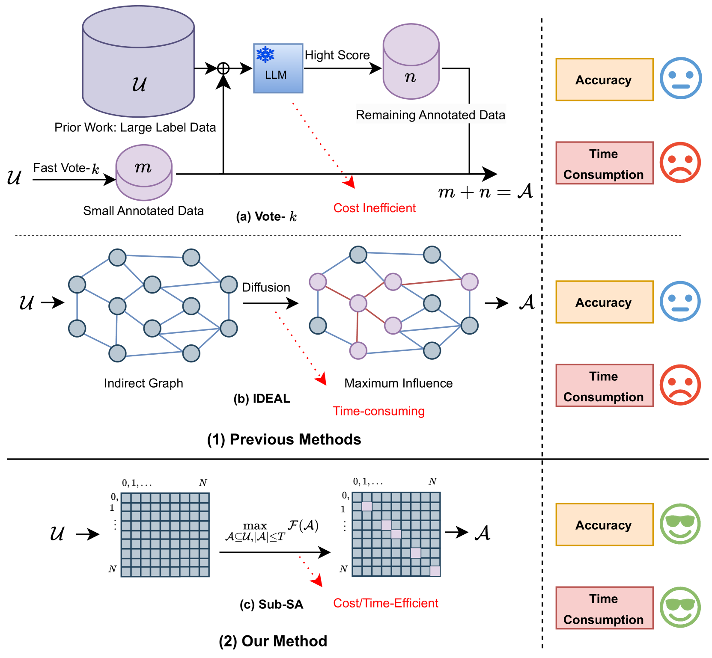
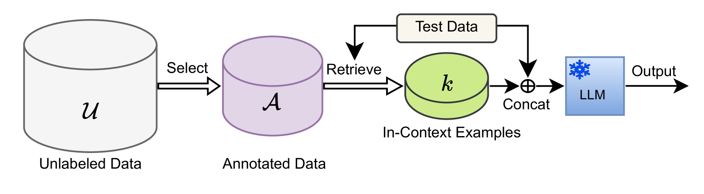

# Sub-SA：借助子模块选择性注释强化上下文学习

发布时间：2024年07月08日

`LLM应用` `人工智能` `数据注释`

> Sub-SA: Strengthen In-context Learning via Submodular Selective Annotation

# 摘要

> ICL 通过上下文示例作为 LLM 预测的提示，这些提示对实现高性能至关重要。然而，从众多标记示例中挑选合适提示往往成本高昂。为此，我们引入了 Sub-SA，一种基于子模块的选择性注释方法，旨在降低成本、提升示例质量并简化选择流程。Sub-SA 设计了子模块函数，助力高效注释子集选择，并从理论层面展现其单调与子模块特性。我们进一步提出 RPR，通过奖励与惩罚机制平衡数据多样性与代表性。基于此，我们采用简单高效的贪婪算法进行注释选择。最终，通过相似性提示检索为 ICL 提供示例。

> In-context learning (ICL) leverages in-context examples as prompts for the predictions of Large Language Models (LLMs). These prompts play a crucial role in achieving strong performance. However, the selection of suitable prompts from a large pool of labeled examples often entails significant annotation costs. To address this challenge, we propose \textbf{Sub-SA} (\textbf{Sub}modular \textbf{S}elective \textbf{A}nnotation), a submodule-based selective annotation method. The aim of Sub-SA is to reduce annotation costs while improving the quality of in-context examples and minimizing the time consumption of the selection process. In Sub-SA, we design a submodular function that facilitates effective subset selection for annotation and demonstrates the characteristics of monotonically and submodularity from the theoretical perspective. Specifically, we propose \textbf{RPR} (\textbf{R}eward and \textbf{P}enalty \textbf{R}egularization) to better balance the diversity and representativeness of the unlabeled dataset attributed to a reward term and a penalty term, respectively. Consequently, the selection for annotations can be effectively addressed with a simple yet effective greedy search algorithm based on the submodular function. Finally, we apply the similarity prompt retrieval to get the examples for ICL.

[Arxiv](https://arxiv.org/abs/2407.05693)