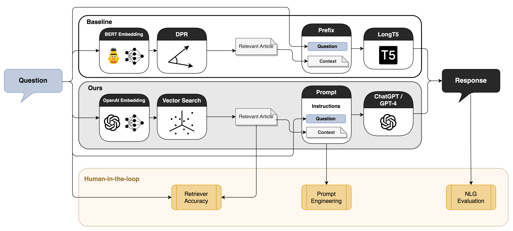

# 探索优化与评估：结合 LLM 与人工反馈的增强型检索问答聊天机器人

发布时间：2024年07月08日

`LLM应用` `人力资源` `人工智能`

> Towards Optimizing and Evaluating a Retrieval Augmented QA Chatbot using LLMs with Human in the Loop

# 摘要

> 我们与SAP SE的专家携手，打造了一款HR支持聊天机器人，旨在高效解决员工疑问。在开发过程中，我们在数据集构建、提示优化及输出评估等环节融入了人工参与。此举不仅提升了聊天机器人的回复质量，还探索了新的检索策略，使之成为HR领域高效、灵活且可扩展的利器。实验表明，GPT-4凭借其卓越性能和内部推理能力，有效应对了数据不一致的挑战。同时，G-Eval和Prometheus等无参考评估指标，经专家验证，其可靠性已接近人类评估水平。

> Large Language Models have found application in various mundane and repetitive tasks including Human Resource (HR) support. We worked with the domain experts of SAP SE to develop an HR support chatbot as an efficient and effective tool for addressing employee inquiries. We inserted a human-in-the-loop in various parts of the development cycles such as dataset collection, prompt optimization, and evaluation of generated output. By enhancing the LLM-driven chatbot's response quality and exploring alternative retrieval methods, we have created an efficient, scalable, and flexible tool for HR professionals to address employee inquiries effectively. Our experiments and evaluation conclude that GPT-4 outperforms other models and can overcome inconsistencies in data through internal reasoning capabilities. Additionally, through expert analysis, we infer that reference-free evaluation metrics such as G-Eval and Prometheus demonstrate reliability closely aligned with that of human evaluation.

[Arxiv](https://arxiv.org/abs/2407.05925)