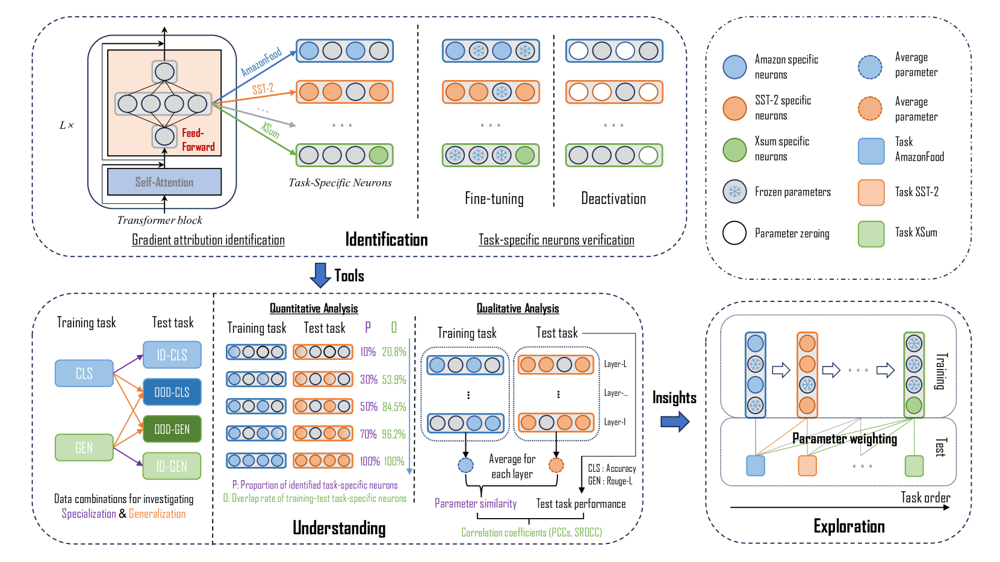
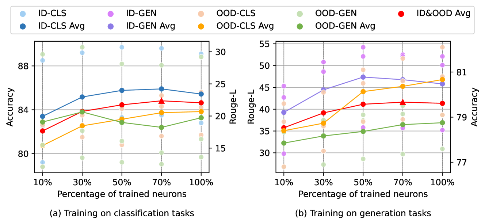
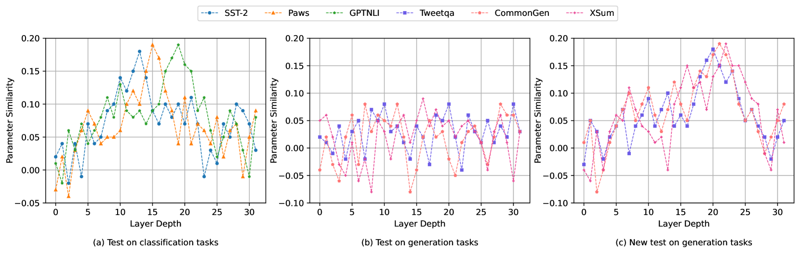
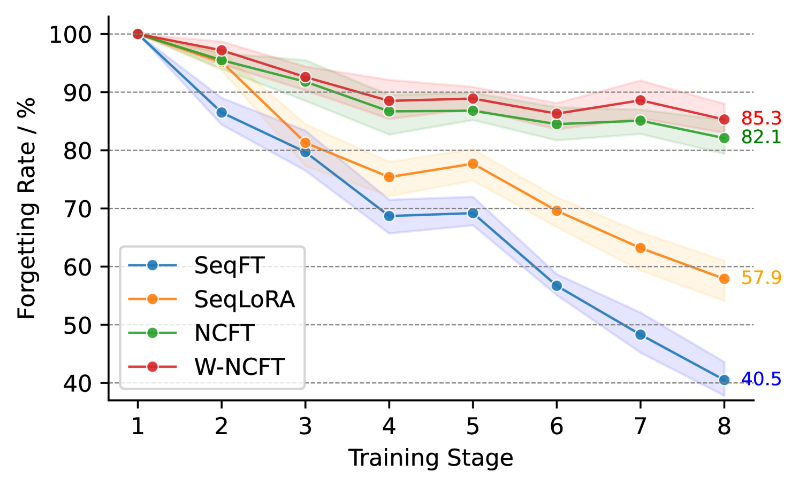
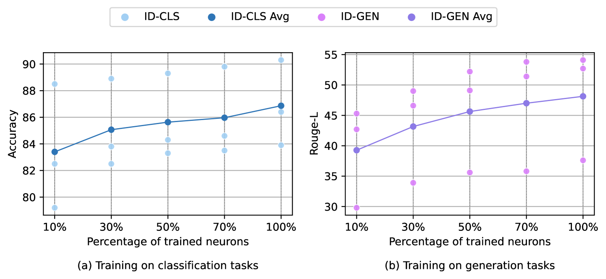

# 本研究旨在通过识别和探究任务特定神经元，深入理解 LLMs 在多任务学习中的泛化能力。

发布时间：2024年07月08日

`LLM理论` `人工智能`

> Towards Understanding Multi-Task Learning (Generalization) of LLMs via Detecting and Exploring Task-Specific Neurons

# 摘要

> 大型语言模型 (LLMs) 虽展现出卓越的多任务能力，但其学习机制的理解仍具挑战。本文从神经元视角切入，通过梯度归因在特定任务数据上识别任务敏感神经元，并证实其与任务的高度相关性，即特定任务神经元。借助这些神经元，我们探讨了多任务学习中的泛化和灾难性遗忘问题，发现神经元重叠与任务间泛化及专业化紧密相关。LLMs 某些层中神经元参数的高度相似性亦与泛化性能相关。基于此，我们提出神经元级连续微调法，仅微调当前任务神经元，实验证明其有效性。本研究深化了 LLMs 在多任务学习中的可解释性认识。

> While large language models (LLMs) have demonstrated superior multi-task capabilities, understanding the learning mechanisms behind this is still a challenging problem. In this paper, we attempt to understand such mechanisms from the perspective of neurons. Specifically, we detect task-sensitive neurons in LLMs via gradient attribution on task-specific data. Through extensive deactivation and fine-tuning experiments, we demonstrate that the detected neurons are highly correlated with the given task, which we term as task-specific neurons. With these identified task-specific neurons, we delve into two common problems in multi-task learning and continuous learning: Generalization and Catastrophic Forgetting. We find that the overlap of task-specific neurons is strongly associated with generalization and specialization across tasks. Interestingly, at certain layers of LLMs, there is a high similarity in the parameters of different task-specific neurons, and such similarity is highly correlated with the generalization performance. Inspired by these findings, we propose a neuron-level continuous fine-tuning method that only fine-tunes the current task-specific neurons during continuous learning, and extensive experiments demonstrate the effectiveness of the proposed method. Our study provides insights into the interpretability of LLMs in multi-task learning.

[Arxiv](https://arxiv.org/abs/2407.06488)