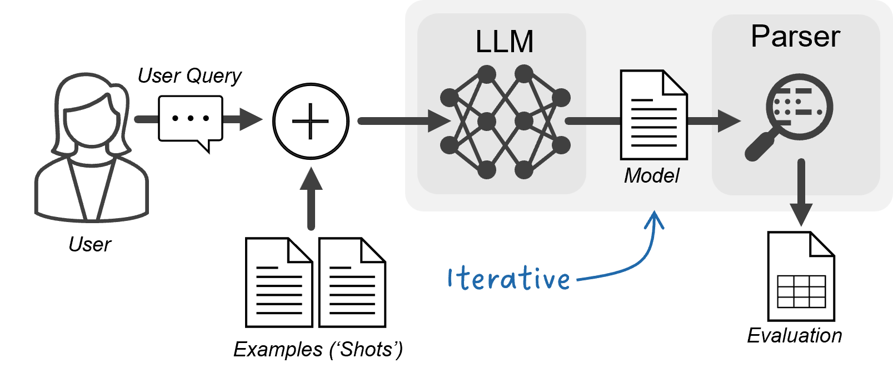
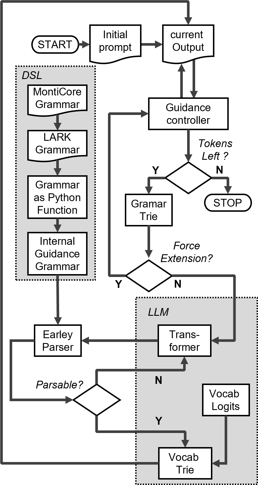
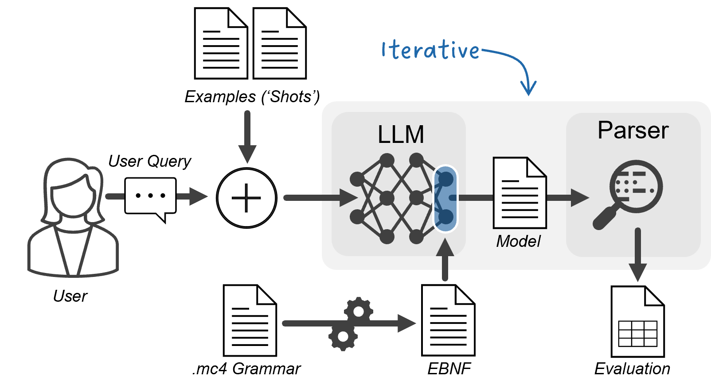

# 通过语法掩蔽技术，我们确保了 LLM 建模任务中的句法正确性。

发布时间：2024年07月08日

`LLM应用` `软件工程` `人工智能`

> Using Grammar Masking to Ensure Syntactic Validity in LLM-based Modeling Tasks

# 摘要

> 我们提出了一种名为“语法掩蔽”的方法，旨在引导大型语言模型（LLM）生成符合特定上下文无关语法的正确模型。尽管少样本学习或引导等提示工程方法能提高LLM生成正确语法的几率，但随着语法复杂度的增加，这些方法的效率和效果都会大打折扣。以往研究多聚焦于语言模型训练或提示工程。本研究则通过约束解码，将模型输出限定在特定语法范围内，确保输出语法的正确性。我们利用MontiCore构建的多种DSL，并测试了多个LLM在有无约束解码情况下的表现。通过解析器验证模型语法的正确性，结果显示，语法掩蔽能显著提升LLM的建模能力，降低对精细提示的依赖，并提高生成正确模型的概率。

> We present and evaluate a method called grammar masking, which is used to guide large language models (LLMs) toward producing syntactically correct models for a given context-free grammar. Prompt engineering methods such as few-shot learning or priming can be used to improve the chances of an LLM producing correct syntax, but the more complex the grammar, the more time-consuming and less promising these methods become. Previous work is focused primarily on the usage of either language model training or prompt engineering. In this work, a method is presented that restricts the output to a given grammar using constrained decoding to ensure the output adheres to a valid syntax. We use several DSLs built with MontiCore and task multiple LLMs to produce models with and without constrained decoding. A corresponding parser is used to confirm the syntactic correctness of each model. We show that grammar masking can dramatically improve the modeling capabilities of several LLMs, reducing the need for well-refined prompting while increasing the chance of producing correct models.

[Arxiv](https://arxiv.org/abs/2407.06146)