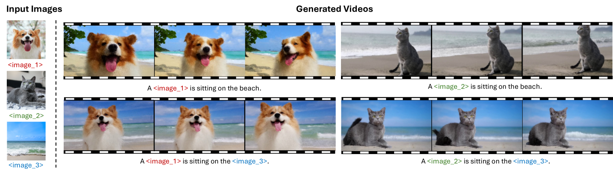
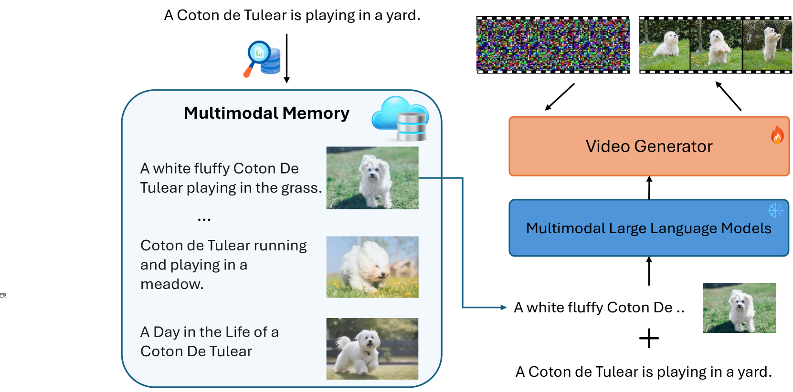
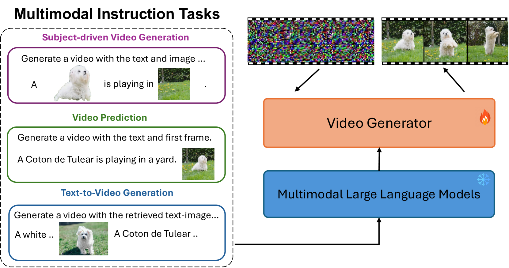
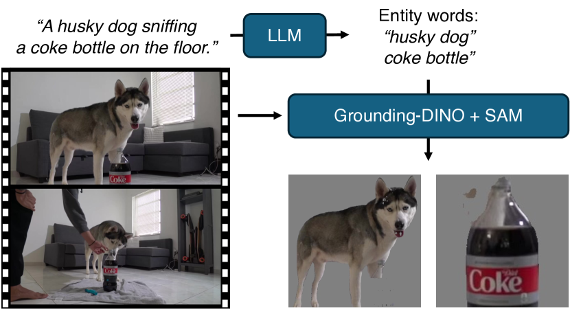
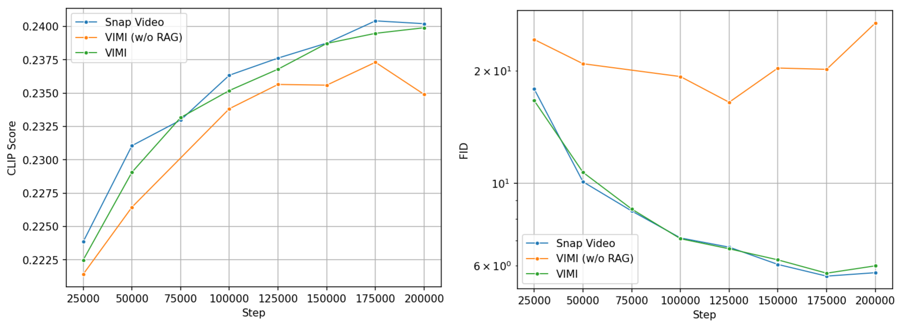
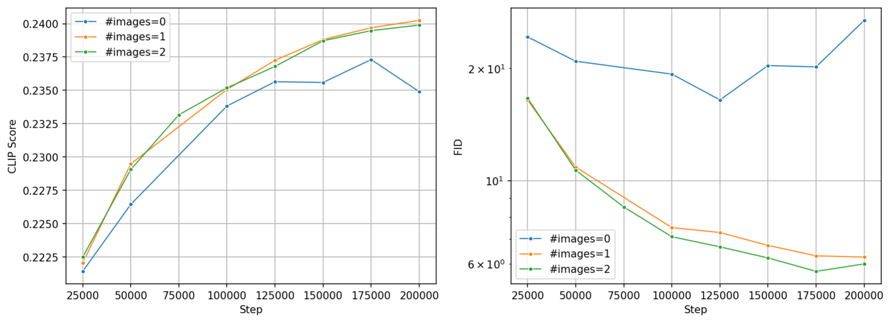
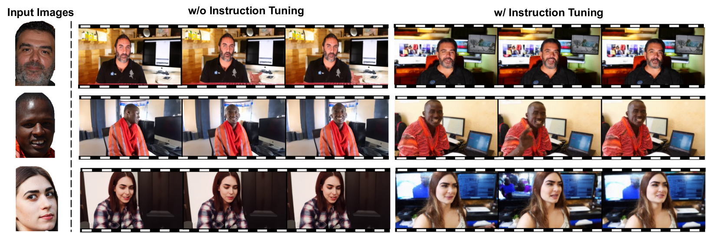

# VIMI：借助多模态指令，奠定视频生成之基石

发布时间：2024年07月08日

`LLM应用` `视频制作` `人工智能`

> VIMI: Grounding Video Generation through Multi-modal Instruction

# 摘要

> 现有的文本到视频模型因缺乏大规模多模态数据集而受限，我们通过构建新数据集和两阶段训练策略，提升了模型的多模态理解和视频生成能力。VIMI不仅能生成内容丰富、个性化的视频，还在UCF101基准测试中达到了顶尖水平。

> Existing text-to-video diffusion models rely solely on text-only encoders for their pretraining. This limitation stems from the absence of large-scale multimodal prompt video datasets, resulting in a lack of visual grounding and restricting their versatility and application in multimodal integration. To address this, we construct a large-scale multimodal prompt dataset by employing retrieval methods to pair in-context examples with the given text prompts and then utilize a two-stage training strategy to enable diverse video generation tasks within the same model. In the first stage, we propose a multimodal conditional video generation framework for pretraining on these augmented datasets, establishing a foundational model for grounded video generation. Secondly, we finetune the model from the first stage on three video generation tasks, incorporating multi-modal instructions. This process further refines the model's ability to handle diverse inputs and tasks, ensuring seamless integration of multi-modal information. After this two-stage train-ing process, VIMI demonstrates multimodal understanding capabilities, producing contextually rich and personalized videos grounded in the provided inputs, as shown in Figure 1. Compared to previous visual grounded video generation methods, VIMI can synthesize consistent and temporally coherent videos with large motion while retaining the semantic control. Lastly, VIMI also achieves state-of-the-art text-to-video generation results on UCF101 benchmark.

[Arxiv](https://arxiv.org/abs/2407.06304)