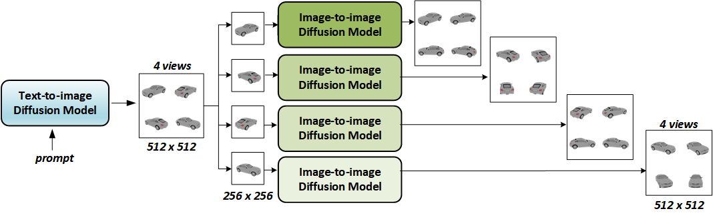

# VQA-Diff 技术结合视觉问答与扩散模型，为自动驾驶领域带来零-shot 图像至 3D 车辆资产的生成能力。

发布时间：2024年07月08日

`LLM应用` `自动驾驶` `汽车制造`

> VQA-Diff: Exploiting VQA and Diffusion for Zero-Shot Image-to-3D Vehicle Asset Generation in Autonomous Driving

# 摘要

> 在自动驾驶领域，从自然场景中捕捉的图像生成3D车辆模型至关重要。然而，传统方法仅依赖图像RGB信息，未能深入理解车辆的细节，如车型和制造商，导致在复杂现实场景中的零-shot预测能力不足。为此，我们创新性地提出了VQA-Diff框架，它结合了视觉问答模型中的大型语言模型知识，以及扩散模型中的丰富图像先验，共同打造逼真的3D车辆模型。通过多专家扩散模型策略和主题驱动的结构控制生成机制，VQA-Diff无需依赖大规模真实数据集，便能实现强大的零-shot图像到新视角生成能力。实验结果显示，VQA-Diff在多个数据集上均超越了现有顶尖技术，无论是在视觉效果还是性能指标上。

> Generating 3D vehicle assets from in-the-wild observations is crucial to autonomous driving. Existing image-to-3D methods cannot well address this problem because they learn generation merely from image RGB information without a deeper understanding of in-the-wild vehicles (such as car models, manufacturers, etc.). This leads to their poor zero-shot prediction capability to handle real-world observations with occlusion or tricky viewing angles. To solve this problem, in this work, we propose VQA-Diff, a novel framework that leverages in-the-wild vehicle images to create photorealistic 3D vehicle assets for autonomous driving. VQA-Diff exploits the real-world knowledge inherited from the Large Language Model in the Visual Question Answering (VQA) model for robust zero-shot prediction and the rich image prior knowledge in the Diffusion model for structure and appearance generation. In particular, we utilize a multi-expert Diffusion Models strategy to generate the structure information and employ a subject-driven structure-controlled generation mechanism to model appearance information. As a result, without the necessity to learn from a large-scale image-to-3D vehicle dataset collected from the real world, VQA-Diff still has a robust zero-shot image-to-novel-view generation ability. We conduct experiments on various datasets, including Pascal 3D+, Waymo, and Objaverse, to demonstrate that VQA-Diff outperforms existing state-of-the-art methods both qualitatively and quantitatively.

[Arxiv](https://arxiv.org/abs/2407.06516)