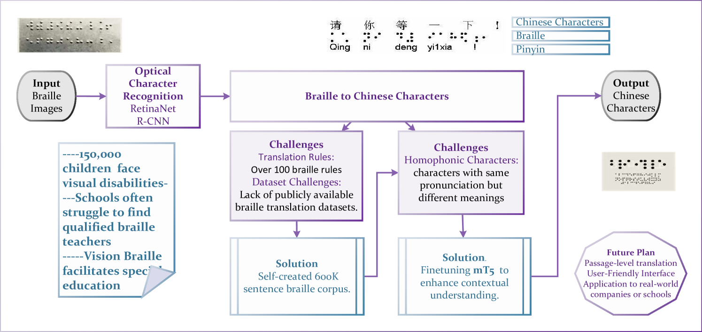

# Vision-Braille：一款端到端的中文盲文图像转文本工具

发布时间：2024年07月08日

`LLM应用` `特殊教育` `辅助技术`

> Vision-Braille: An End-to-End Tool for Chinese Braille Image-to-Text Translation

# 摘要

> 视觉障碍者依赖盲文进行读写，但特殊教育资源的匮乏成为他们教育的瓶颈。教育公平是社会文明与个人尊严的体现，改善他们的学习渠道至关重要。由于缺乏精准的盲文翻译系统，尤其是中文中的声调标记问题，视力正常的教师难以理解他们的盲文作业。过去的算法在提取上下文信息方面表现不佳，导致翻译准确性低下。本项目通过微调mT5模型，成功创建了盲文到中文的转换系统，显著提高了翻译的清晰度，验证集和测试集的BLEU分数分别达到了62.4和62.3。这一创新系统不仅为视觉障碍学生及其家庭提供了便利，助力他们实现大学梦想，也是首个公开可用的盲文翻译工具。我们的主页上提供了演示，欢迎体验。

> Visually impaired people are a large group who can only use braille for reading and writing. However, the lack of special educational resources is the bottleneck for educating them. Educational equity is a reflection of the level of social civilization, cultural equality, and individual dignity. Facilitating and improving lifelong learning channels for the visually impaired is of great significance. Their written braille homework or exam papers cannot be understood by sighted teachers, because of the lack of a highly accurate braille translation system, especially in Chinese which has tone marks. braille writers often omit tone marks to save space, leading to confusion when braille with the same consonants and vowels is translated into Chinese. Previous algorithms were insufficient in extracting contextual information, resulting in low accuracy of braille translations into Chinese. This project informatively fine-tuned the mT5 model with an Encoder-decoder architecture for braille to Chinese character conversion. This research created a training set of braille and corresponding Chinese text from the Leipzig Corpora. This project significantly reduced the confusion in braille, achieving $62.4$ and $62.3$ BLEU scores in the validation and test sets, with a curriculum learning fine-tuning method. By incorporating the braille recognition algorithm, this project is the first publicly available braille translation system and can benefit lots of visually impaired students and families who are preparing for the Chinese College Test and help to propel their college dreams in the future. There is a demo on our homepage\footnote{\url{https://vision-braille.com/}}.

[Arxiv](https://arxiv.org/abs/2407.06048)