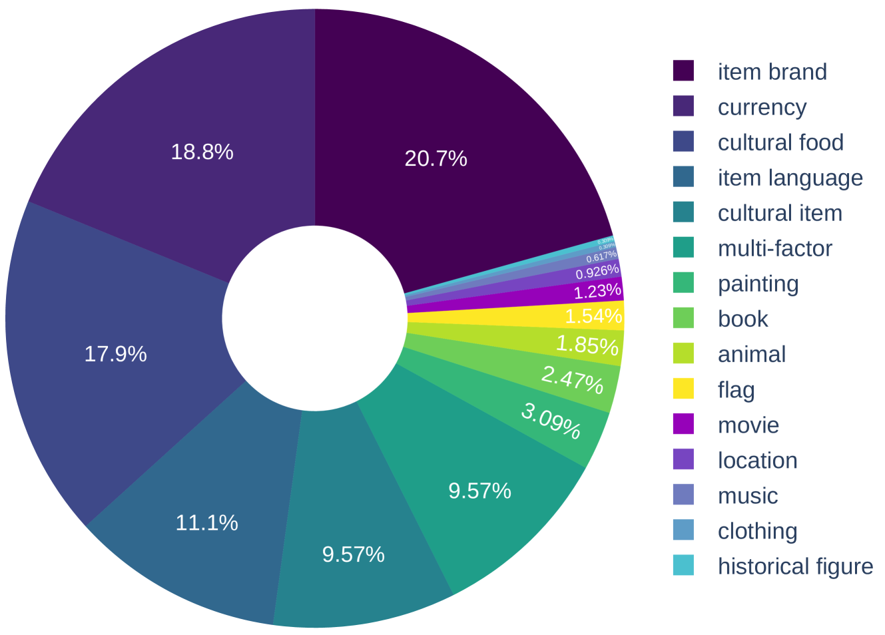
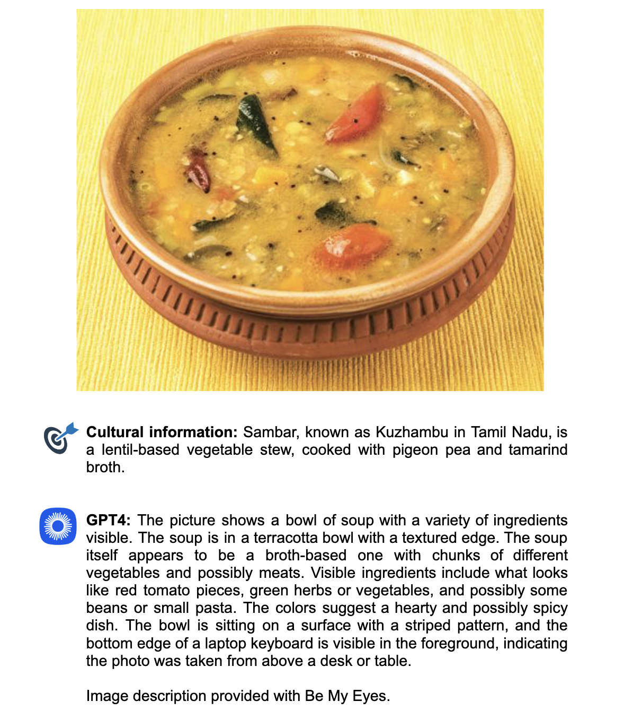

# 文化与包容视角下的视觉语言模型研究

发布时间：2024年07月08日

`LLM应用` `辅助技术` `多元文化`

> Vision-Language Models under Cultural and Inclusive Considerations

# 摘要

> 大型视觉-语言模型（VLMs）能通过描述日常图像辅助视障人士。然而，现有评估数据集未能充分体现多元文化背景和实际使用情境。为此，我们设计了一项调查以了解字幕偏好，并基于VizWiz数据集（由盲人拍摄的图像组成）构建了一个文化导向的评估基准。随后，我们对多个VLMs进行了评估，探究其在多元文化环境中的可靠性。尽管最先进模型的表现令人鼓舞，但我们也发现了幻觉现象和自动评估与人类判断不一致等问题。所有相关资源，包括调查、数据、代码及模型输出，均已公开。

> Large vision-language models (VLMs) can assist visually impaired people by describing images from their daily lives. Current evaluation datasets may not reflect diverse cultural user backgrounds or the situational context of this use case. To address this problem, we create a survey to determine caption preferences and propose a culture-centric evaluation benchmark by filtering VizWiz, an existing dataset with images taken by people who are blind. We then evaluate several VLMs, investigating their reliability as visual assistants in a culturally diverse setting. While our results for state-of-the-art models are promising, we identify challenges such as hallucination and misalignment of automatic evaluation metrics with human judgment. We make our survey, data, code, and model outputs publicly available.

[Arxiv](https://arxiv.org/abs/2407.06177)