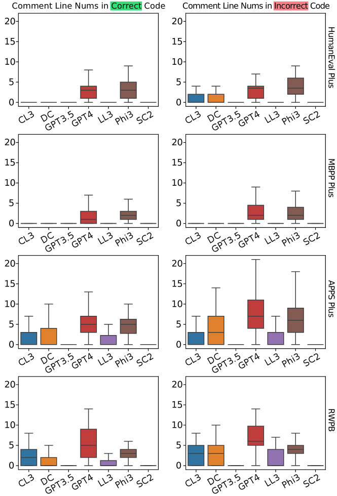
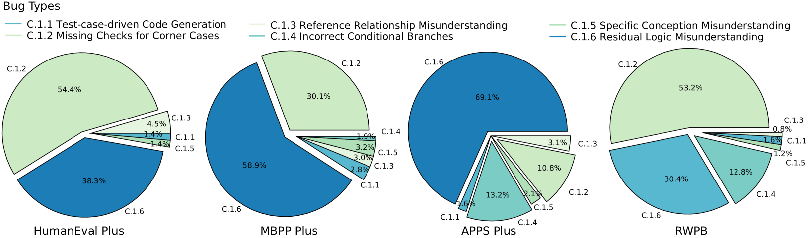
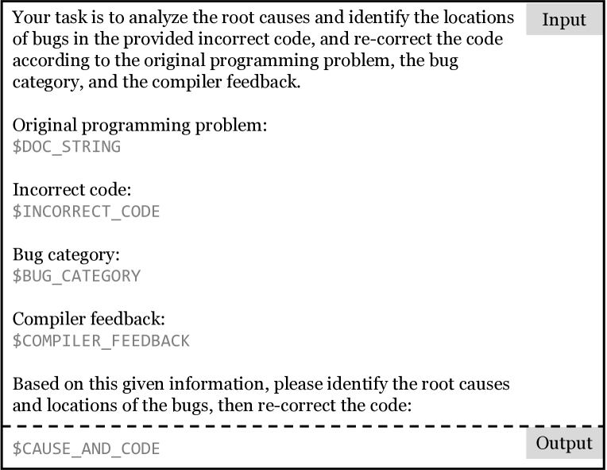

# 大型语言模型所编代码，问题何在？深入探究。

发布时间：2024年07月08日

`LLM应用` `软件开发` `人工智能`

> What's Wrong with Your Code Generated by Large Language Models? An Extensive Study

# 摘要

> 大型语言模型（LLMs）在代码生成领域的迅猛发展备受瞩目。为提升其代码生成能力，研究重点多放在高质量数据集的收集与多样化训练技术的应用上。然而，现有方法的局限性却鲜有深入探讨。为此，我们展开了一项全面实证研究，对比了三大闭源与四大开源LLM在常用基准上的表现。研究发现，这些模型在应对复杂问题时，生成的代码虽短却更复杂，且与标准方案存在差距。我们还构建了错误分类体系，深入剖析了常见错误的根源。为更贴近实际应用，我们精心设计了包含140项任务的实战基准，揭示了实际与理论基准间的错误分布差异。最终，我们创新提出了一种无需额外训练的迭代方法，通过自我批判机制，使模型能根据错误类型与编译反馈自我修正。实验显示，该方法能大幅降低错误率，两次迭代后通过率提升29.2%，展现了LLM在处理复杂问题上的广阔前景。

> The increasing development of large language models (LLMs) in code generation has drawn significant attention among researchers. To enhance LLM-based code generation ability, current efforts are predominantly directed towards collecting high-quality datasets and leveraging diverse training technologies. However, there is a notable lack of comprehensive studies examining the limitations and boundaries of these existing methods. To bridge this gap, we conducted an extensive empirical study evaluating the performance of three leading closed-source LLMs and four popular open-source LLMs on three commonly used benchmarks. Our investigation, which evaluated the length, cyclomatic complexity and API number of the generated code, revealed that these LLMs face challenges in generating successful code for more complex problems, and tend to produce code that is shorter yet more complicated as compared to canonical solutions. Additionally, we developed a taxonomy of bugs for incorrect codes that includes three categories and 12 sub-categories, and analyze the root cause for common bug types. Furthermore, to better understand the performance of LLMs in real-world projects, we manually created a real-world benchmark comprising 140 code generation tasks. Our analysis highlights distinct differences in bug distributions between actual scenarios and existing benchmarks. Finally, we propose a novel training-free iterative method that introduces self-critique, enabling LLMs to critique and correct their generated code based on bug types and compiler feedback. Experimental results demonstrate that our approach can significantly mitigate bugs and increase the passing rate by 29.2% after two iterations, indicating substantial potential for LLMs to handle more complex problems.

[Arxiv](https://arxiv.org/abs/2407.06153)