# 何时一致的预测更可能是正确的？

发布时间：2024年07月08日

`LLM理论` `人工智能`

> When is the consistent prediction likely to be a correct prediction?

# 摘要

> 自我一致性理论（Wang et al., 2023）认为，大型语言模型（LLM）中最一致的答案更可能是正确答案。然而，我们对此提出质疑，并进行了细致的修正。我们发现，通过更多计算，即更长的推理文本，而非简单地选择所有输出中最一致的答案，得出的结果更可能正确。这是因为LLM能在无特殊提示下，自主生成链式思维（CoT）风格的推理，尤其是在生成较长响应时，这使得预测更为一致且准确。在零-shot场景下，通过多次采样Mixtral-8x7B模型并关注较长响应，我们在GSM8K和MultiArith数据集上达到了零-shot CoT提示下自我一致性性能的86%。此外，我们指出LLM生成较长响应的概率较低，这凸显了根据输出长度调整解码策略的重要性。

> Self-consistency (Wang et al., 2023) suggests that the most consistent answer obtained through large language models (LLMs) is more likely to be correct. In this paper, we challenge this argument and propose a nuanced correction. Our observations indicate that consistent answers derived through more computation i.e. longer reasoning texts, rather than simply the most consistent answer across all outputs, are more likely to be correct. This is predominantly because we demonstrate that LLMs can autonomously produce chain-of-thought (CoT) style reasoning with no custom prompts merely while generating longer responses, which lead to consistent predictions that are more accurate. In the zero-shot setting, by sampling Mixtral-8x7B model multiple times and considering longer responses, we achieve 86% of its self-consistency performance obtained through zero-shot CoT prompting on the GSM8K and MultiArith datasets. Finally, we demonstrate that the probability of LLMs generating a longer response is quite low, highlighting the need for decoding strategies conditioned on output length.

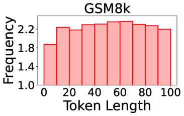

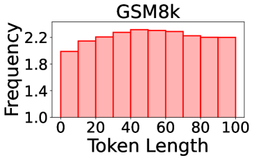

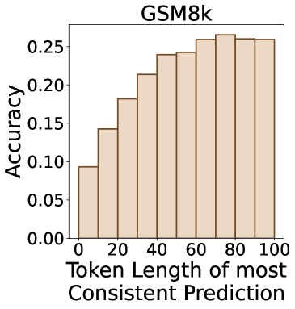

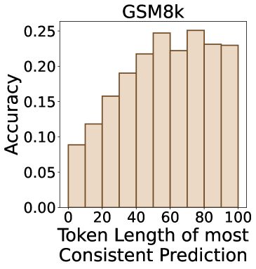

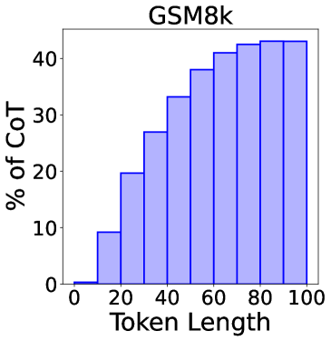

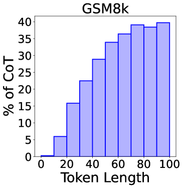

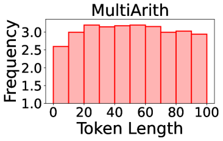

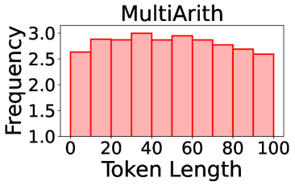

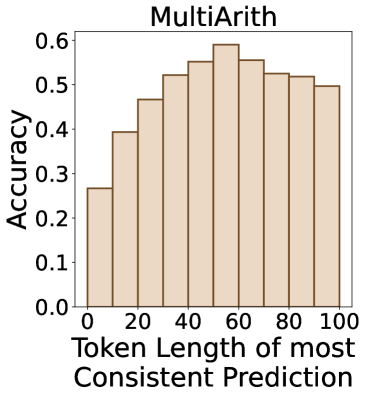

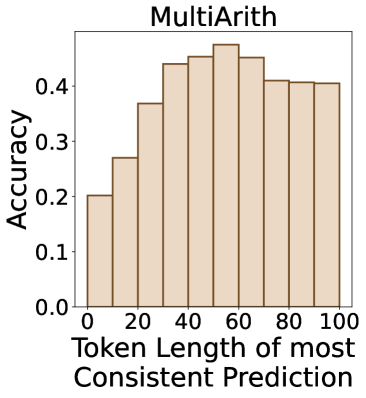

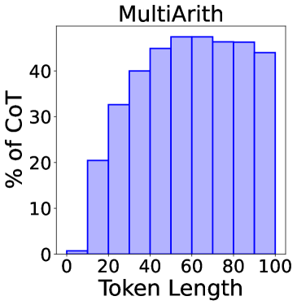

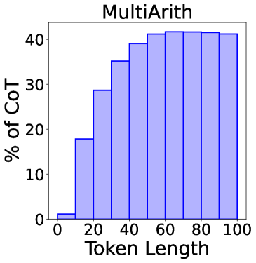

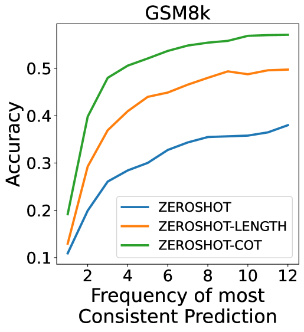

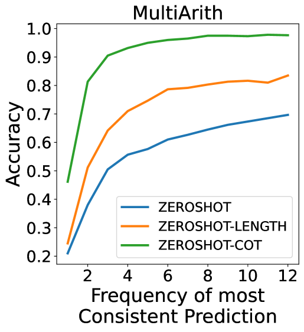

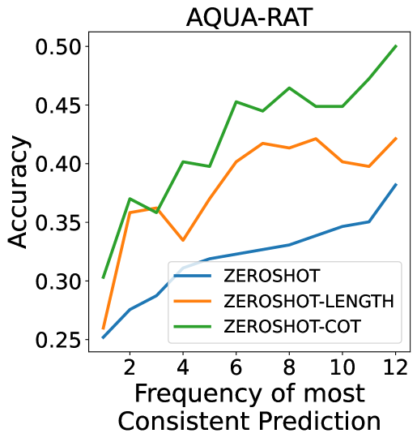

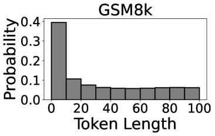

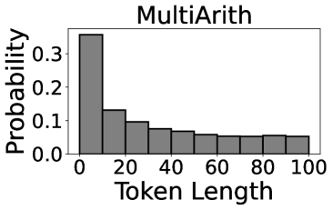

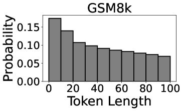

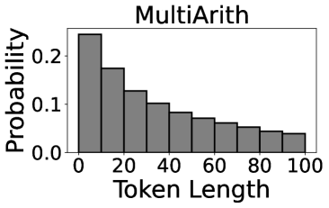

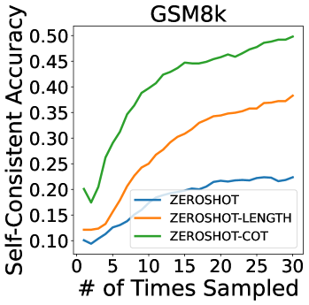

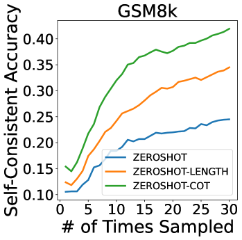

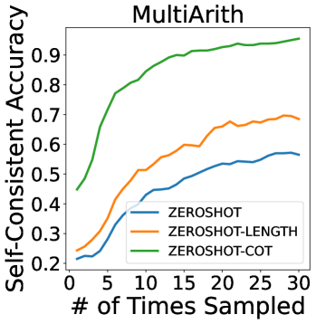

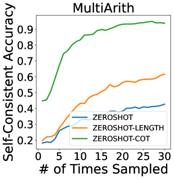

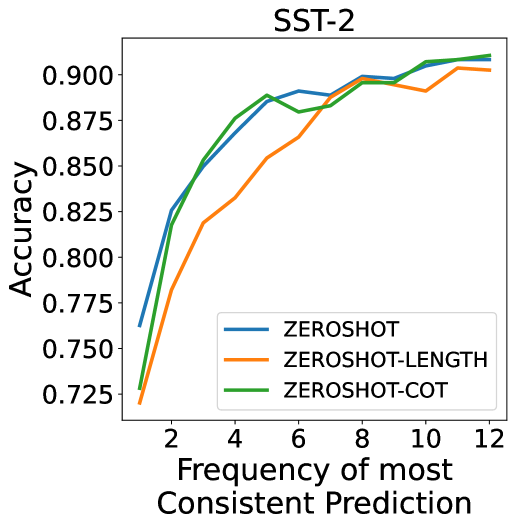

[Arxiv](https://arxiv.org/abs/2407.05778)