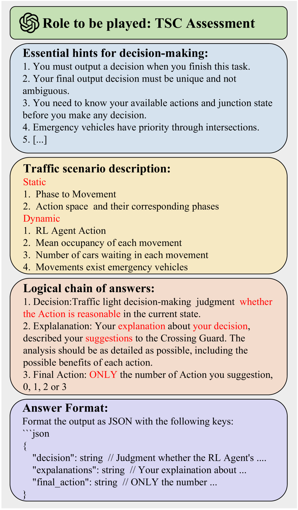

# iLLM-TSC：融合强化学习与大型语言模型，优化交通信号控制策略

发布时间：2024年07月08日

`LLM应用` `智能交通系统`

> iLLM-TSC: Integration reinforcement learning and large language model for traffic signal control policy improvement

# 摘要

> 城市拥堵问题依旧严峻，而交通信号控制（TSC）被视为一种有力对策。尽管RL已被证实有效，但现有基于RL的TSC系统常忽视通信退化导致的不完美观察及奖励函数未涵盖的罕见事件。为此，我们创新性地结合LLM与RL，旨在填补奖励函数中的空白并优化RL策略。在我们的方法中，RL先基于数据做决策，LLM则评估其合理性，必要时进行调整。此集成方法无需修改即可融入现有TSC系统。测试表明，在通信退化环境下，我们的方法使平均等待时间减少了17.5%，凸显了其在智能交通系统中推广RL应用的潜力。相关代码详见\url{https://github.com/Traffic-Alpha/iLLM-TSC}。

> Urban congestion remains a critical challenge, with traffic signal control (TSC) emerging as a potent solution. TSC is often modeled as a Markov Decision Process problem and then solved using reinforcement learning (RL), which has proven effective. However, the existing RL-based TSC system often overlooks imperfect observations caused by degraded communication, such as packet loss, delays, and noise, as well as rare real-life events not included in the reward function, such as unconsidered emergency vehicles. To address these limitations, we introduce a novel integration framework that combines a large language model (LLM) with RL. This framework is designed to manage overlooked elements in the reward function and gaps in state information, thereby enhancing the policies of RL agents. In our approach, RL initially makes decisions based on observed data. Subsequently, LLMs evaluate these decisions to verify their reasonableness. If a decision is found to be unreasonable, it is adjusted accordingly. Additionally, this integration approach can be seamlessly integrated with existing RL-based TSC systems without necessitating modifications. Extensive testing confirms that our approach reduces the average waiting time by $17.5\%$ in degraded communication conditions as compared to traditional RL methods, underscoring its potential to advance practical RL applications in intelligent transportation systems. The related code can be found at \url{https://github.com/Traffic-Alpha/iLLM-TSC}.

[Arxiv](https://arxiv.org/abs/2407.06025)