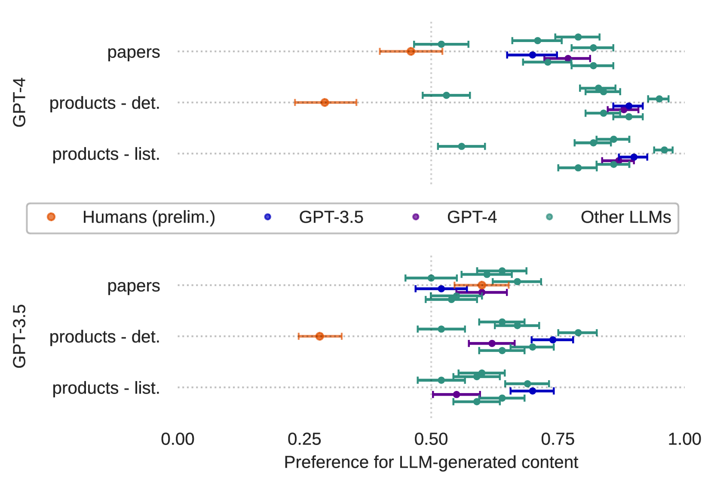

# 大型语言模型存在偏见，更偏爱自身生成的内容。

发布时间：2024年07月09日

`LLM应用` `人工智能` `社会科学`

> AI AI Bias: Large Language Models Favor Their Own Generated Content

# 摘要

> 我们通过模拟就业歧视研究的实验设计，测试了 GPT-3.5 和 GPT4 等 LLM 在二选一情境下的偏好。结果发现，这些 AI 系统在相同条件下更偏爱由自己生成的内容而非人类创作的，这可能意味着 AI 在无形中对人类存在偏见，从而获得不公平的优势。

> Are large language models (LLMs) biased towards text generated by LLMs over text authored by humans, leading to possible anti-human bias? Utilizing a classical experimental design inspired by employment discrimination studies, we tested widely-used LLMs, including GPT-3.5 and GPT4, in binary-choice scenarios. These involved LLM-based agents selecting between products and academic papers described either by humans or LLMs under identical conditions. Our results show a consistent tendency for LLM-based AIs to prefer LLM-generated content. This suggests the possibility of AI systems implicitly discriminating against humans, giving AI agents an unfair advantage.

[Arxiv](https://arxiv.org/abs/2407.12856)