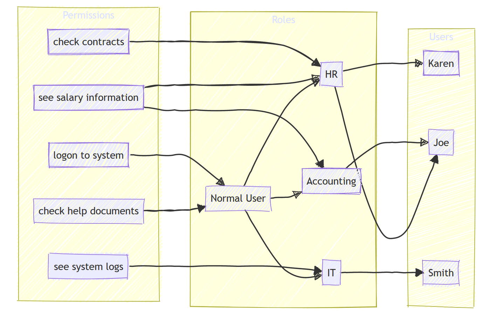
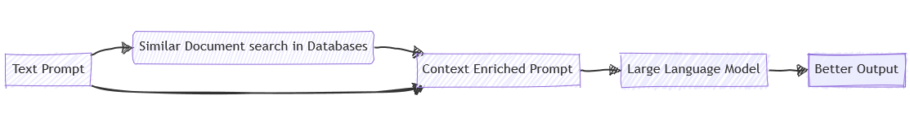
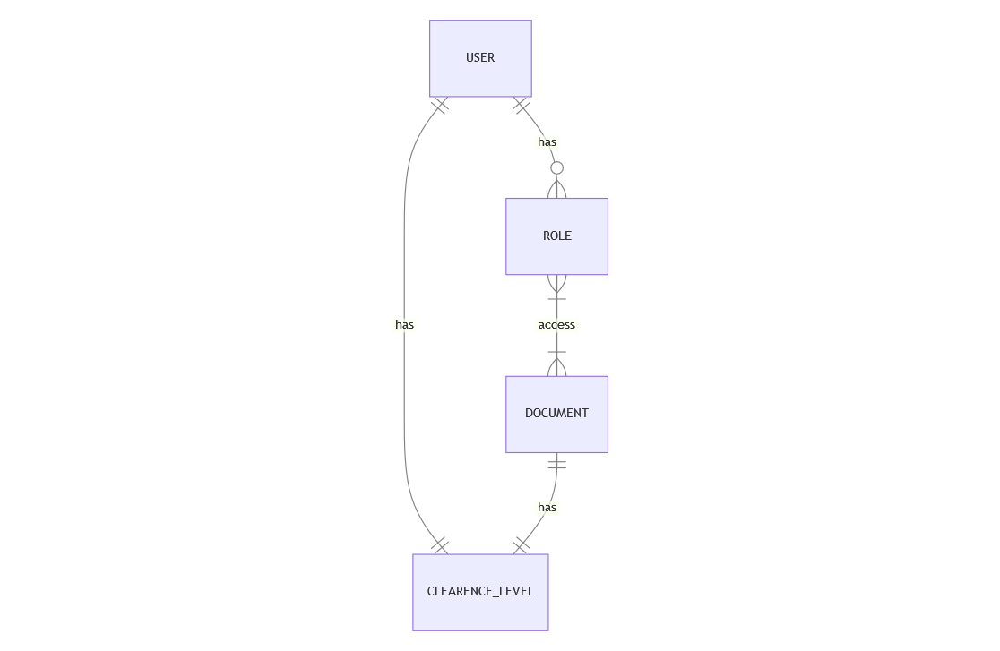
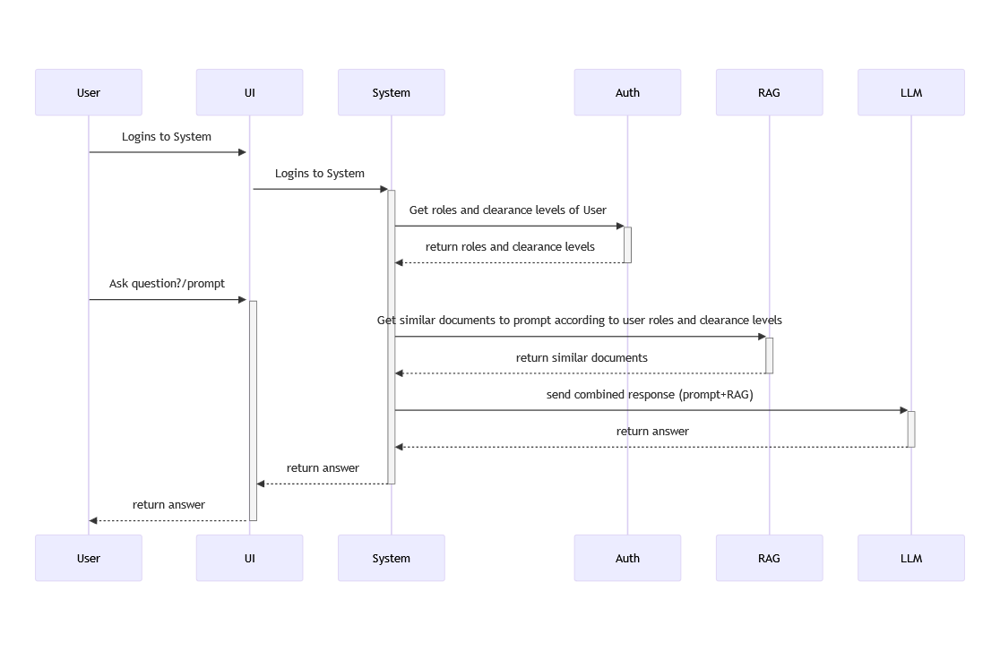
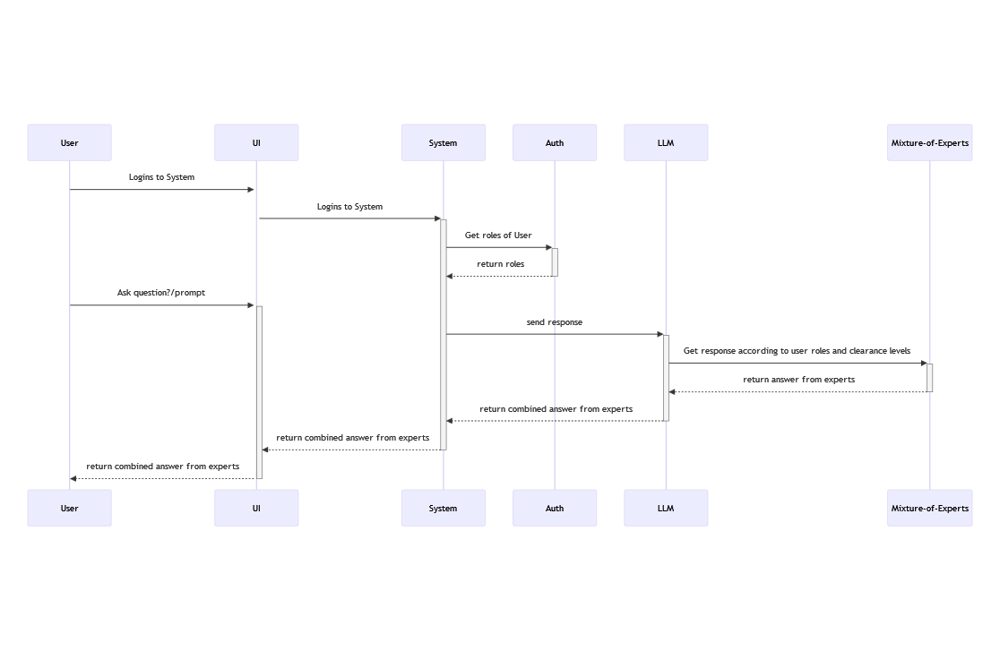
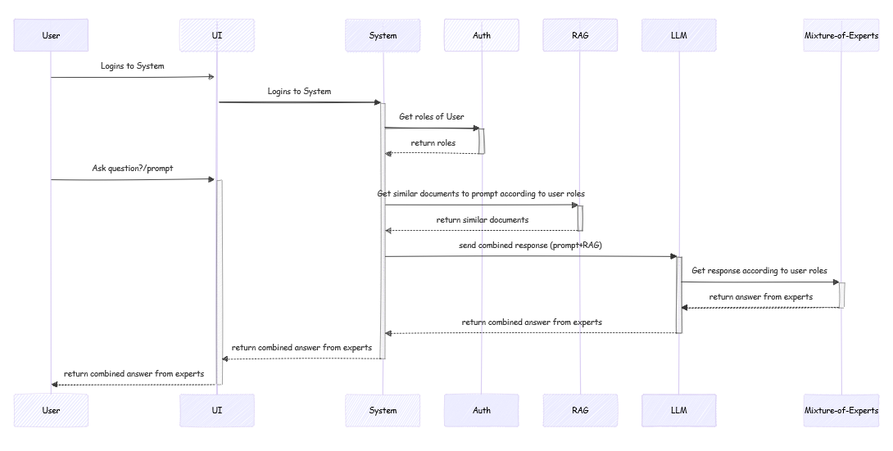

# 一种基于角色安全和权限级别，结合检索增强生成或专家混合技术的企业级大型语言模型应用简易架构。

发布时间：2024年07月09日

`LLM应用`

> A Simple Architecture for Enterprise Large Language Model Applications based on Role based security and Clearance Levels using Retrieval-Augmented Generation or Mixture of Experts

# 摘要

> 本研究设计了一种简洁的企业应用架构，专为大型语言模型（LLM）在基于角色的安全性和北约清关级别上使用。该架构旨在克服当前LLM在安全和信息访问管理上的不足。它兼容检索增强生成（RAG）和专家模型混合（MoE）的微调，可单独或组合使用。通过用户的角色和安全级别，对RAG文档和MoE专家进行筛选，有效防止信息泄露。

> This study proposes a simple architecture for Enterprise application for Large Language Models (LLMs) for role based security and NATO clearance levels. Our proposal aims to address the limitations of current LLMs in handling security and information access. The proposed architecture could be used while utilizing Retrieval-Augmented Generation (RAG) and fine tuning of Mixture of experts models (MoE). It could be used only with RAG, or only with MoE or with both of them. Using roles and security clearance level of the user, documents in RAG and experts in MoE are filtered. This way information leakage is prevented.

[Arxiv](https://arxiv.org/abs/2407.06718)