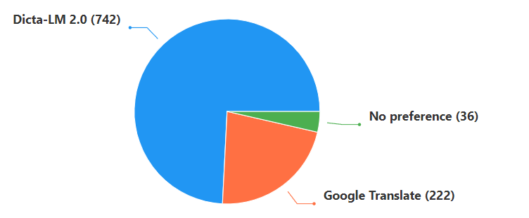

# 将 LLM 适应于希伯来语：揭秘 DictaLM 2.0，其词汇与指令能力得到增强

发布时间：2024年07月09日

`LLM应用` `多语言技术`

> Adapting LLMs to Hebrew: Unveiling DictaLM 2.0 with Enhanced Vocabulary and Instruction Capabilities

# 摘要

> 在希伯来语等低资源语言中训练大型语言模型 (LLM) 充满挑战。本文推出了 DictaLM2.0 和 DictaLM2.0-Instruct，这两款 LLM 基于 Mistral 模型，在包含约 2000 亿词元的希伯来语和英语语料库上进行了训练。将预训练模型适应新语言需要特殊技术，这与从头开始训练或在英语等资源丰富语言上进一步训练现有模型大相径庭。我们详细介绍了这些创新的训练方法，它们有效促进了模型对希伯来语特性的学习和适应。此外，我们还对 DictaLM2.0-Instruct 进行了微调，以提升其处理特定任务指令的能力。为了全面评估我们的模型，我们创建了一套新的希伯来语 LLM 评估基准，涵盖问答、情感分析、Winograd 模式挑战、翻译和摘要等多种任务。我们的研究不仅解决了低资源语言中训练 LLM 的难题，还提出了一种通用框架，可用于将其他 LLM 适应到多种非英语语言，推动了多语言 NLP 领域的发展。

> Training large language models (LLMs) in low-resource languages such as Hebrew poses unique challenges. In this paper, we introduce DictaLM2.0 and DictaLM2.0-Instruct, two LLMs derived from the Mistral model, trained on a substantial corpus of approximately 200 billion tokens in both Hebrew and English. Adapting a pre-trained model to a new language involves specialized techniques that differ significantly from training a model from scratch or further training existing models on well-resourced languages such as English. We outline these novel training methodologies, which facilitate effective learning and adaptation to the linguistic properties of Hebrew. Additionally, we fine-tuned DictaLM2.0-Instruct on a comprehensive instruct dataset to enhance its performance on task-specific instructions. To rigorously evaluate our models, we introduce a new benchmark suite for Hebrew LLM evaluation, covering a diverse set of tasks including Question Answering, Sentiment Analysis, Winograd Schema Challenge, Translation, and Summarization. Our work not only addresses the intricacies of training LLMs in low-resource languages but also proposes a framework that can be leveraged for adapting other LLMs to various non-English languages, contributing to the broader field of multilingual NLP.

[Arxiv](https://arxiv.org/abs/2407.07080)