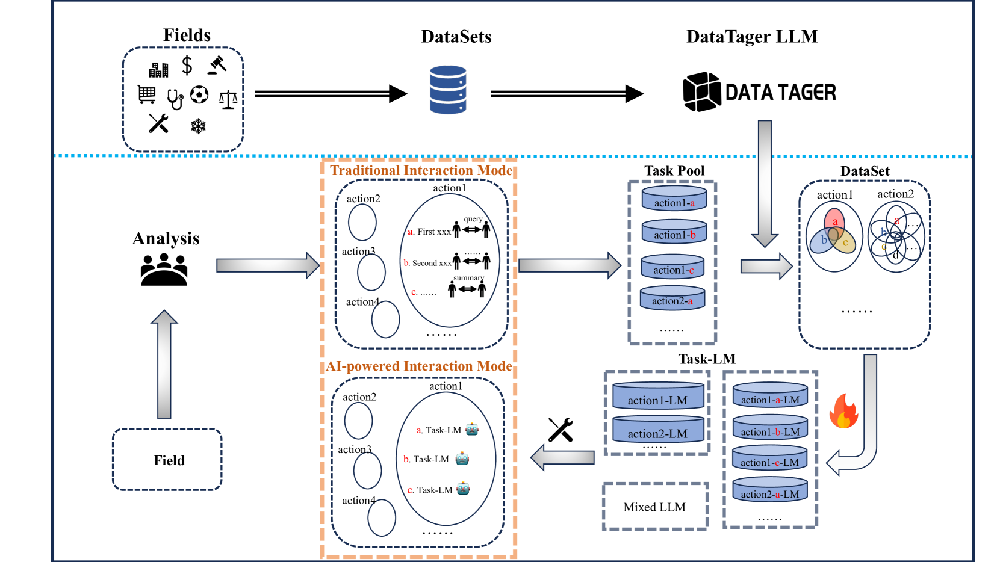
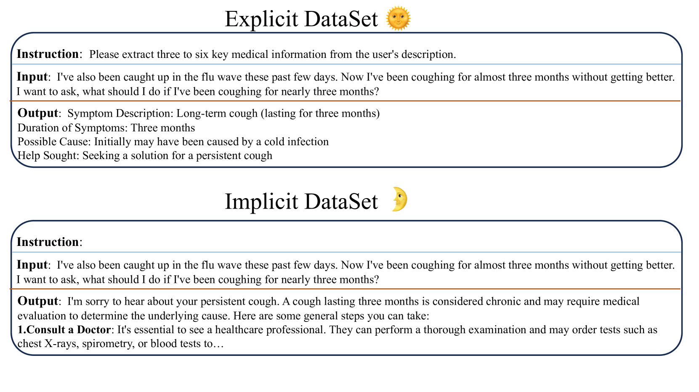
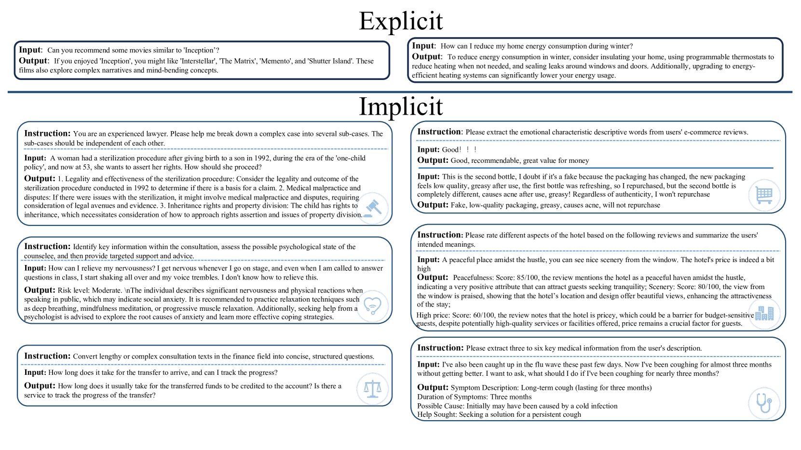

# AnyTaskTune：借助任务微调，打造高级领域定制方案

发布时间：2024年07月09日

`LLM应用` `医疗保健`

> AnyTaskTune: Advanced Domain-Specific Solutions through Task-Fine-Tuning

# 摘要

> 大型语言模型（LLM）在各行业的广泛应用往往忽略了个人和小型组织的精细需求，这些需求更倾向于那些针对其特定业务环境精确定制的模型。为此，我们引入了**AnyTaskTune**，一种名为**任务精细微调**的新颖微调方法，旨在提升模型在多样化的特定领域任务上的性能。该方法通过细致地识别和定义领域内的目标子任务，并创建专门的增强数据集进行微调，从而优化特定任务的模型性能。我们在法律、金融、医疗保健等多个领域进行了全面的微调实验，涵盖了超过二十种不同的子任务。为了证实我们的方法并促进社区参与，我们将开源这些双语任务数据集。研究结果显示，使用**任务精细微调**方法微调的模型不仅在这些特定任务上表现卓越，而且在各自领域内显著优于具有更高通用能力的模型。我们的工作已在[GitHub](https://github.com/PandaVT/DataTager)上公开。

> The pervasive deployment of Large Language Models-LLMs in various sectors often neglects the nuanced requirements of individuals and small organizations, who benefit more from models precisely tailored to their specific business contexts rather than those with broadly superior general capabilities. This work introduces \textbf{AnyTaskTune}, a novel fine-tuning methodology coined as \textbf{Task-Fine-Tune}, specifically developed to elevate model performance on a diverse array of domain-specific tasks. This method involves a meticulous process to identify and define targeted sub-tasks within a domain, followed by the creation of specialized enhancement datasets for fine-tuning, thereby optimizing task-specific model performance. We conducted comprehensive fine-tuning experiments not only in the legal domain for tasks such as keyword extraction and sentence prediction but across over twenty different sub-tasks derived from the domains of finance, healthcare, law, psychology, consumer services, and human resources. To substantiate our approach and facilitate community engagement, we will open-source these bilingual task datasets. Our findings demonstrate that models fine-tuned using the \textbf{Task-Fine-Tune} methodology not only achieve superior performance on these specific tasks but also significantly outperform models with higher general capabilities in their respective domains. Our work is publicly available at \url{https://github.com/PandaVT/DataTager}.

[Arxiv](https://arxiv.org/abs/2407.07094)