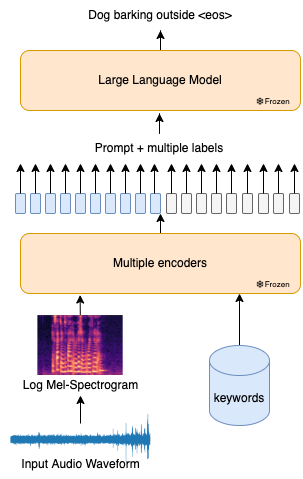

# 场景与事件的音-语数据集综述

发布时间：2024年07月09日

`LLM应用` `音频处理` `数据科学`

> Audio-Language Datasets of Scenes and Events: A Survey

# 摘要

> 音频-语言模型 (ALM) 通过处理声音，为声音产生的事件和场景提供语言描述。随着计算能力的提升和数据集的丰富，这一领域取得了显著进展。本文聚焦于训练 ALM 所用的数据集，特别强调了利用大型、多样化数据集提升模型性能的趋势。Freesound 平台和 AudioSet 等关键资源，推动了该领域的迅猛发展。与以往侧重技术与训练细节的调查不同，本文对众多数据集进行了细致的分类与评估，涵盖其来源、特性及应用场景。此外，还进行了数据泄露分析，以确保数据集的完整性并减少偏差。本调查基于截至 2023 年 12 月的研究论文，未涉及此后发表的文献。

> Audio-language models (ALMs) process sounds to provide a linguistic description of sound-producing events and scenes. Recent advances in computing power and dataset creation have led to significant progress in this domain. This paper surveys existing datasets used for training audio-language models, emphasizing the recent trend towards using large, diverse datasets to enhance model performance. Key sources of these datasets include the Freesound platform and AudioSet that have contributed to the field's rapid growth. Although prior surveys primarily address techniques and training details, this survey categorizes and evaluates a wide array of datasets, addressing their origins, characteristics, and use cases. It also performs a data leak analysis to ensure dataset integrity and mitigate bias between datasets. This survey was conducted by analyzing research papers up to and including December 2023, and does not contain any papers after that period.

[Arxiv](https://arxiv.org/abs/2407.06947)