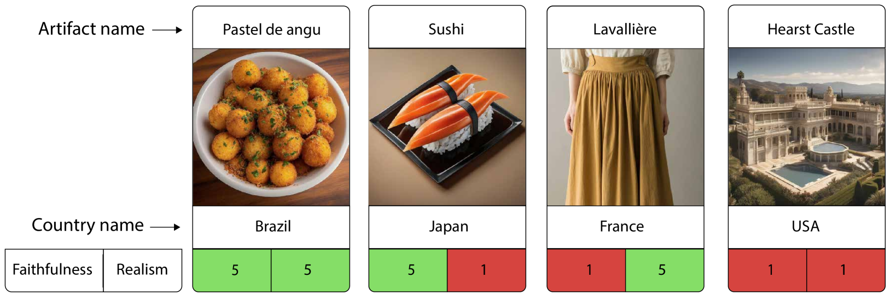
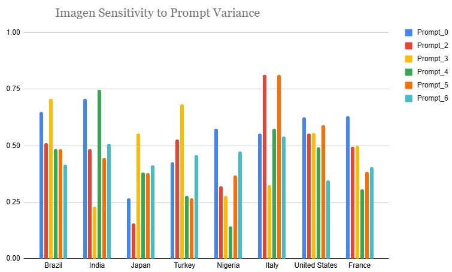
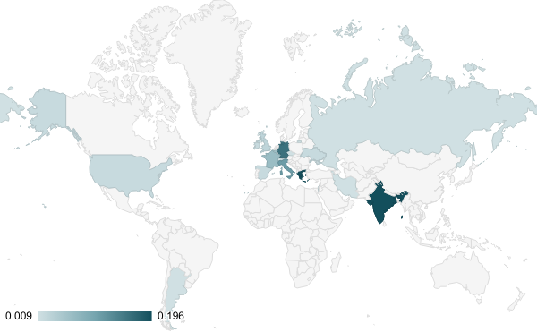

# 不仅仅是美学：探讨文本到图像模型中的文化素养

发布时间：2024年07月09日

`LLM应用` `文化艺术` `人工智能`

> Beyond Aesthetics: Cultural Competence in Text-to-Image Models

# 摘要

> 文本到图像（T2I）模型在全球多元社区中日益流行，它们为各自独特的文化创造了视觉表现。然而，当前的T2I基准主要关注生成图像的忠实度、美学和真实感，却忽视了文化能力这一关键维度。为此，我们引入了一个框架，用于评估T2I模型在文化意识和文化多样性这两个关键维度上的文化能力，并提出了一种可扩展的方法，结合结构化知识库和大型语言模型构建了一个大型文化文物数据集，以支持这种评估。特别是，我们应用这种方法构建了CUBE（文本到图像模型的文化基准），这是首个评估T2I模型文化能力的基准。CUBE涵盖了与8个不同地理文化区域的国家的文化文物，涉及三个概念：美食、地标和艺术。CUBE包括1）CUBE-1K，一组高质量的提示，用于评估文化意识；2）CUBE-CSpace，一个更大的文化文物数据集，用于评估文化多样性。我们还引入了文化多样性作为T2I评估的新组件，利用质量加权的Vendi得分。我们的评估揭示了现有模型在各国文化意识方面的显著差距，并为未明确提示的T2I输出提供了关于文化多样性的宝贵见解。我们的方法可扩展到其他文化区域和概念，有助于开发更好地服务于全球人口的T2I模型。

> Text-to-Image (T2I) models are being increasingly adopted in diverse global communities where they create visual representations of their unique cultures. Current T2I benchmarks primarily focus on faithfulness, aesthetics, and realism of generated images, overlooking the critical dimension of cultural competence. In this work, we introduce a framework to evaluate cultural competence of T2I models along two crucial dimensions: cultural awareness and cultural diversity, and present a scalable approach using a combination of structured knowledge bases and large language models to build a large dataset of cultural artifacts to enable this evaluation. In particular, we apply this approach to build CUBE (CUltural BEnchmark for Text-to-Image models), a first-of-its-kind benchmark to evaluate cultural competence of T2I models. CUBE covers cultural artifacts associated with 8 countries across different geo-cultural regions and along 3 concepts: cuisine, landmarks, and art. CUBE consists of 1) CUBE-1K, a set of high-quality prompts that enable the evaluation of cultural awareness, and 2) CUBE-CSpace, a larger dataset of cultural artifacts that serves as grounding to evaluate cultural diversity. We also introduce cultural diversity as a novel T2I evaluation component, leveraging quality-weighted Vendi score. Our evaluations reveal significant gaps in the cultural awareness of existing models across countries and provide valuable insights into the cultural diversity of T2I outputs for under-specified prompts. Our methodology is extendable to other cultural regions and concepts, and can facilitate the development of T2I models that better cater to the global population.

[Arxiv](https://arxiv.org/abs/2407.06863)