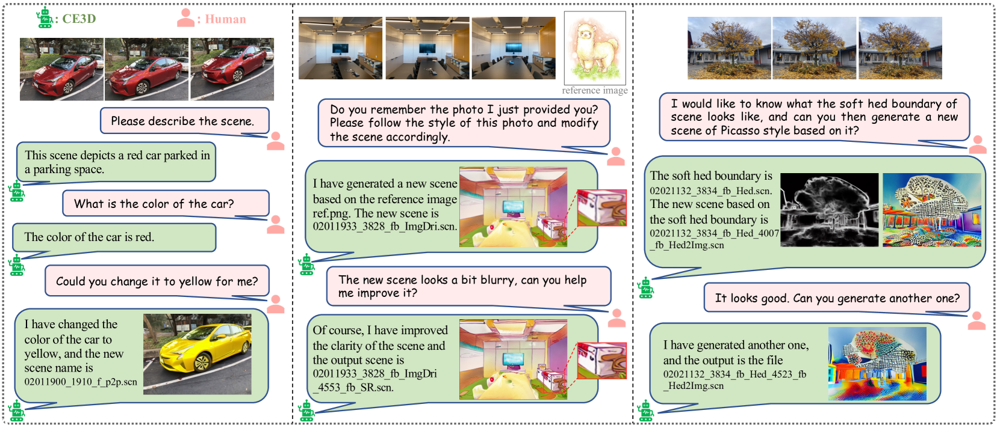
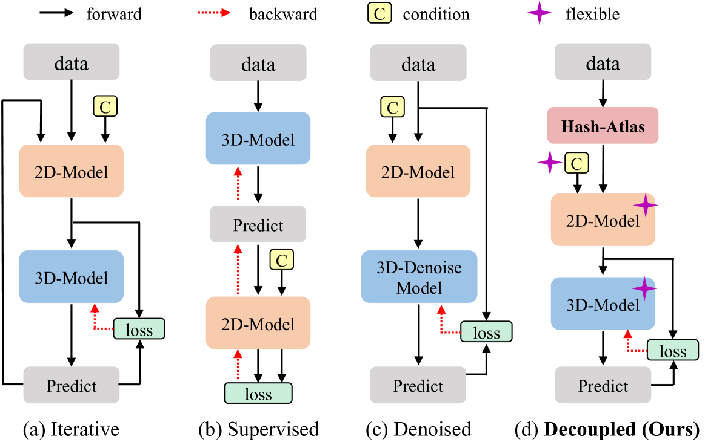
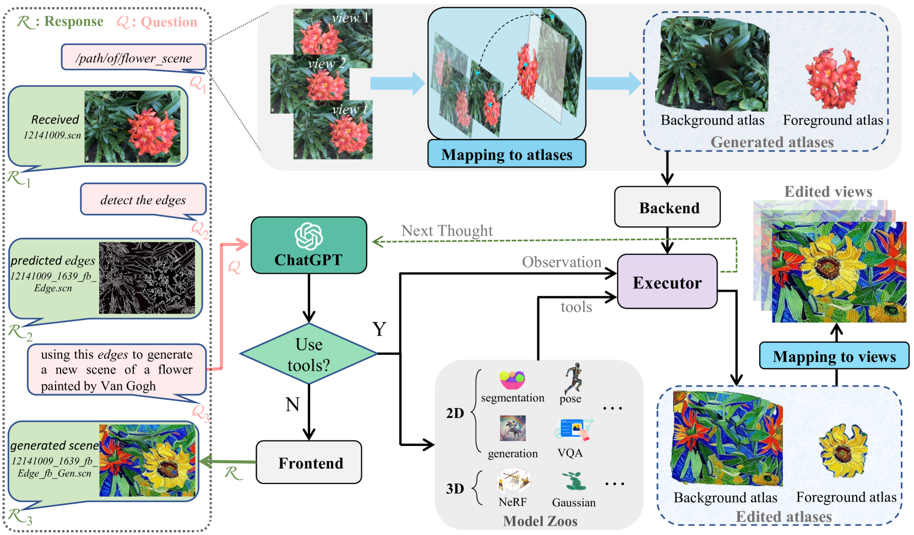
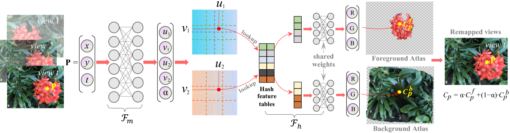
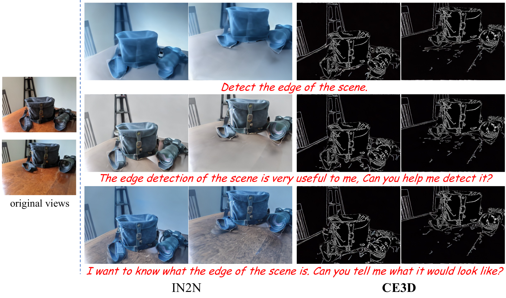
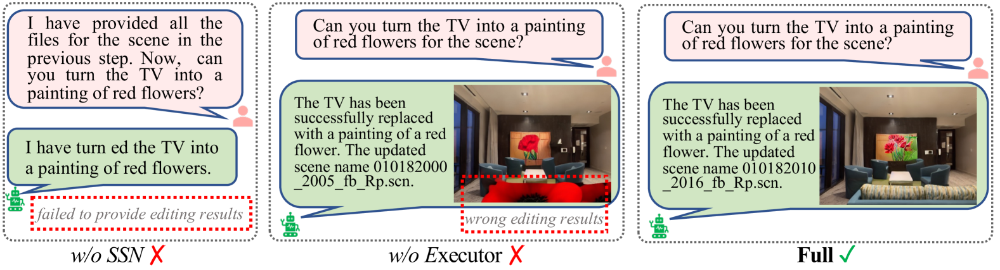
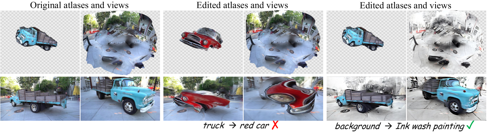

# Chat-Edit-3D：借助文本提示实现互动式3D场景编辑

发布时间：2024年07月09日

`LLM应用` `3D建模` `计算机视觉`

> Chat-Edit-3D: Interactive 3D Scene Editing via Text Prompts

# 摘要

> 近期，基于视觉-语言预训练模型的图像内容操作技术已成功应用于文本驱动的3D场景编辑。尽管如此，现有3D场景编辑方案仍存在局限，如固定输入模式限制了用户灵活性，单一2D视觉模型制约了编辑能力，且复杂的集成设计增加了难度。为此，我们推出了基于对话的3D场景编辑方法CE3D，该方法依托大型语言模型，支持用户自由文本输入并智能解读意图，自动调用相应视觉模型。我们还创新性地采用Hash-Atlas技术，将3D场景编辑简化为2D图集图像操作，实现了2D编辑与3D重建的彻底分离，使CE3D能灵活整合各类2D或3D视觉模型，无需复杂融合设计。实验证实，CE3D能有效集成多视觉模型，实现丰富编辑效果，展现出卓越的场景理解和多轮对话能力。代码已公开，详见<a href="https://sk-fun.fun/CE3D">此链接</a>。

> Recent work on image content manipulation based on vision-language pre-training models has been effectively extended to text-driven 3D scene editing. However, existing schemes for 3D scene editing still exhibit certain shortcomings, hindering their further interactive design. Such schemes typically adhere to fixed input patterns, limiting users' flexibility in text input. Moreover, their editing capabilities are constrained by a single or a few 2D visual models and require intricate pipeline design to integrate these models into 3D reconstruction processes. To address the aforementioned issues, we propose a dialogue-based 3D scene editing approach, termed CE3D, which is centered around a large language model that allows for arbitrary textual input from users and interprets their intentions, subsequently facilitating the autonomous invocation of the corresponding visual expert models. Furthermore, we design a scheme utilizing Hash-Atlas to represent 3D scene views, which transfers the editing of 3D scenes onto 2D atlas images. This design achieves complete decoupling between the 2D editing and 3D reconstruction processes, enabling CE3D to flexibly integrate a wide range of existing 2D or 3D visual models without necessitating intricate fusion designs. Experimental results demonstrate that CE3D effectively integrates multiple visual models to achieve diverse editing visual effects, possessing strong scene comprehension and multi-round dialog capabilities. Code is available at <a href="https://sk-fun.fun/CE3D"> this https URL.</a>

[Arxiv](https://arxiv.org/abs/2407.06842)