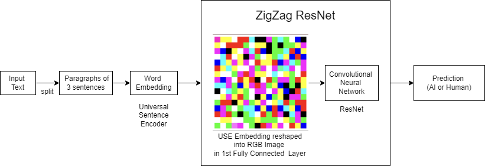
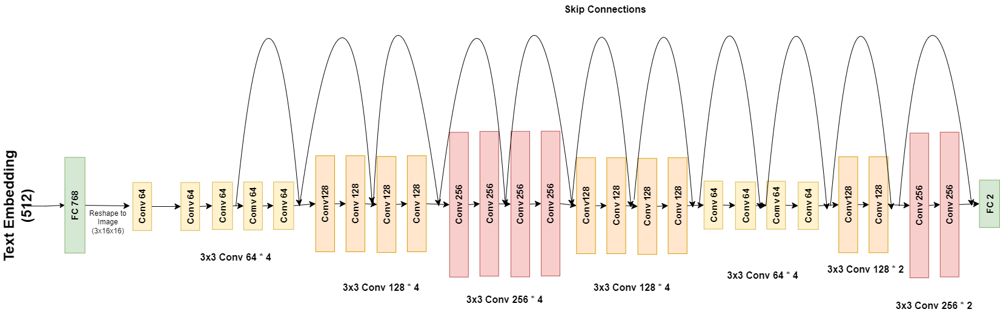
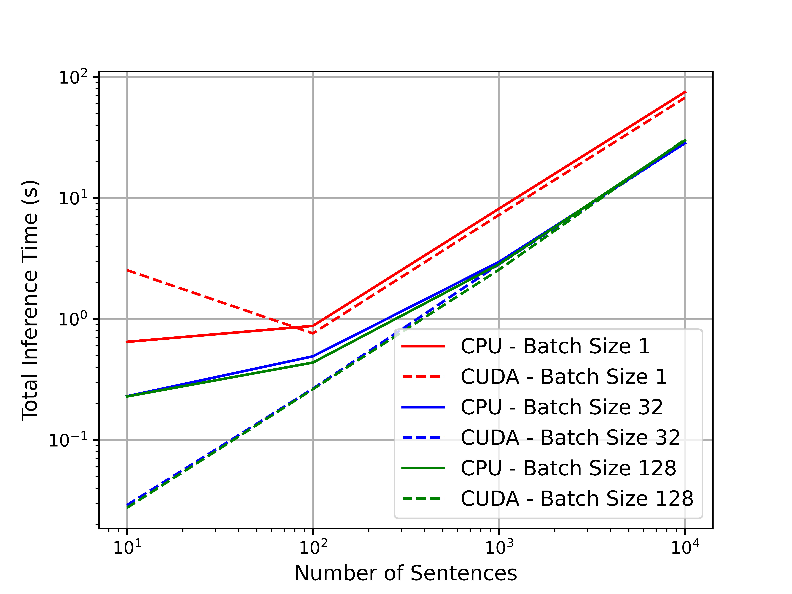
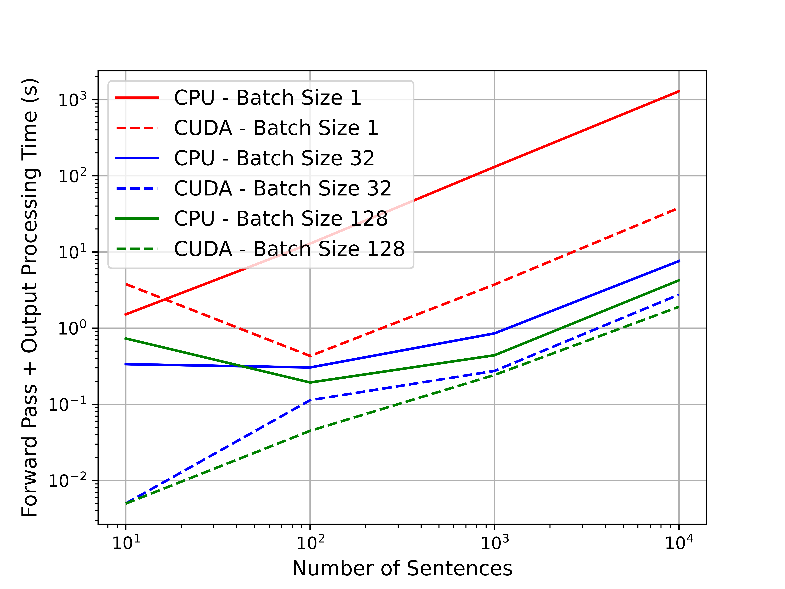
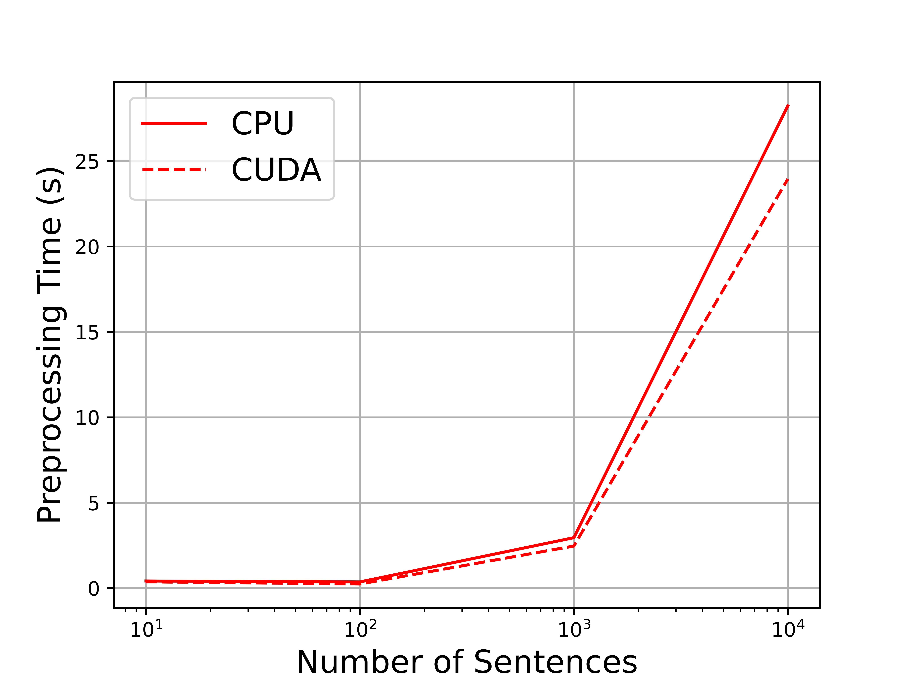

# ConvNLP：探索基于图像的AI文本检测技术

发布时间：2024年07月09日

`LLM应用` `人工智能`

> ConvNLP: Image-based AI Text Detection

# 摘要

> 生成式AI技术，如大型语言模型（LLMs），在革新教育领域的潜力受到其滥用导致的伦理问题的削弱，这加剧了学术不诚实的问题。LLMs如GPT-4和Llama 2在生成复杂内容和回答问题方面变得越来越强大，从撰写学术论文到解决复杂数学问题。学生依赖这些LLMs完成作业，从而损害了学术诚信。检测LLM生成文本的解决方案计算密集且往往缺乏泛化能力。本文提出了一种新颖的方法，使用词嵌入的视觉表示来检测LLM生成的AI文本。我们设计了一种新颖的卷积神经网络，称为ZigZag ResNet，以及一个名为ZigZag Scheduler的调度器，以提高泛化能力。通过使用由六种不同最先进的LLMs生成的文本数据集进行广泛评估，我们的模型展示了强大的域内和域间泛化能力。我们的最佳模型在域内和域间测试数据上的平均检测率达到了88.35%。通过详尽的消融研究，我们的ZigZag ResNet和ZigZag Scheduler相比原始ResNet提供了近4%的性能提升。我们的模型的端到端推理延迟每句话低于2.5毫秒。我们的解决方案提供了一种轻量级、计算高效且更快的替代方案，用于检测AI生成的文本，具有更好的泛化性能。它可以帮助学术机构在学术环境中对抗LLMs的滥用。通过这项工作，我们旨在保护学术诚信的原则，并确保在先进LLMs时代学生工作的可信度。

> The potentials of Generative-AI technologies like Large Language models (LLMs) to revolutionize education are undermined by ethical considerations around their misuse which worsens the problem of academic dishonesty. LLMs like GPT-4 and Llama 2 are becoming increasingly powerful in generating sophisticated content and answering questions, from writing academic essays to solving complex math problems. Students are relying on these LLMs to complete their assignments and thus compromising academic integrity. Solutions to detect LLM-generated text are compute-intensive and often lack generalization. This paper presents a novel approach for detecting LLM-generated AI-text using a visual representation of word embedding. We have formulated a novel Convolutional Neural Network called ZigZag ResNet, as well as a scheduler for improving generalization, named ZigZag Scheduler. Through extensive evaluation using datasets of text generated by six different state-of-the-art LLMs, our model demonstrates strong intra-domain and inter-domain generalization capabilities. Our best model detects AI-generated text with an impressive average detection rate (over inter- and intra-domain test data) of 88.35%. Through an exhaustive ablation study, our ZigZag ResNet and ZigZag Scheduler provide a performance improvement of nearly 4% over the vanilla ResNet. The end-to-end inference latency of our model is below 2.5ms per sentence. Our solution offers a lightweight, computationally efficient, and faster alternative to existing tools for AI-generated text detection, with better generalization performance. It can help academic institutions in their fight against the misuse of LLMs in academic settings. Through this work, we aim to contribute to safeguarding the principles of academic integrity and ensuring the trustworthiness of student work in the era of advanced LLMs.

[Arxiv](https://arxiv.org/abs/2407.07225)