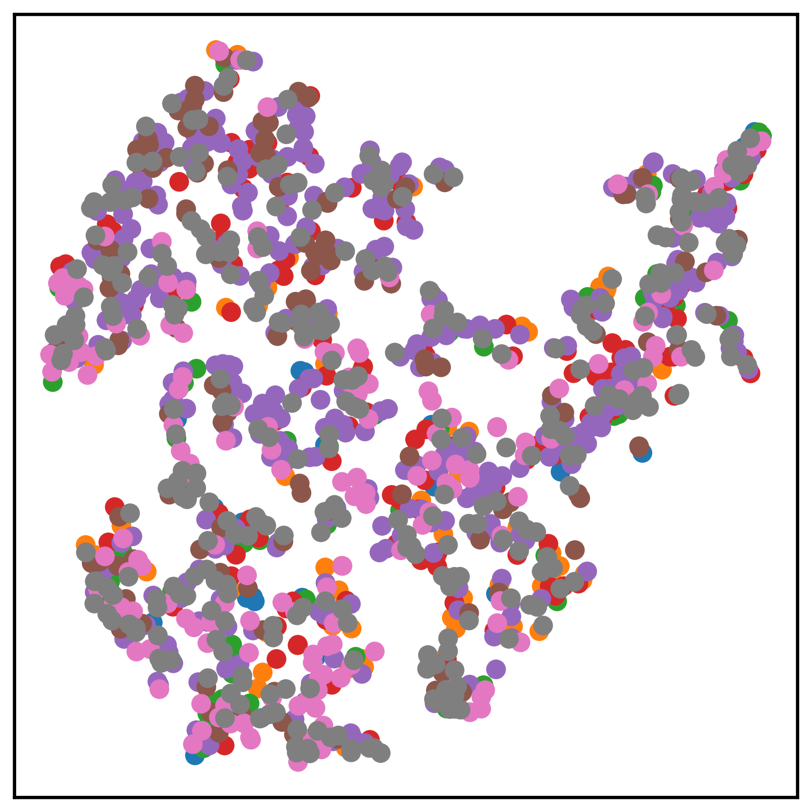
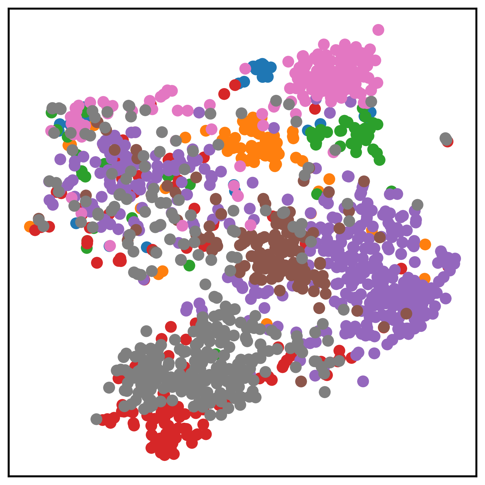
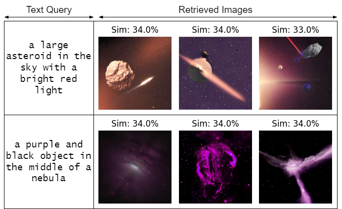
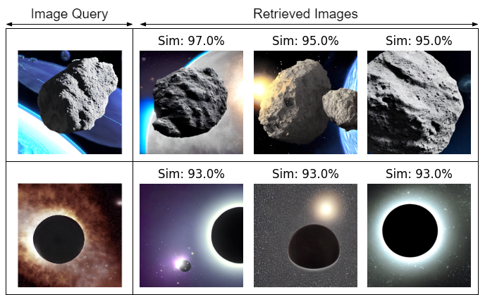

# CosmoCLIP：拓展大型视觉-语言模型至天文影像领域

发布时间：2024年07月09日

`LLM应用` `天文学` `机器学习`

> CosmoCLIP: Generalizing Large Vision-Language Models for Astronomical Imaging

# 摘要

> 现有的视觉-文本对比学习模型通过匹配图像与标题的嵌入并分离无关对来提升表示的可迁移性，支持零-shot预测。然而，天文图像-标签数据集规模远小于互联网上的通用数据集。为此，我们推出了CosmoCLIP，一个基于SpaceNet和BLIP标题的预训练CLIP模型的天文图像-文本对比学习框架。SpaceNet包含约13,000张分布优化的图像，而BLIP则作为知识丰富的提取器。通过对比学习这些描述中的丰富语义，CosmoCLIP在多种任务中展现出卓越的泛化能力。实验结果显示，CosmoCLIP框架简洁高效，在零-shot分类和图像-文本检索任务中大幅超越CLIP。

> Existing vision-text contrastive learning models enhance representation transferability and support zero-shot prediction by matching paired image and caption embeddings while pushing unrelated pairs apart. However, astronomical image-label datasets are significantly smaller compared to general image and label datasets available from the internet. We introduce CosmoCLIP, an astronomical image-text contrastive learning framework precisely fine-tuned on the pre-trained CLIP model using SpaceNet and BLIP-based captions. SpaceNet, attained via FLARE, constitutes ~13k optimally distributed images, while BLIP acts as a rich knowledge extractor. The rich semantics derived from this SpaceNet and BLIP descriptions, when learned contrastively, enable CosmoCLIP to achieve superior generalization across various in-domain and out-of-domain tasks. Our results demonstrate that CosmoCLIP is a straightforward yet powerful framework, significantly outperforming CLIP in zero-shot classification and image-text retrieval tasks.

[Arxiv](https://arxiv.org/abs/2407.07315)