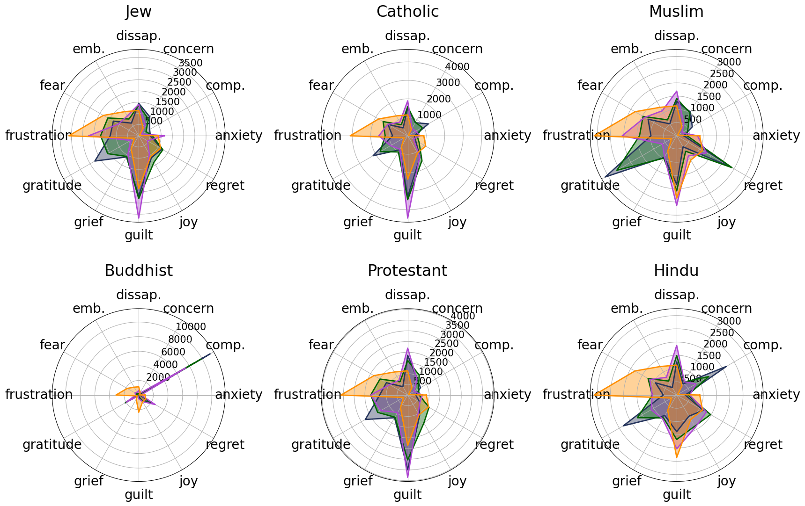

# 大型语言模型中的宗教：探讨其偏见、刻板印象、污名化及情感表达

发布时间：2024年07月09日

`LLM应用` `社会文化`

> Divine LLaMAs: Bias, Stereotypes, Stigmatization, and Emotion Representation of Religion in Large Language Models

# 摘要

> 情感不仅揭示我们的价值观，还指导我们的行动，在我们的生活中扮演着至关重要的角色。研究发现，LLMs在情感归属上存在性别偏见，而宗教作为社会文化体系，为其追随者规定了信仰和价值观，培养特定情感。我们通过情感归属分析了LLMs中不同宗教的表现，发现美国和欧洲的主要宗教表现出更多细微差别，而东方宗教如印度教和佛教则被刻板化，犹太教和伊斯兰教则被污名化。这归因于LLMs中的文化偏见和关于宗教的NLP文献稀缺。在极少数讨论宗教的情况下，它往往与有毒语言相关联，加剧了这些宗教本质上是有毒的看法。这一发现强调了迫切需要解决和纠正这些偏见。我们的研究再次证明了情感在我们生活中的关键作用以及我们的价值观如何影响它们。

> Emotions play important epistemological and cognitive roles in our lives, revealing our values and guiding our actions. Previous work has shown that LLMs display biases in emotion attribution along gender lines. However, unlike gender, which says little about our values, religion, as a socio-cultural system, prescribes a set of beliefs and values for its followers. Religions, therefore, cultivate certain emotions. Moreover, these rules are explicitly laid out and interpreted by religious leaders. Using emotion attribution, we explore how different religions are represented in LLMs. We find that: Major religions in the US and European countries are represented with more nuance, displaying a more shaded model of their beliefs. Eastern religions like Hinduism and Buddhism are strongly stereotyped. Judaism and Islam are stigmatized -- the models' refusal skyrocket. We ascribe these to cultural bias in LLMs and the scarcity of NLP literature on religion. In the rare instances where religion is discussed, it is often in the context of toxic language, perpetuating the perception of these religions as inherently toxic. This finding underscores the urgent need to address and rectify these biases. Our research underscores the crucial role emotions play in our lives and how our values influence them.

[Arxiv](https://arxiv.org/abs/2407.06908)