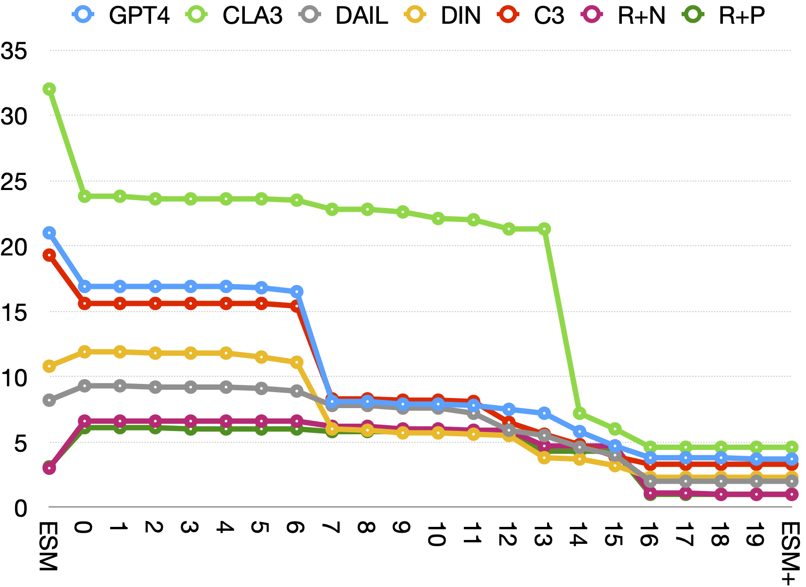

# ESM+：探索大规模语言模型时代下文本到SQL评估的新视角

发布时间：2024年07月09日

`LLM应用` `数据库`

> ESM+: Modern Insights into Perspective on Text-to-SQL Evaluation in the Age of Large Language Models

# 摘要

> Text-to-SQL 任务让用户能用自然语言从 SQL 数据库中提取信息。尽管挑战重重，基于 LLM 的模型在此领域已取得显著进步。值得注意的是，未经微调的 LLM 模型展现出与微调模型不同的特性，使得现有评估指标难以准确衡量其性能。为此，我们深入分析了 EXE 和 ESM 两大评估指标，并提出了改进版 ESM+，以提升评估的稳定性。实验表明，相较于 EXE 和原始 ESM 的高误报率和漏报率，ESM+ 的误报和漏报率大幅降低至 0.1% 和 2.6%。我们已将 ESM+ 脚本开源，期待社区共同参与，共同推动 Text-to-SQL 评估的可靠性。

> The task of Text-to-SQL enables anyone to retrieve information from SQL databases using natural language. Despite several challenges, recent models have made remarkable advancements in this task using large language models (LLMs). Interestingly, we find that LLM-based models without fine-tuning exhibit distinct natures compared to their fine-tuned counterparts, leading to inadequacies in current evaluation metrics to accurately convey their performance. Thus, we analyze the two primary metrics, Test Suite Execution Accuracy (EXE) and Exact Set Matching Accuracy (ESM), to examine their robustness for this task and address shortcomings. We compare the performance of 9 LLM-based models using EXE, the original ESM, and our improved ESM (called ESM+). Our results show that EXE and ESM have high false positive and negative rates of 11.3% and 13.9%, while ESM+ gives those of 0.1% and 2.6% respectively, providing a significantly more stable evaluation. We release the ESM+ script as open-source for the community to contribute, while enjoying a more reliable assessment of Text-to-SQL.

[Arxiv](https://arxiv.org/abs/2407.07313)