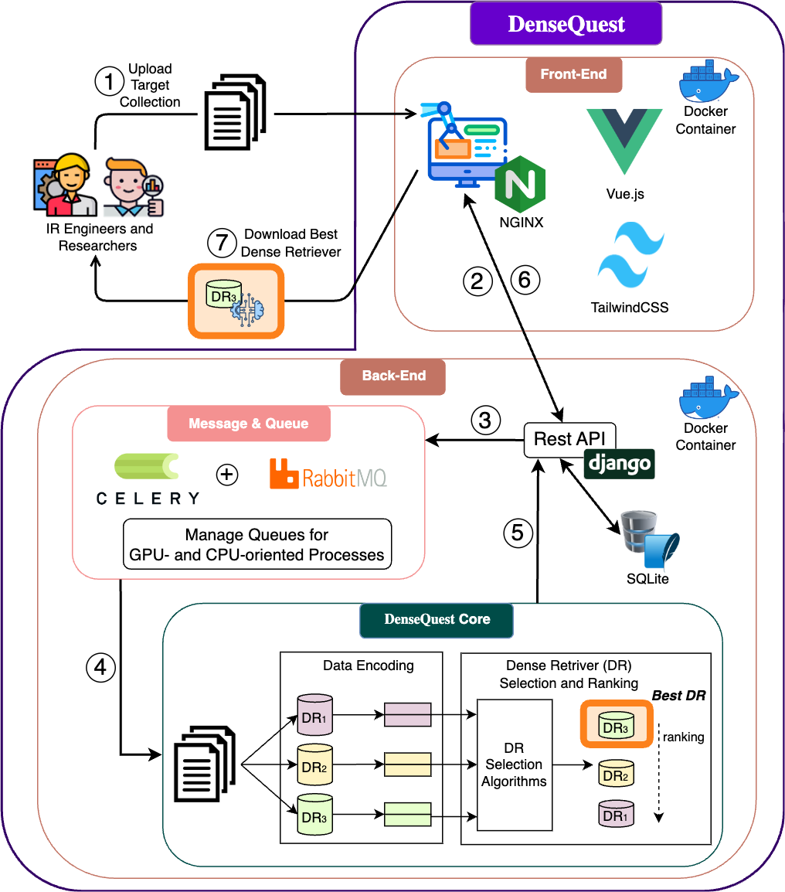

# 探索 DenseQuest：专为挑选自定义集合的最佳密集检索器而设计的系统

发布时间：2024年07月09日

`LLM应用` `信息检索` `云计算`

> Embark on DenseQuest: A System for Selecting the Best Dense Retriever for a Custom Collection

# 摘要

> 本次演示介绍了一款基于网络的应用，名为 DenseQuest，专为选择适用于私有数据集的预训练密集检索器而设计。DenseQuest 通过无监督选择与排序，从众多密集检索器中精准预测最适合特定上传数据集的选项。它融合了多种先进技术，包括一种无需查询或相关性判断、由大型语言模型驱动的高效方法。系统界面直观易用，旨在帮助信息检索领域的工程师和研究者快速找到适合新私有数据集的通用密集检索模型。演示中还展示了系统在云端的架构及多种应用场景，确保了广泛的可访问性和实用性。DenseQuest 系统可通过 https://densequest.ielab.io 访问。

> In this demo we present a web-based application for selecting an effective pre-trained dense retriever to use on a private collection. Our system, DenseQuest, provides unsupervised selection and ranking capabilities to predict the best dense retriever among a pool of available dense retrievers, tailored to an uploaded target collection. DenseQuest implements a number of existing approaches, including a recent, highly effective method powered by Large Language Models (LLMs), which requires neither queries nor relevance judgments. The system is designed to be intuitive and easy to use for those information retrieval engineers and researchers who need to identify a general-purpose dense retrieval model to encode or search a new private target collection. Our demonstration illustrates conceptual architecture and the different use case scenarios of the system implemented on the cloud, enabling universal access and use. DenseQuest is available at https://densequest.ielab.io.

[Arxiv](https://arxiv.org/abs/2407.06685)