# 从非结构化自然语言数据中进行端到端因果效应估计

发布时间：2024年07月09日

`LLM应用` `数据分析`

> End-To-End Causal Effect Estimation from Unstructured Natural Language Data

# 摘要

> 了解干预效果对决策至关重要，但现有因果效应估计方法依赖手动数据处理，增加了成本和时间。我们利用大型语言模型（LLM）挖掘多样化的文本数据，提出NATURAL，一种新型因果效应估计器，能在非结构化文本上运行，辅助经典因果效应计算。我们克服技术难题，如自动化数据整理和填补信息缺失。通过六个数据集（含随机对照试验），我们系统评估了NATURAL的性能，结果显示其估计值与真实情况高度一致，甚至在III/IV期临床试验中表现优异。这表明非结构化文本数据富含因果信息，NATURAL是开发自动化资源利用管道的关键一步。

> Knowing the effect of an intervention is critical for human decision-making, but current approaches for causal effect estimation rely on manual data collection and structuring, regardless of the causal assumptions. This increases both the cost and time-to-completion for studies. We show how large, diverse observational text data can be mined with large language models (LLMs) to produce inexpensive causal effect estimates under appropriate causal assumptions. We introduce NATURAL, a novel family of causal effect estimators built with LLMs that operate over datasets of unstructured text. Our estimators use LLM conditional distributions (over variables of interest, given the text data) to assist in the computation of classical estimators of causal effect. We overcome a number of technical challenges to realize this idea, such as automating data curation and using LLMs to impute missing information. We prepare six (two synthetic and four real) observational datasets, paired with corresponding ground truth in the form of randomized trials, which we used to systematically evaluate each step of our pipeline. NATURAL estimators demonstrate remarkable performance, yielding causal effect estimates that fall within 3 percentage points of their ground truth counterparts, including on real-world Phase 3/4 clinical trials. Our results suggest that unstructured text data is a rich source of causal effect information, and NATURAL is a first step towards an automated pipeline to tap this resource.

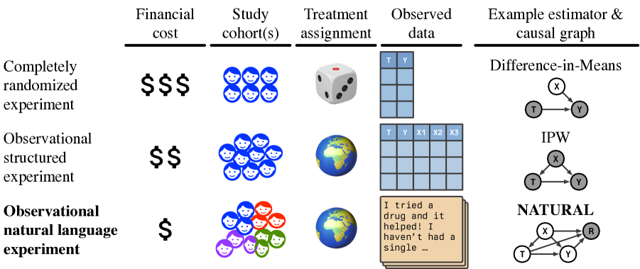

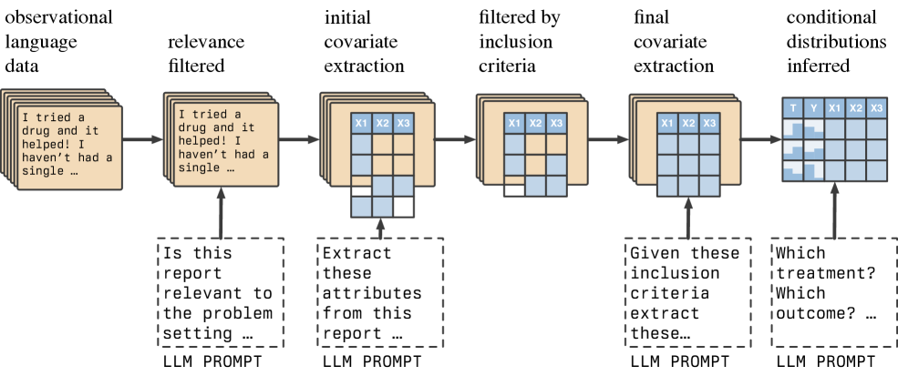

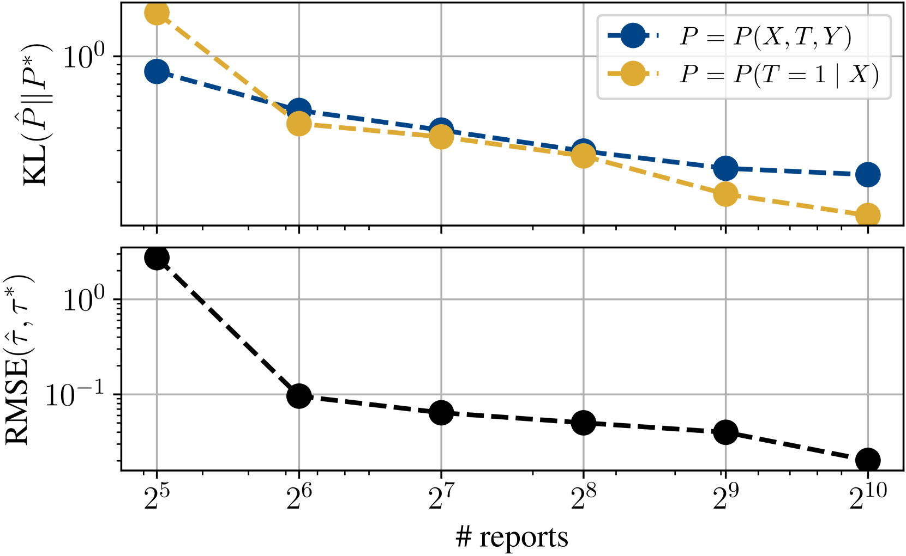

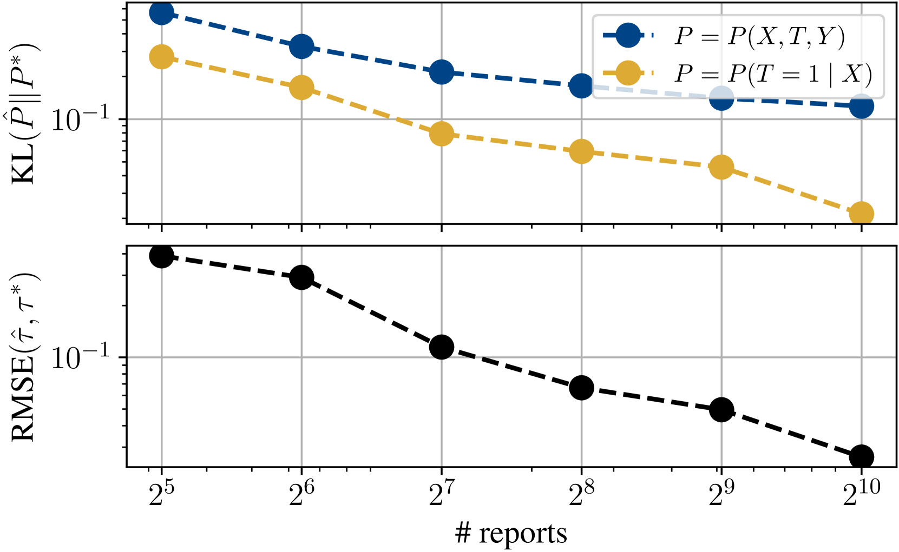

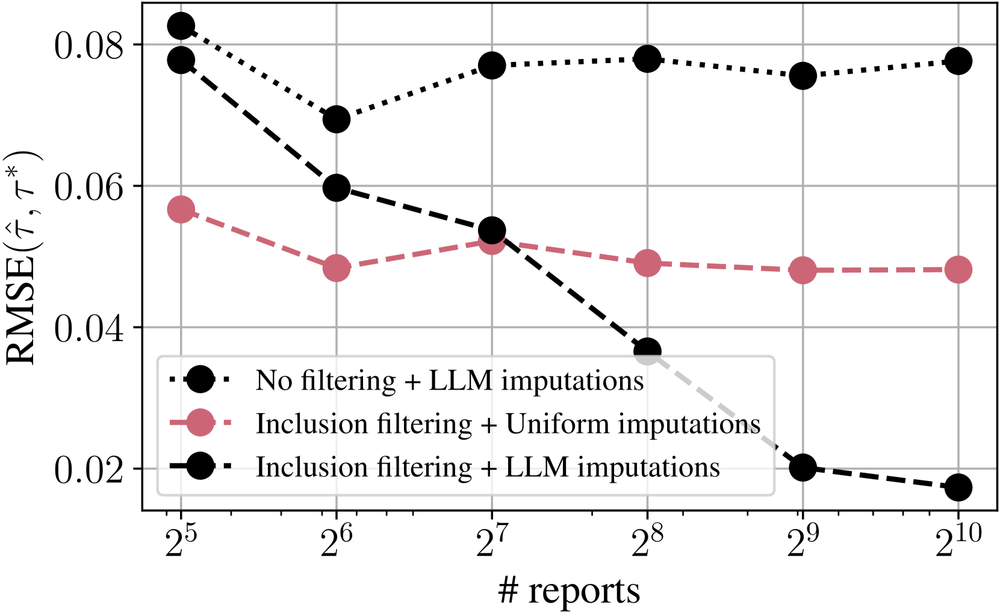

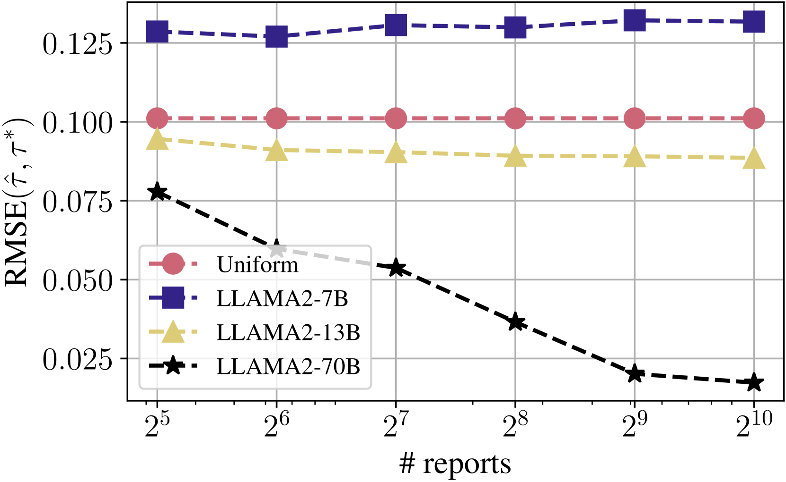

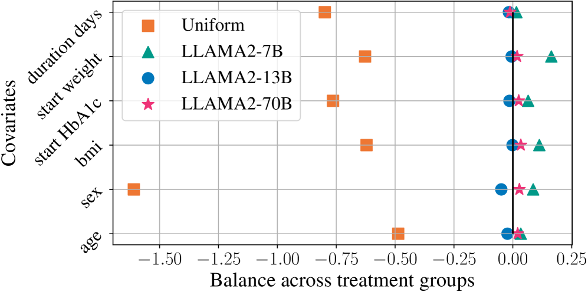

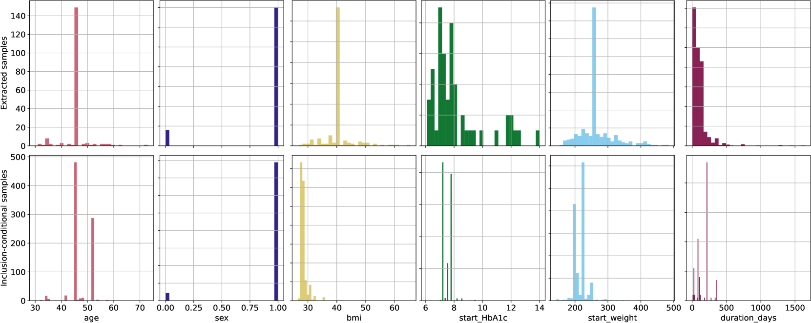

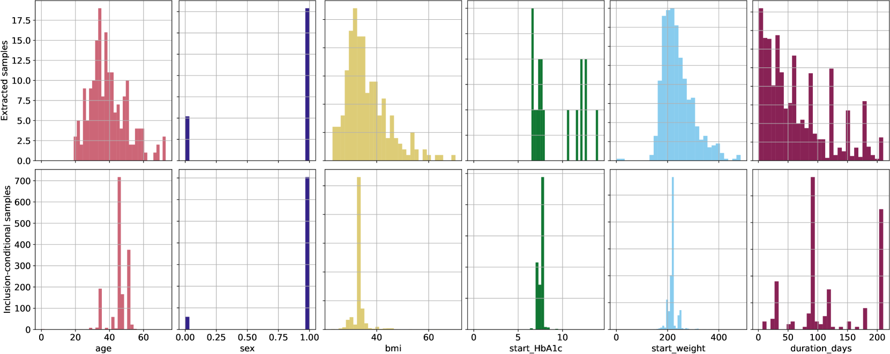

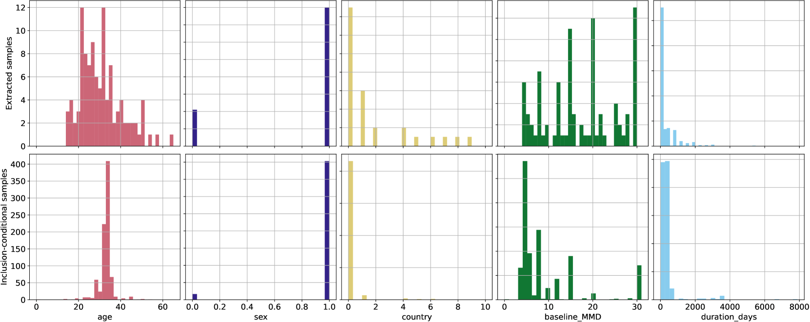

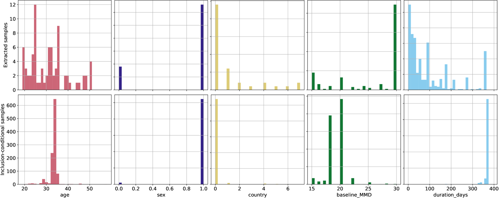

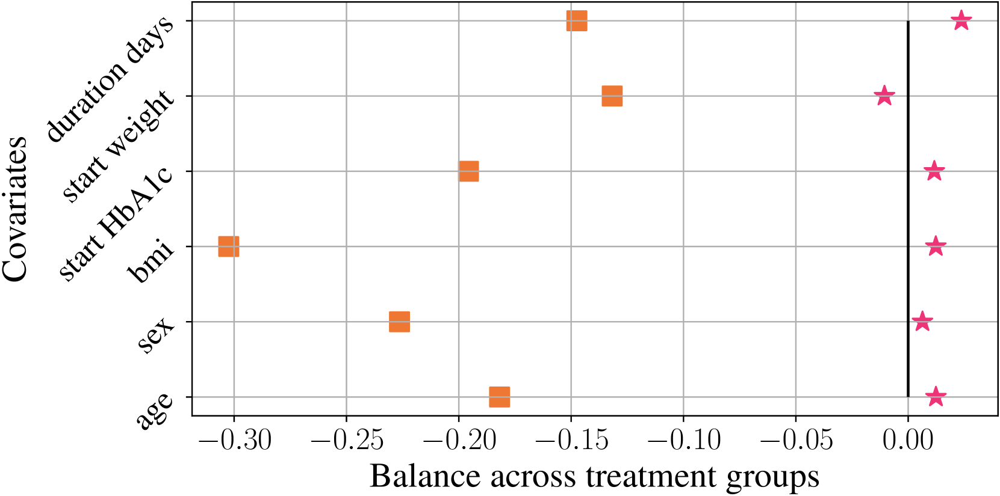

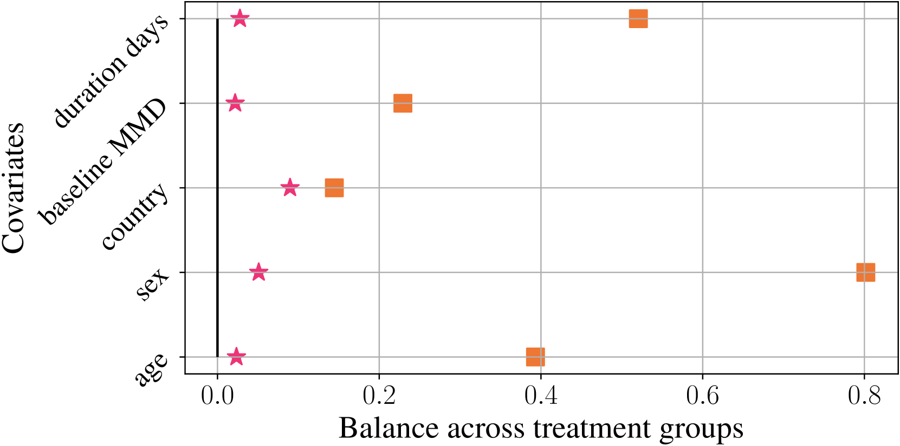

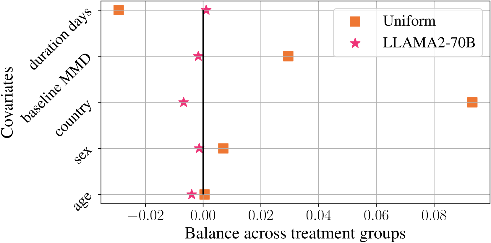

[Arxiv](https://arxiv.org/abs/2407.07018)