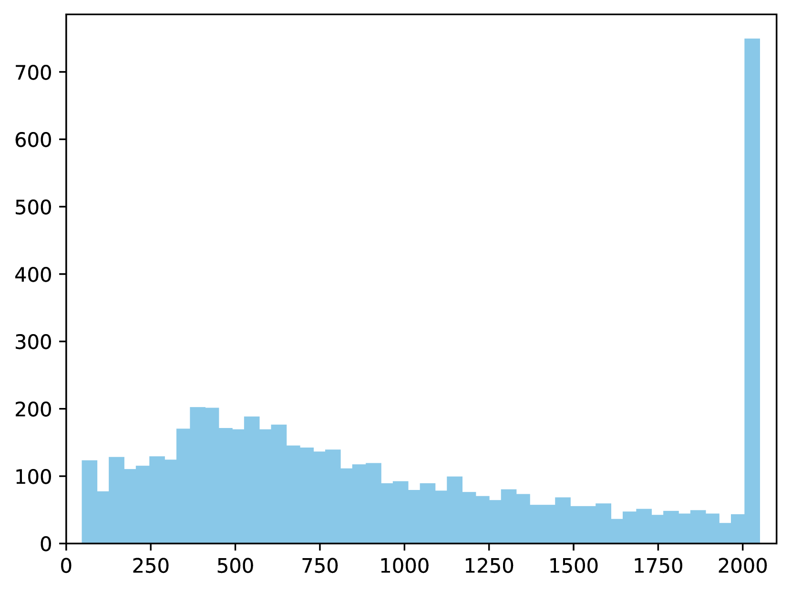

# 熵定律揭秘：数据压缩与大型语言模型性能的内在联系

发布时间：2024年07月09日

`LLM理论` `数据科学` `机器学习`

> Entropy Law: The Story Behind Data Compression and LLM Performance

# 摘要

> 数据虽为大型语言模型的基石，但并非所有数据皆具价值。精选数据能更有效地激发模型潜能，同时大幅降低计算成本。当前方法多聚焦于单个样本质量评估，却忽视了样本间的组合效应。即便单个样本质量上乘，其组合可能因内在同质性或矛盾而影响模型教学效果。本文旨在探索模型性能与数据选择间的深层联系。受模型信息压缩特性启发，我们揭示了“熵定律”，将模型性能与数据压缩比及首轮训练损失相联系，分别反映数据冗余与知识掌握程度。理论与实证研究显示，模型性能与数据压缩比呈负相关，常伴随较低训练损失。基于此，我们提出高效通用的数据选择方法**ZIP**，优先选取低压缩比数据子集。借助多阶段贪婪算法选择多样化数据，我们得以构建兼具满意多样性的优质数据子集。广泛实验验证了熵定律及ZIP方法在不同模型架构与训练阶段的优势。此外，熵定律的应用还能在训练初期预警潜在性能风险。

> Data is the cornerstone of large language models (LLMs), but not all data is useful for model learning. Carefully selected data can better elicit the capabilities of LLMs with much less computational overhead. Most methods concentrate on evaluating the quality of individual samples in data selection, while the combinatorial effects among samples are neglected. Even if each sample is of perfect quality, their combinations may be suboptimal in teaching LLMs due to their intrinsic homogeneity or contradiction. In this paper, we aim to uncover the underlying relationships between LLM performance and data selection. Inspired by the information compression nature of LLMs, we uncover an ``entropy law'' that connects LLM performance with data compression ratio and first-epoch training loss, which reflect the information redundancy of a dataset and the mastery of inherent knowledge encoded in this dataset, respectively. Through both theoretical deduction and empirical evaluation, we find that model performance is negatively correlated to the compression ratio of training data, which usually yields a lower training loss. Based on the findings of the entropy law, we propose a quite efficient and universal data selection method named \textbf{ZIP} for training LLMs, which aim to prioritize data subsets exhibiting a low compression ratio. Based on a multi-stage algorithm that selects diverse data in a greedy manner, we can obtain a good data subset with satisfactory diversity. Extensive experiments have been conducted to validate the entropy law and the superiority of ZIP across different LLM backbones and alignment stages. We also present an interesting application of entropy law that can detect potential performance risks at the beginning of model training.

[Arxiv](https://arxiv.org/abs/2407.06645)