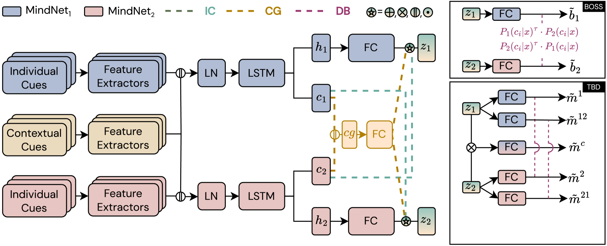
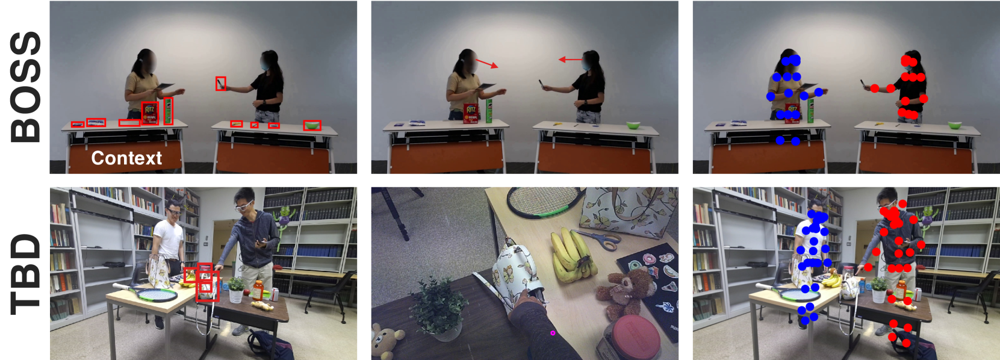
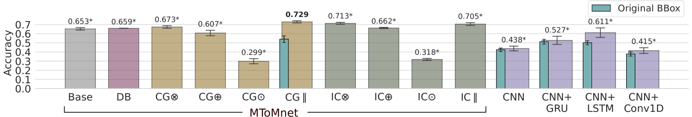
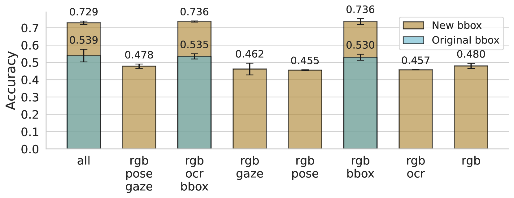
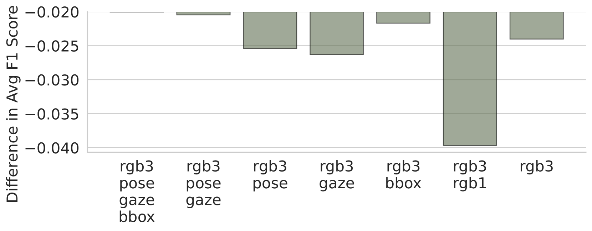
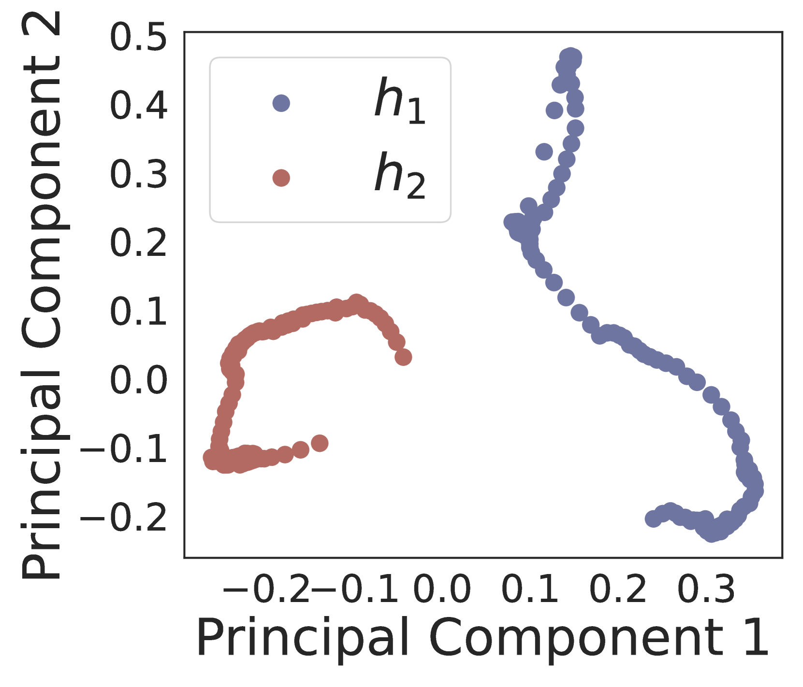
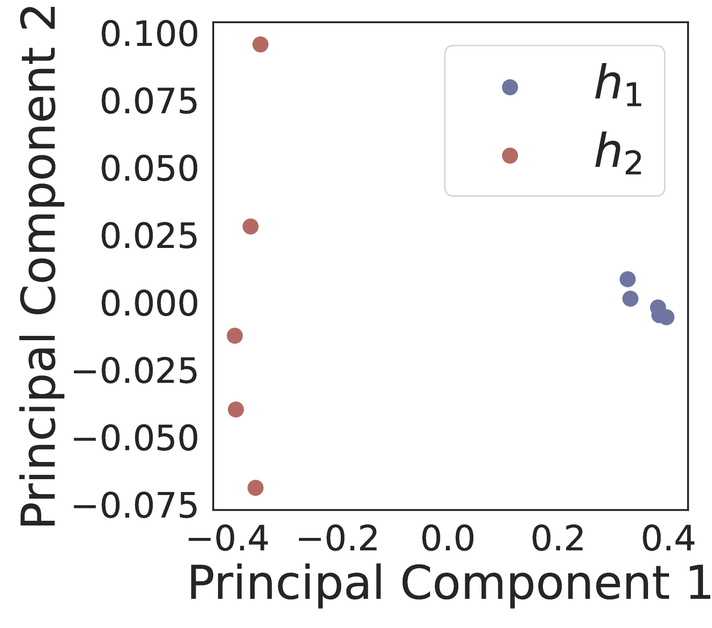
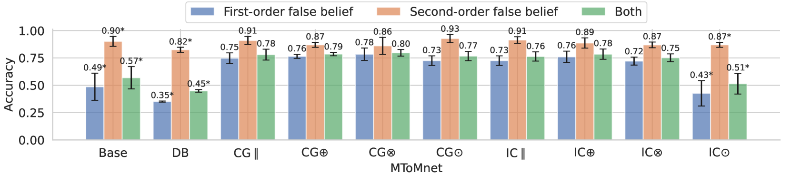
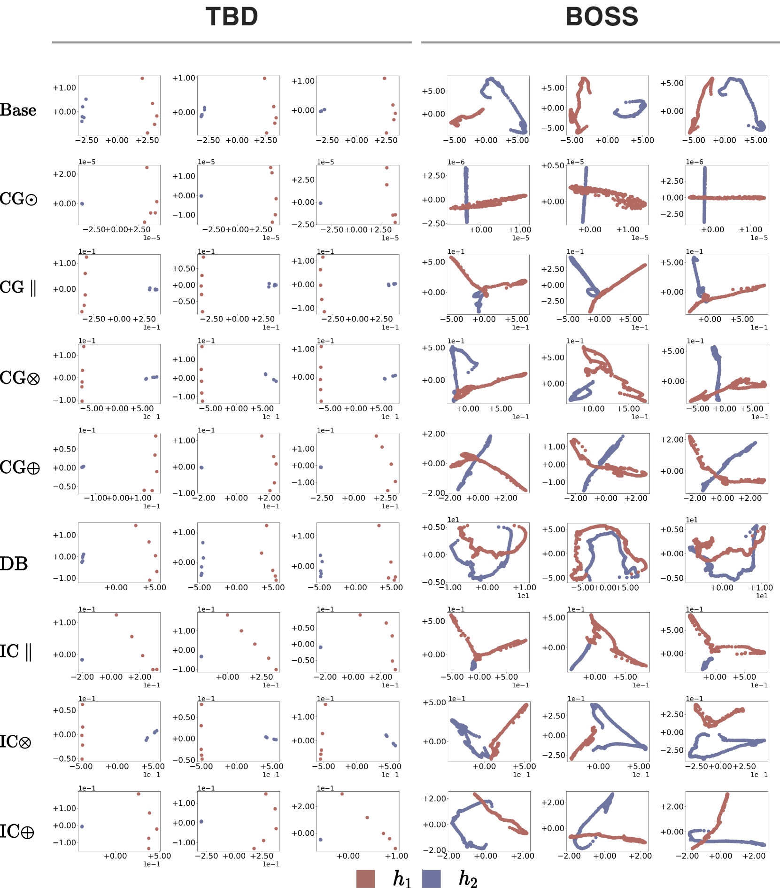

# 在非言语社交互动中，显式建模心智理论以预测信念

发布时间：2024年07月09日

`Agent` `人工智能` `社交互动`

> Explicit Modelling of Theory of Mind for Belief Prediction in Nonverbal Social Interactions

# 摘要

> 我们创新性地提出了 MToMnet，这是一种心智理论神经网络，旨在从多模态输入中预测人类社交互动中的信念及其变化。ToM 在非言语沟通和协作中扮演关键角色，但现有信念建模方法往往忽视了 ToM 的显式建模，或仅限于少数模态。MToMnet 巧妙地整合了场景视频、物体位置等上下文线索与个人注视、身体语言等特定信息，为每个人构建独立的 MindNet。借鉴社交认知与计算 ToM 的研究，我们设计了三种 MToMnet 变体，涵盖潜在表示融合与分类分数重排序等策略。在两个真实世界数据集上的评估显示，MToMnet 不仅大幅领先现有方法，且参数需求显著降低。这一成果为未来人工智能系统在非言语行为中精准预测人类信念、提升协作效率指明了光明道路。

> We propose MToMnet - a Theory of Mind (ToM) neural network for predicting beliefs and their dynamics during human social interactions from multimodal input. ToM is key for effective nonverbal human communication and collaboration, yet, existing methods for belief modelling have not included explicit ToM modelling or have typically been limited to one or two modalities. MToMnet encodes contextual cues (scene videos and object locations) and integrates them with person-specific cues (human gaze and body language) in a separate MindNet for each person. Inspired by prior research on social cognition and computational ToM, we propose three different MToMnet variants: two involving fusion of latent representations and one involving re-ranking of classification scores. We evaluate our approach on two challenging real-world datasets, one focusing on belief prediction, while the other examining belief dynamics prediction. Our results demonstrate that MToMnet surpasses existing methods by a large margin while at the same time requiring a significantly smaller number of parameters. Taken together, our method opens up a highly promising direction for future work on artificial intelligent systems that can robustly predict human beliefs from their non-verbal behaviour and, as such, more effectively collaborate with humans.

[Arxiv](https://arxiv.org/abs/2407.06762)