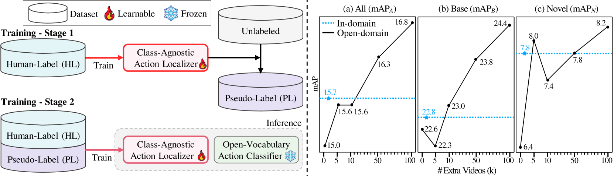
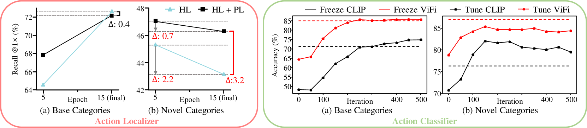
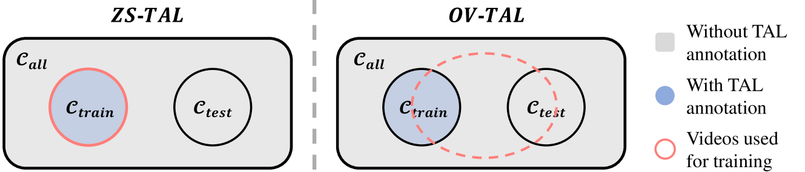
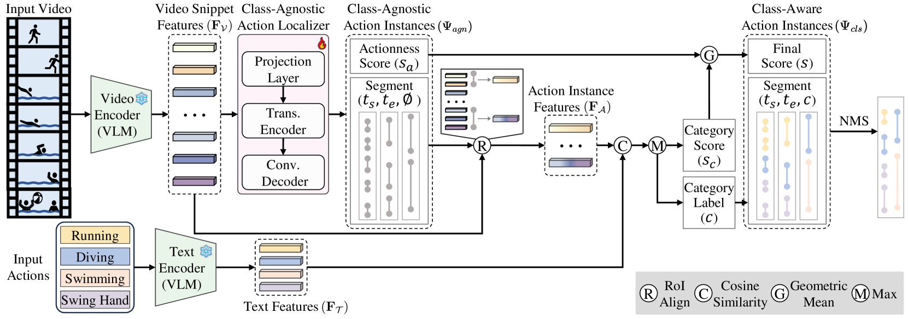
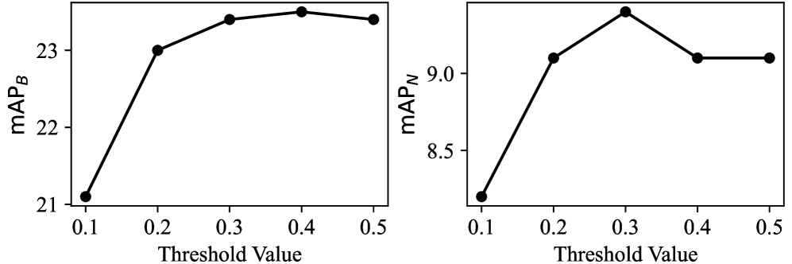
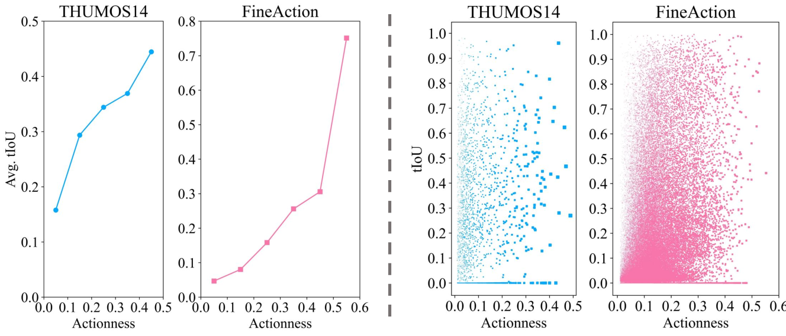

# 研究自训练方法在开放词汇时间动作定位任务中的扩展能力

发布时间：2024年07月09日

`LLM应用` `视频分析` `人工智能`

> Exploring Scalability of Self-Training for Open-Vocabulary Temporal Action Localization

# 摘要

> 时序动作定位 (TAL) 因缺乏大规模标注数据集而受限。为此，我们引入预训练视觉-语言模型 (如 CLIP) 进行开放词汇 TAL (OV-TAL)。但现有方法仍依赖小规模标注数据集。本文探索了利用未标注 YouTube 视频进行自训练的可扩展性，分两阶段：首先，训练类别无关定位器生成伪标签；然后，结合伪标签与标注数据集训练定位器。实验证明，利用网络视频自训练显著提升定位器泛化能力。同时，我们改进了评估方案。代码已发布。

> The vocabulary size in temporal action localization (TAL) is constrained by the scarcity of large-scale annotated datasets. To address this, recent works incorporate powerful pre-trained vision-language models (VLMs), such as CLIP, to perform open-vocabulary TAL (OV-TAL). However, unlike VLMs trained on extensive image/video-text pairs, existing OV-TAL methods still rely on small, fully labeled TAL datasets for training an action localizer. In this paper, we explore the scalability of self-training with unlabeled YouTube videos for OV-TAL. Our self-training approach consists of two stages. First, a class-agnostic action localizer is trained on a human-labeled TAL dataset and used to generate pseudo-labels for unlabeled videos. Second, the large-scale pseudo-labeled dataset is combined with the human-labeled dataset to train the localizer. Extensive experiments demonstrate that leveraging web-scale videos in self-training significantly enhances the generalizability of an action localizer. Additionally, we highlighted issues with existing OV-TAL evaluation schemes and proposed a new evaluation protocol. Code is released at https://github.com/HYUNJS/STOV-TAL

[Arxiv](https://arxiv.org/abs/2407.07024)