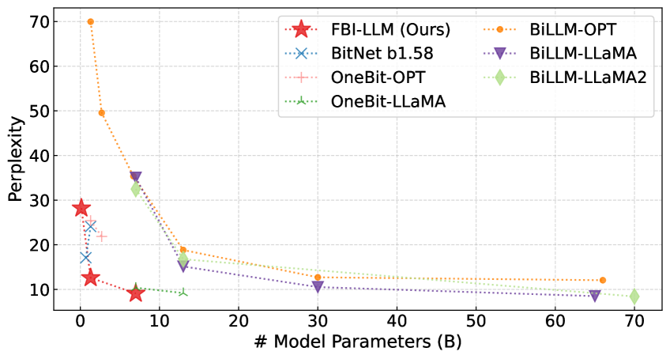
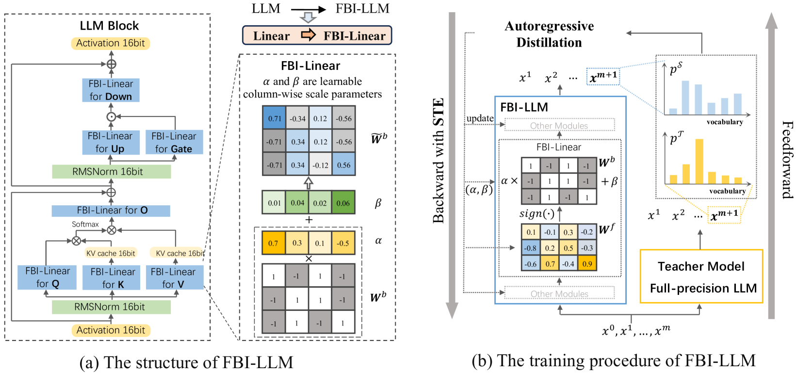
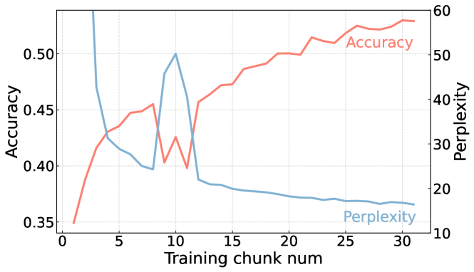
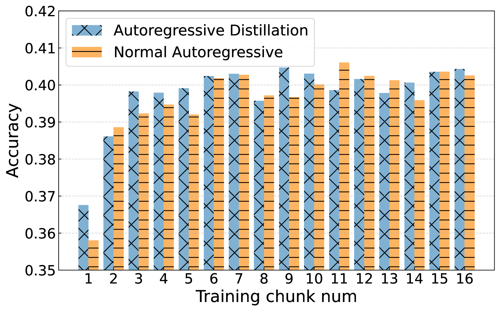
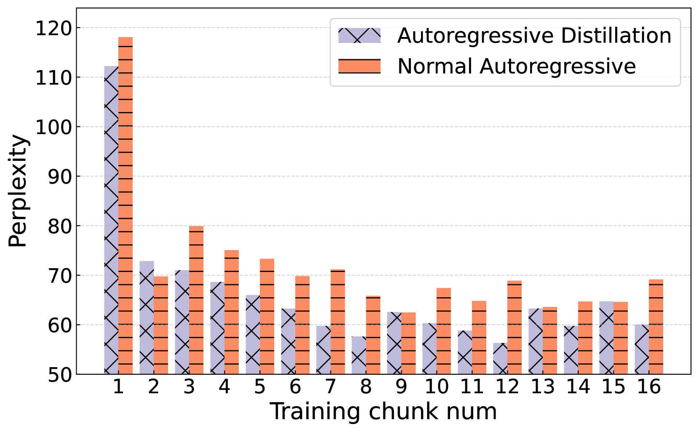
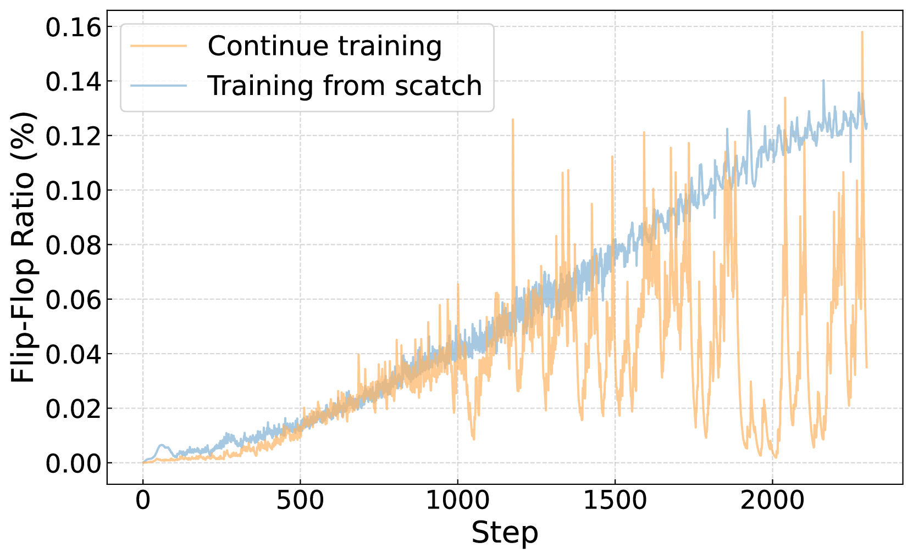
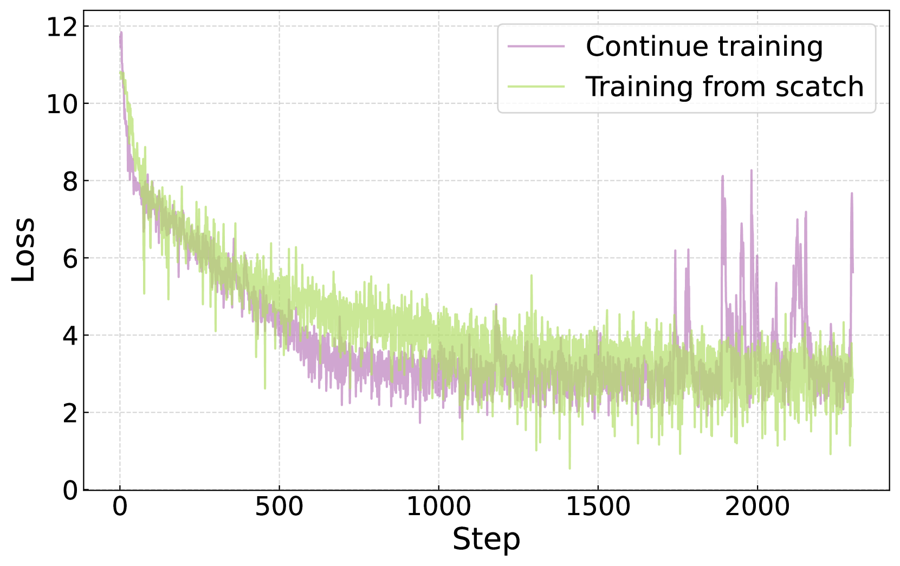
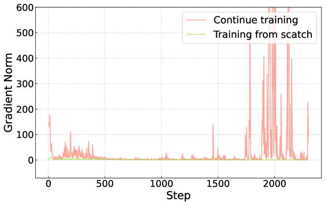
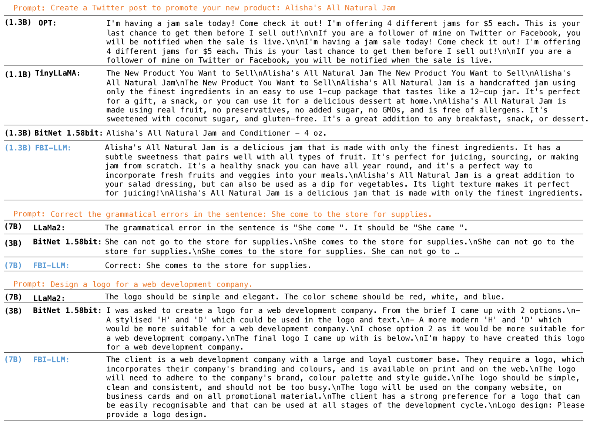

# FBI-LLM：借助自回归蒸馏技术，从零起步全面扩展二值化大型语言模型。

发布时间：2024年07月09日

`LLM理论` `计算机科学` `人工智能`

> FBI-LLM: Scaling Up Fully Binarized LLMs from Scratch via Autoregressive Distillation

# 摘要

> 本研究首次展示了如何从头开始训练全二值化大型语言模型（FBI-LLM），使其性能与基于transformer的全精度LLM相媲美。通过自回归蒸馏损失，我们保持了与常规LLM相同的模型规模和数据量，同时在困惑度和任务效果上表现出色。令人惊讶的是，预训练权重并非训练二值化LLM的必需品。这一发现不仅开启了新的计算框架，还可能推动未来为1位LLM定制硬件的设计。我们公开了所有模型、代码和数据集，以促进更广泛的研究探索。

> This work presents a Fully BInarized Large Language Model (FBI-LLM), demonstrating for the first time how to train a large-scale binary language model from scratch (not the partial binary or ternary LLM like BitNet b1.58) to match the performance of its full-precision counterparts (e.g., FP16 or BF16) in transformer-based LLMs. It achieves this by employing an autoregressive distillation (AD) loss with maintaining equivalent model dimensions (130M, 1.3B, 7B) and training data volume as regular LLM pretraining, while delivering competitive results in terms of perplexity and task-specific effectiveness. Intriguingly, by analyzing the training trajectory, we find that the pretrained weight is not necessary for training binarized LLMs from scratch. This research encourages a new computational framework and may facilitate the future design of specialized hardware tailored for fully 1-bit LLMs. We make all models, code, and training dataset fully accessible and transparent to support further research (Code: https://github.com/LiqunMa/FBI-LLM. Model: https://huggingface.co/LiqunMa/).

[Arxiv](https://arxiv.org/abs/2407.07093)