# FinCon：一款集成了概念性语言强化技术的合成 LLM 多智能体系统，旨在提升财务决策的精准度。

发布时间：2024年07月09日

`Agent` `投资管理`

> FinCon: A Synthesized LLM Multi-Agent System with Conceptual Verbal Reinforcement for Enhanced Financial Decision Making

# 摘要

> 大型语言模型（LLM）在处理复杂任务方面潜力巨大，广泛应用于金融领域。然而，高质量的连续金融投资决策依然充满挑战。这些任务要求智能系统与波动市场多次互动，以最大化回报并管理风险。尽管LLM已助力开发出超越人类的投资代理系统，但通过经验改进优化决策、增强信息合成的潜力尚未充分挖掘。为此，我们推出了FinCon，一个专为金融任务设计的LLM多代理框架，融入概念性口头强化。借鉴现实投资公司的有效组织结构，FinCon采用经理-分析师沟通层级，通过自然语言实现跨职能代理的协同合作，并赋予代理更大记忆容量。框架内置风险控制机制，定期自我批评以更新投资信念，提升决策质量。这些概念化信念作为未来行为的强化，精准传递至需更新的节点，既提升性能又降低通信成本。FinCon在单一股票交易和投资组合管理等金融任务中展现出卓越的泛化能力。

> Large language models (LLMs) have demonstrated notable potential in conducting complex tasks and are increasingly utilized in various financial applications. However, high-quality sequential financial investment decision-making remains challenging. These tasks require multiple interactions with a volatile environment for every decision, demanding sufficient intelligence to maximize returns and manage risks. Although LLMs have been used to develop agent systems that surpass human teams and yield impressive investment returns, opportunities to enhance multi-sourced information synthesis and optimize decision-making outcomes through timely experience refinement remain unexplored. Here, we introduce the FinCon, an LLM-based multi-agent framework with CONceptual verbal reinforcement tailored for diverse FINancial tasks. Inspired by effective real-world investment firm organizational structures, FinCon utilizes a manager-analyst communication hierarchy. This structure allows for synchronized cross-functional agent collaboration towards unified goals through natural language interactions and equips each agent with greater memory capacity than humans. Additionally, a risk-control component in FinCon enhances decision quality by episodically initiating a self-critiquing mechanism to update systematic investment beliefs. The conceptualized beliefs serve as verbal reinforcement for the future agent's behavior and can be selectively propagated to the appropriate node that requires knowledge updates. This feature significantly improves performance while reducing unnecessary peer-to-peer communication costs. Moreover, FinCon demonstrates strong generalization capabilities in various financial tasks, including single stock trading and portfolio management.

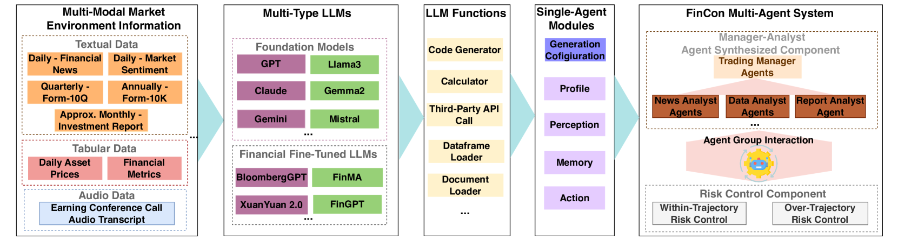

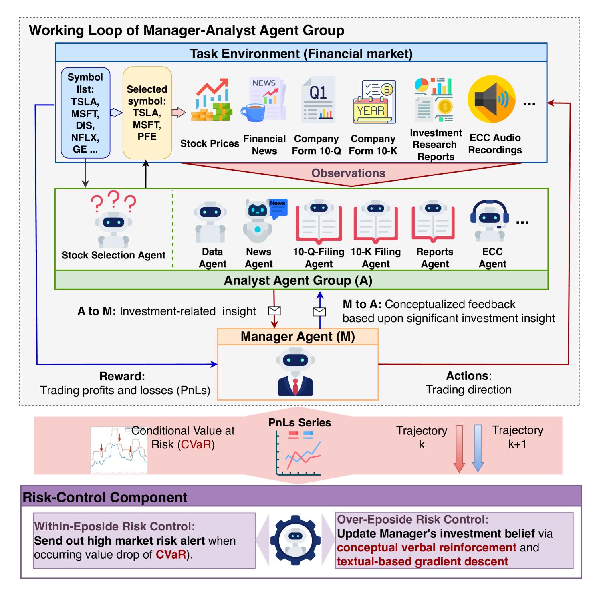

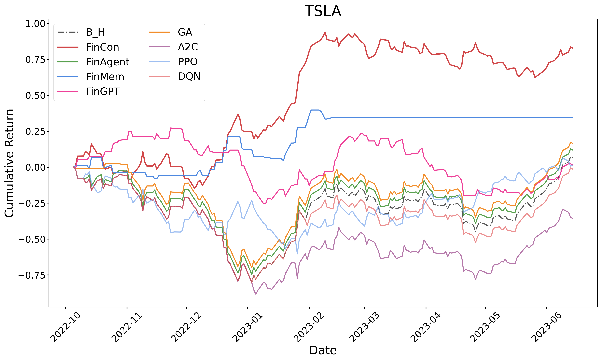

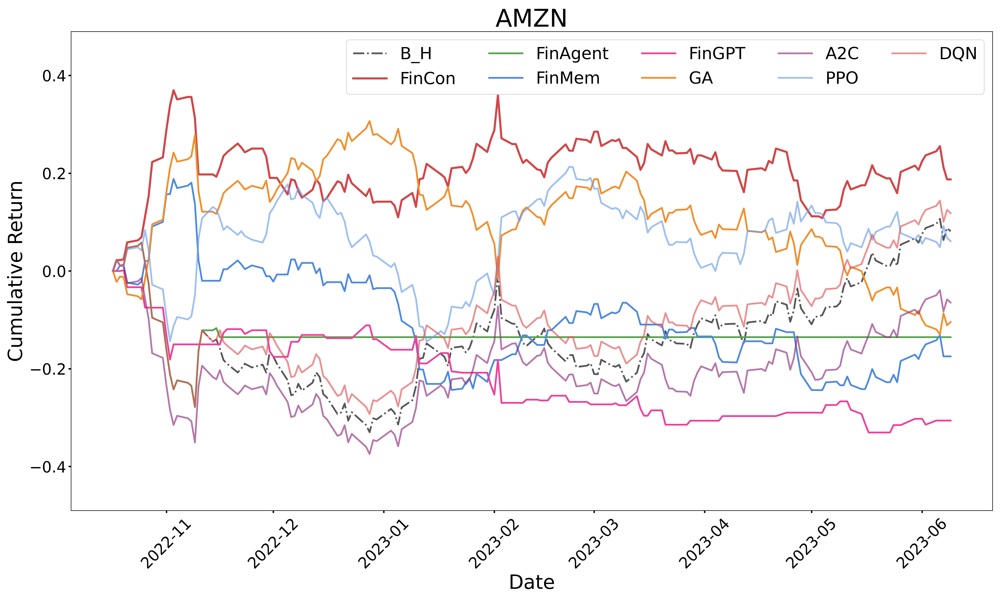

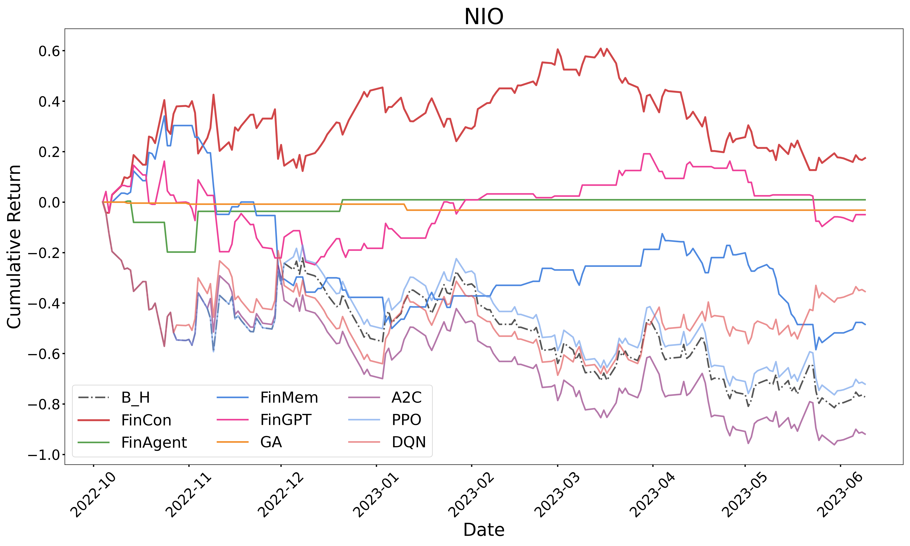

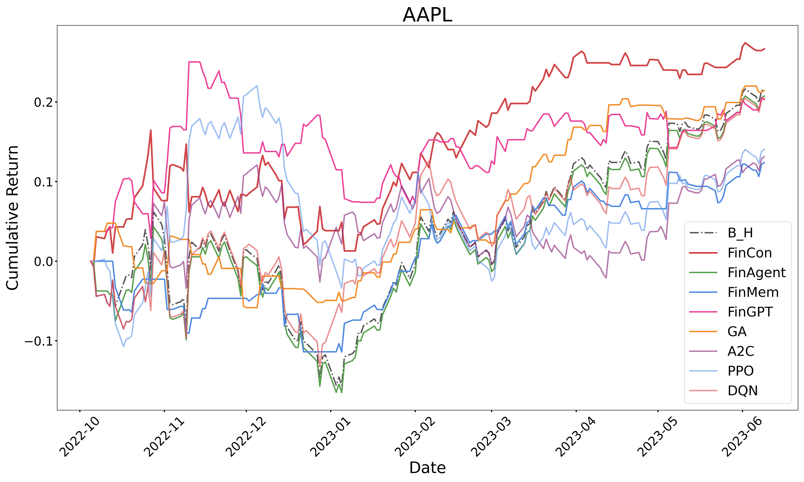

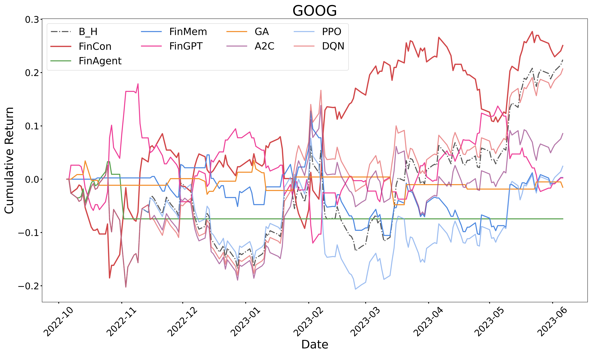

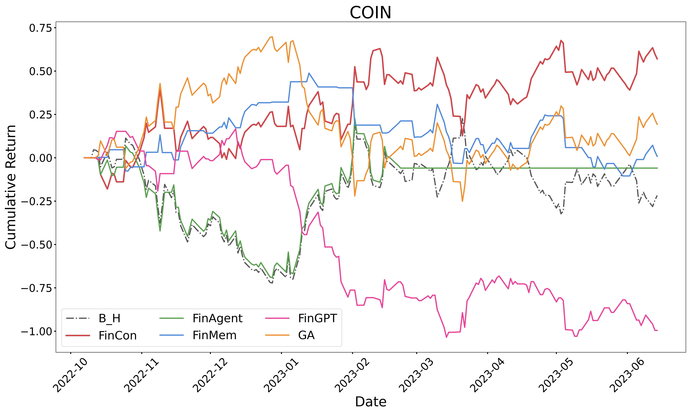

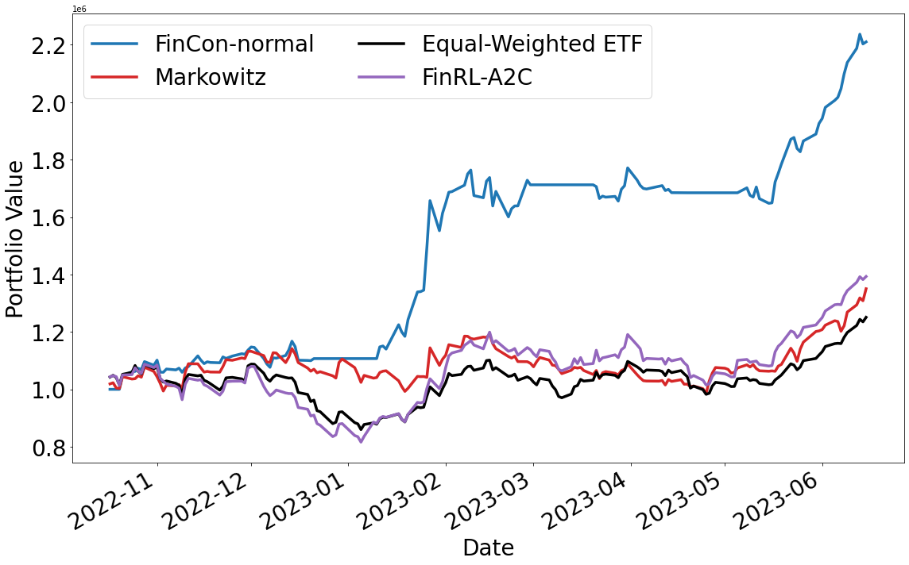

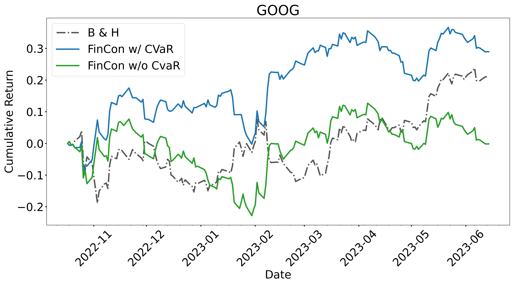

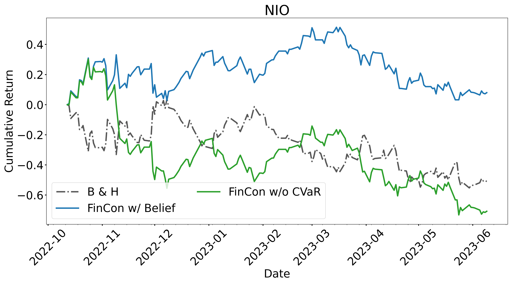

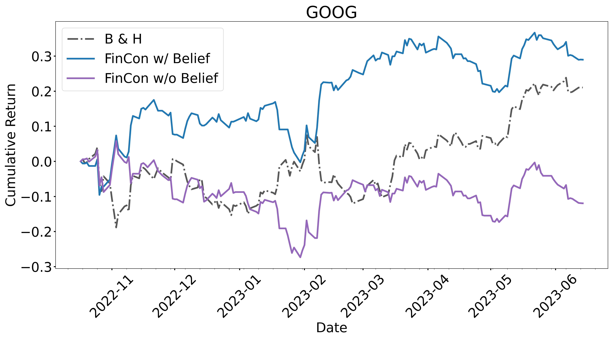

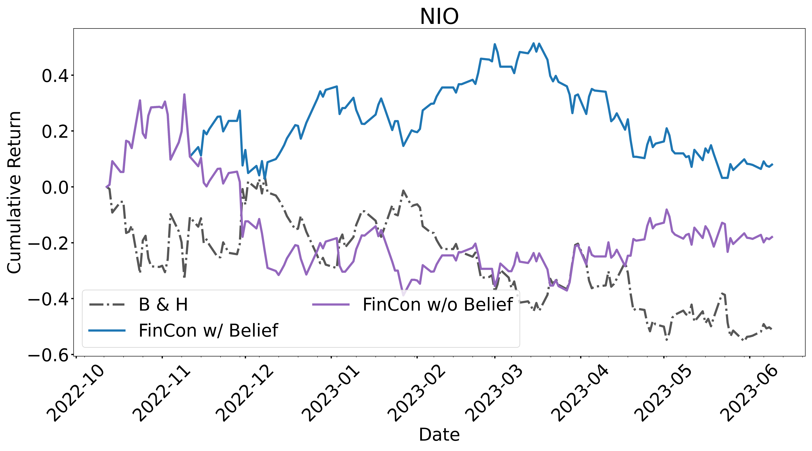

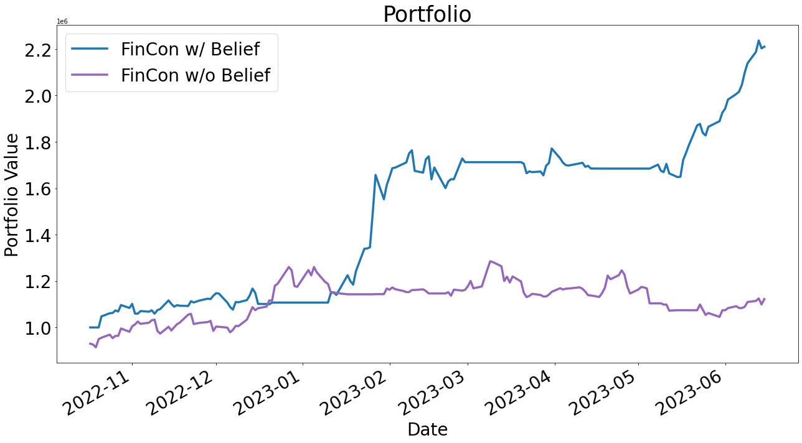

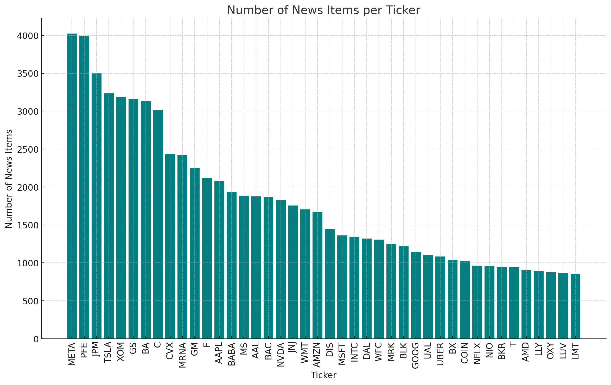

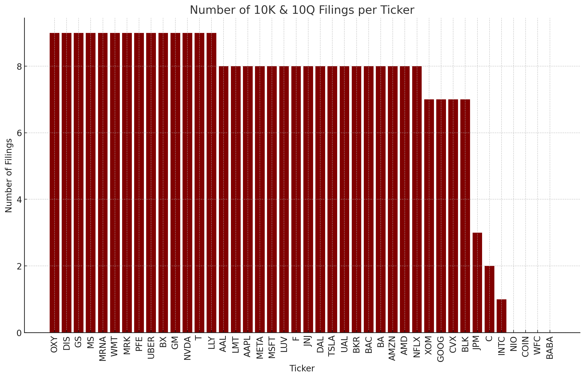

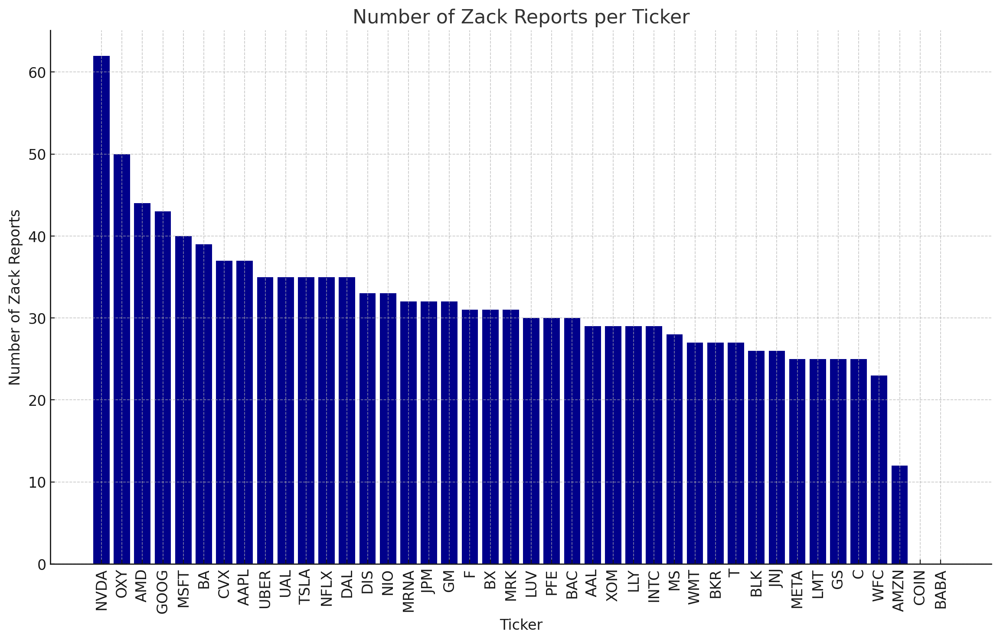

[Arxiv](https://arxiv.org/abs/2407.06567)