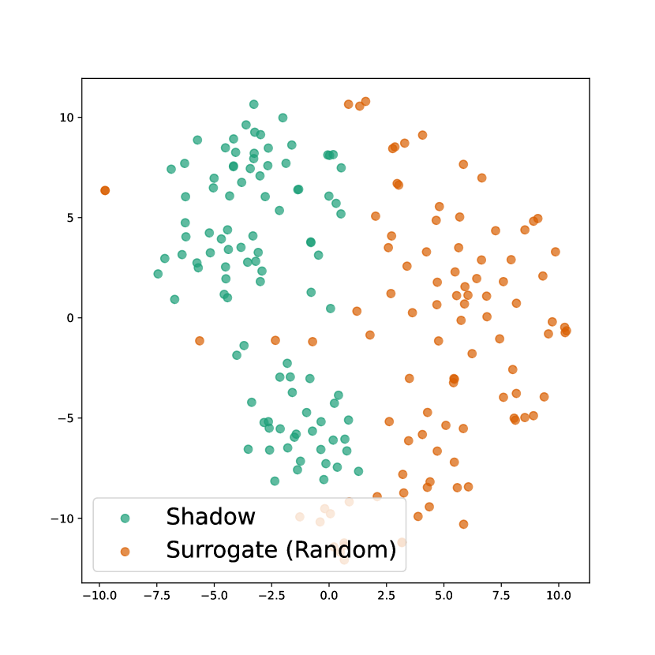

# ICLGuard：调控 In-Context Learning 行为，确保适用性授权

发布时间：2024年07月09日

`LLM应用` `人工智能` `网络安全`

> ICLGuard: Controlling In-Context Learning Behavior for Applicability Authorization

# 摘要

> ICL 是 LLM 的一项创新功能，允许用户无需更新模型即可执行新任务。用户通过结合少量示例和测试输入，在推理时完成任务，这种方式比传统微调更灵活。但这也带来了风险，如用户可能无限制地使用模型处理敏感内容，这可能违反政策或损害所有者利益。因此，我们提出了“适用性授权”概念和 ICLGuard 框架，帮助模型所有者控制 ICL 行为。ICLGuard 通过微调少量参数，确保 LLM 在特定数据上停用 ICL 功能，同时不影响其在其他数据上的表现和整体性能。

> In-context learning (ICL) is a recent advancement in the capabilities of large language models (LLMs). This feature allows users to perform a new task without updating the model. Concretely, users can address tasks during the inference time by conditioning on a few input-label pair demonstrations along with the test input. It is different than the conventional fine-tuning paradigm and offers more flexibility. However, this capability also introduces potential issues. For example, users may use the model on any data without restriction, such as performing tasks with improper or sensitive content, which might violate the model policy or conflict with the model owner's interests. As a model owner, it is crucial to establish a mechanism to control the model's behavior under ICL, depending on the model owner's requirements for various content. To this end, we introduce the concept of "applicability authorization" tailored for LLMs, particularly for ICL behavior, and propose a simple approach, ICLGuard. It is a fine-tuning framework designed to allow the model owner to regulate ICL behavior on different data. ICLGuard preserves the original LLM and fine-tunes only a minimal set of additional trainable parameters to "guard" the LLM. Empirical results show that the guarded LLM can deactivate its ICL ability on target data without affecting its ICL ability on other data and its general functionality across all data.

[Arxiv](https://arxiv.org/abs/2407.06955)