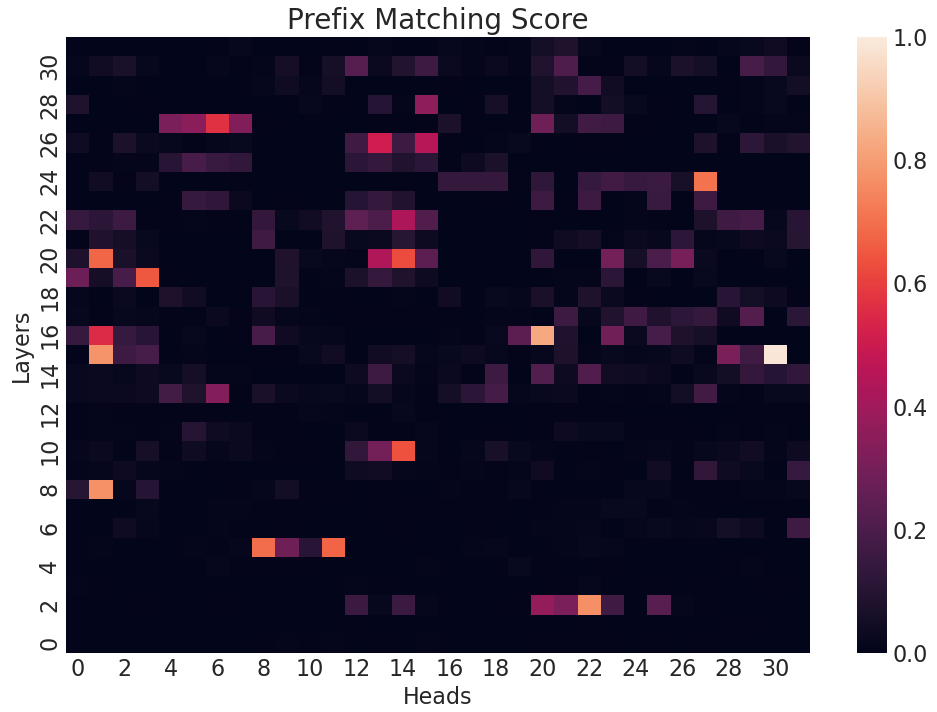
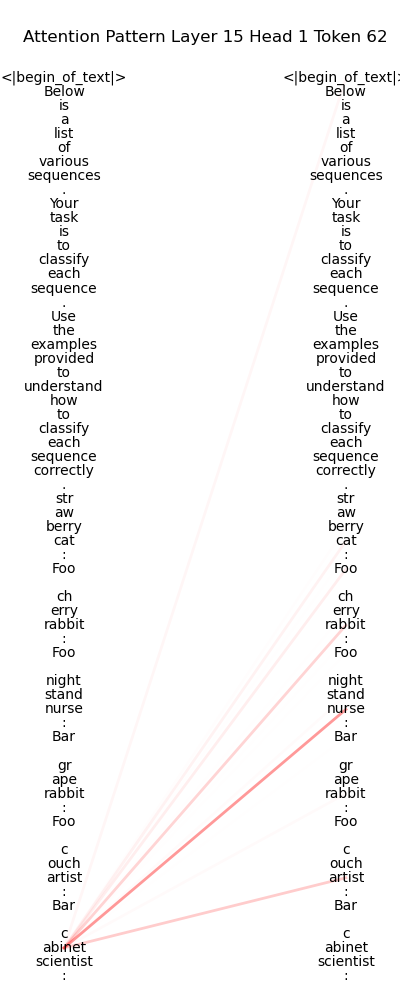
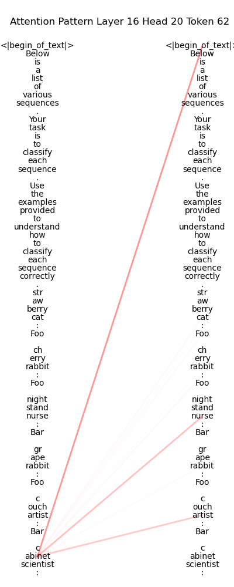
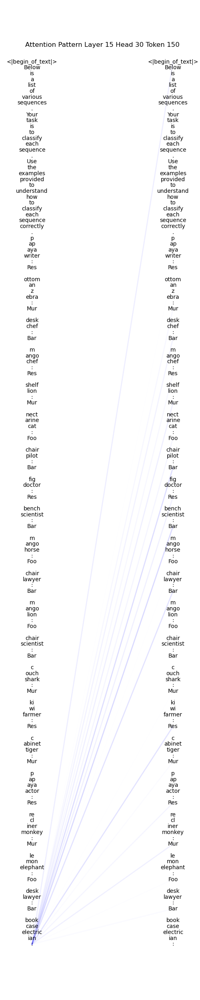
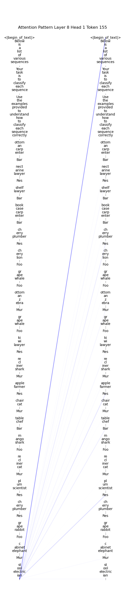
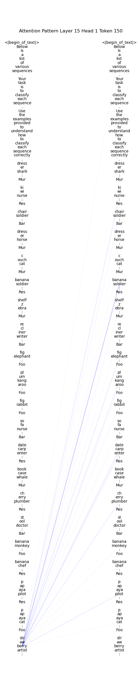
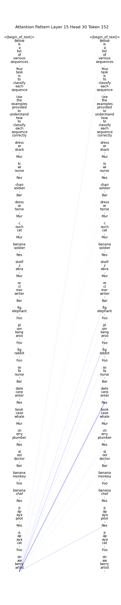

# 诱导头：上下文学习中模式匹配的核心机制

发布时间：2024年07月09日

`LLM理论` `人工智能`

> Induction Heads as an Essential Mechanism for Pattern Matching in In-context Learning

# 摘要

> 大型语言模型 (LLM) 通过 in-context learning (ICL) 展现了出色的学习和执行复杂任务的能力。然而，其内部机制的全面理解仍有待深入。本文深入探讨了 few-shot ICL 中 induction heads 的关键作用。我们针对 Llama-3-8B 和 InternLM2-20B 这两大顶尖模型，在抽象模式识别和 NLP 任务上进行了细致分析。结果表明，即便轻微调整 induction heads，也会导致抽象模式识别任务的 ICL 性能大幅下滑至接近随机水平，高达 ~32%。在 NLP 任务中，这种调整同样显著削弱了模型从示例中学习的能力，使得 few-shot ICL 性能与零-shot prompts 相当。此外，我们通过 attention knockout 技术，精准禁用特定 induction 模式，从而揭示了 induction 机制在 ICL 中的具体作用。

> Large language models (LLMs) have shown a remarkable ability to learn and perform complex tasks through in-context learning (ICL). However, a comprehensive understanding of its internal mechanisms is still lacking. This paper explores the role of induction heads in a few-shot ICL setting. We analyse two state-of-the-art models, Llama-3-8B and InternLM2-20B on abstract pattern recognition and NLP tasks. Our results show that even a minimal ablation of induction heads leads to ICL performance decreases of up to ~32% for abstract pattern recognition tasks, bringing the performance close to random. For NLP tasks, this ablation substantially decreases the model's ability to benefit from examples, bringing few-shot ICL performance close to that of zero-shot prompts. We further use attention knockout to disable specific induction patterns, and present fine-grained evidence for the role that the induction mechanism plays in ICL.

[Arxiv](https://arxiv.org/abs/2407.07011)