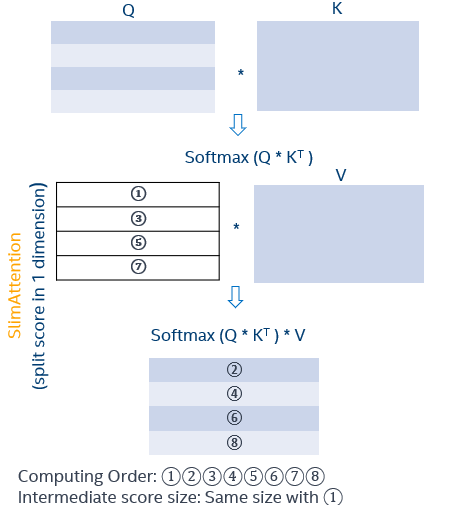
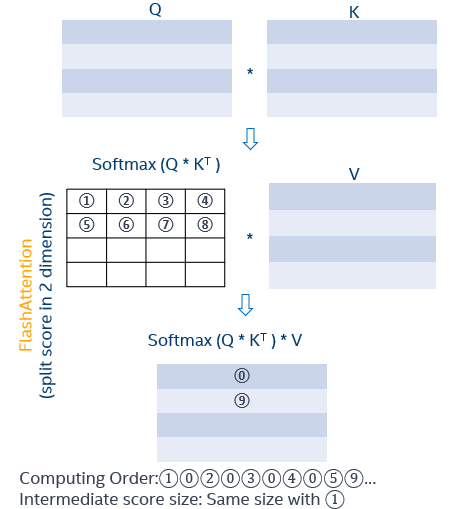
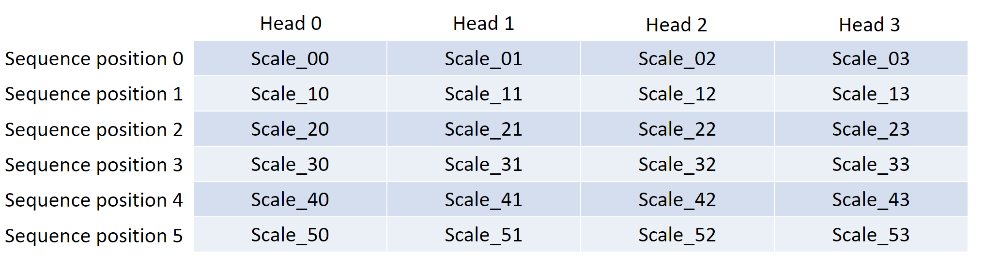
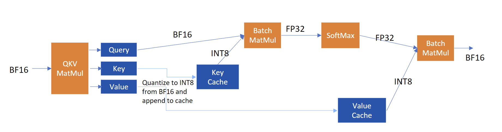
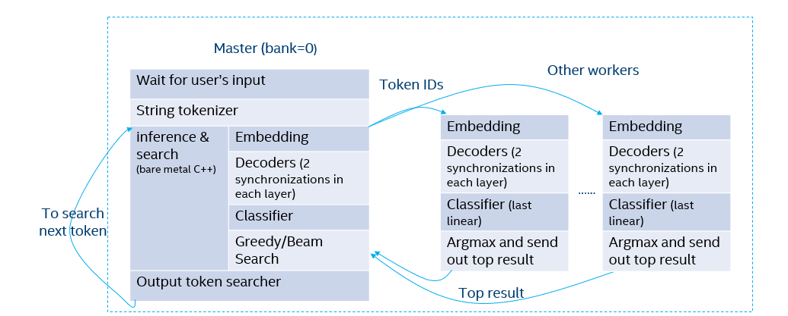

# CPU环境下大型语言模型的推理性能优化

发布时间：2024年07月09日

`LLM应用` `计算机硬件` `软件优化`

> Inference Performance Optimization for Large Language Models on CPUs

# 摘要

> 大型语言模型（LLM）在多任务中表现卓越，但在资源有限的环境中部署高性能LLM备受关注。面对GPU资源限制，我们转向CPU寻求解决方案。本文提出一种简便的推理性能优化方案，旨在CPU上加速LLM，通过精简KV缓存同时保持精度。我们采用分布式推理优化策略，并依托oneAPI集体通信库实现。此外，针对常用模型进行定制优化，相关代码已在GitHub开源，地址为https://github.com/intel/xFasterTransformer。

> Large language models (LLMs) have shown exceptional performance and vast potential across diverse tasks. However, the deployment of LLMs with high performance in low-resource environments has garnered significant attention in the industry. When GPU hardware resources are limited, we can explore alternative options on CPUs. To mitigate the financial burden and alleviate constraints imposed by hardware resources, optimizing inference performance is necessary. In this paper, we introduce an easily deployable inference performance optimization solution aimed at accelerating LLMs on CPUs. In this solution, we implement an effective way to reduce the KV cache size while ensuring precision. We propose a distributed inference optimization approach and implement it based on oneAPI Collective Communications Library. Furthermore, we propose optimization approaches for LLMs on CPU, and conduct tailored optimizations for the most commonly used models. The code is open-sourced at https://github.com/intel/xFasterTransformer.

[Arxiv](https://arxiv.org/abs/2407.07304)