# 互联网代理网络：构建一个多元化的代理网络，以促进智能协作

发布时间：2024年07月09日

`Agent` `人工智能` `互联网`

> Internet of Agents: Weaving a Web of Heterogeneous Agents for Collaborative Intelligence

# 摘要

> 随着大型语言模型的飞速进步，高度自主的智能代理应运而生。然而，现有框架在整合第三方代理和模拟分布式环境方面存在局限，且通信方式僵化。为此，我们创新性地提出了“代理互联网”(IoA) 框架，它不仅灵活可扩展，还引入了即时通讯风格的架构和动态协作机制。实验证明，IoA 在各类任务中表现卓越，有效促进了异构代理间的协同。这一框架如同互联网般，让代理们无缝协作，共同迈向更高智能。项目代码已公开于 \url{https://github.com/OpenBMB/IoA}。

> The rapid advancement of large language models (LLMs) has paved the way for the development of highly capable autonomous agents. However, existing multi-agent frameworks often struggle with integrating diverse capable third-party agents due to reliance on agents defined within their own ecosystems. They also face challenges in simulating distributed environments, as most frameworks are limited to single-device setups. Furthermore, these frameworks often rely on hard-coded communication pipelines, limiting their adaptability to dynamic task requirements. Inspired by the concept of the Internet, we propose the Internet of Agents (IoA), a novel framework that addresses these limitations by providing a flexible and scalable platform for LLM-based multi-agent collaboration. IoA introduces an agent integration protocol, an instant-messaging-like architecture design, and dynamic mechanisms for agent teaming and conversation flow control. Through extensive experiments on general assistant tasks, embodied AI tasks, and retrieval-augmented generation benchmarks, we demonstrate that IoA consistently outperforms state-of-the-art baselines, showcasing its ability to facilitate effective collaboration among heterogeneous agents. IoA represents a step towards linking diverse agents in an Internet-like environment, where agents can seamlessly collaborate to achieve greater intelligence and capabilities. Our codebase has been released at \url{https://github.com/OpenBMB/IoA}.

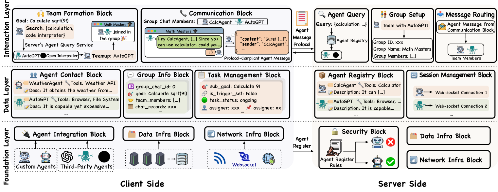

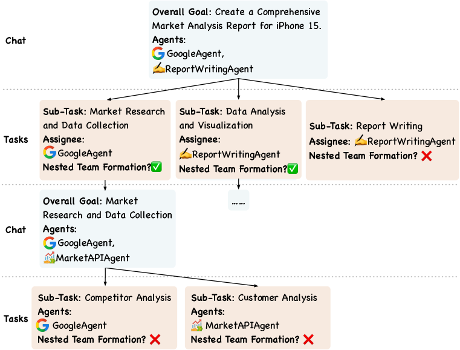

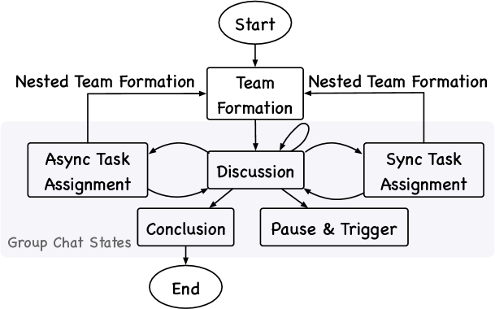

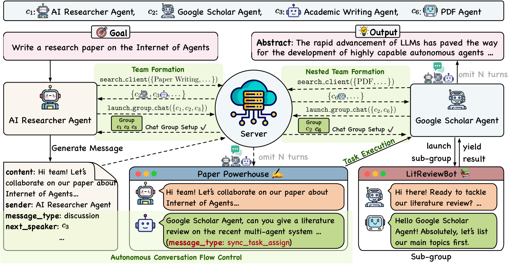

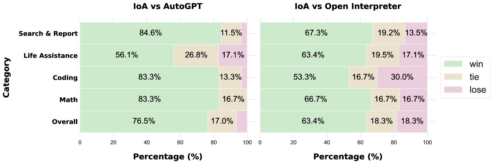

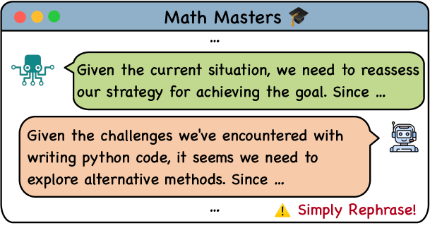

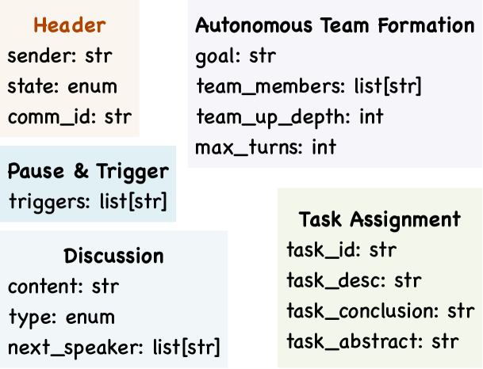

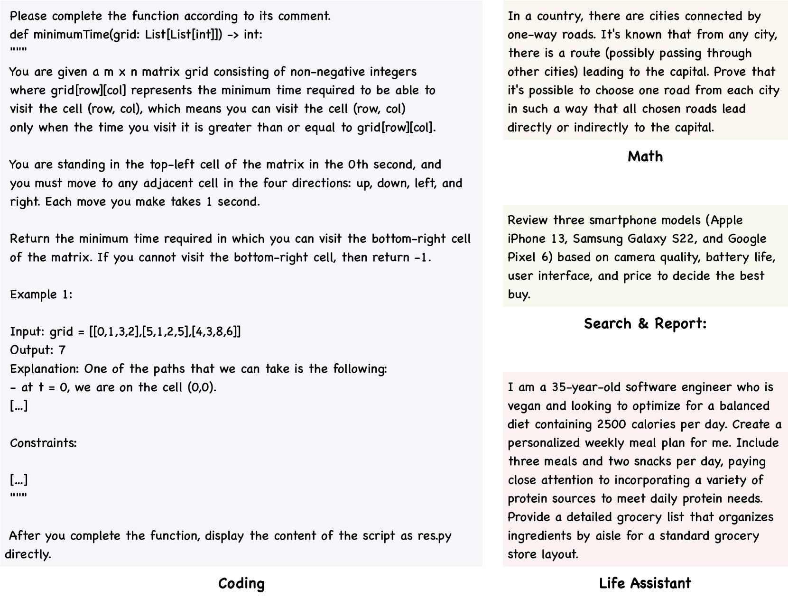

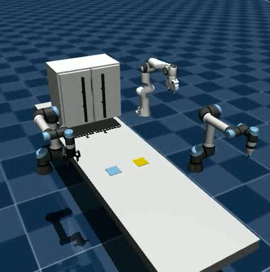

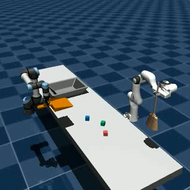

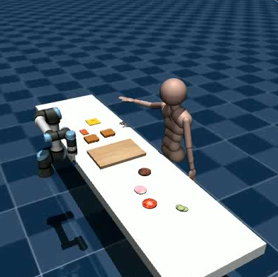

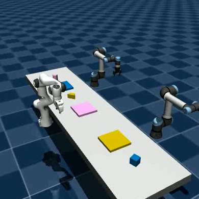

[Arxiv](https://arxiv.org/abs/2407.07061)