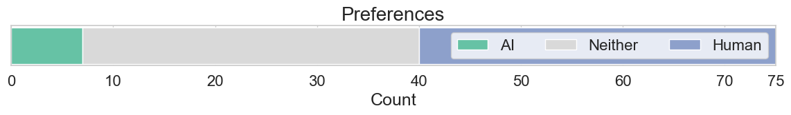
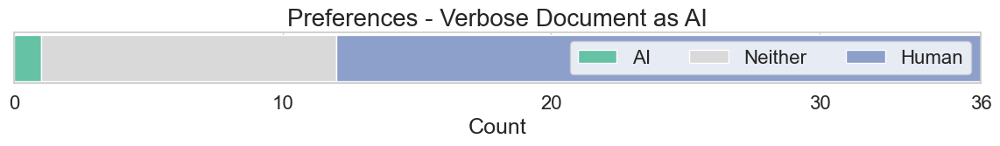
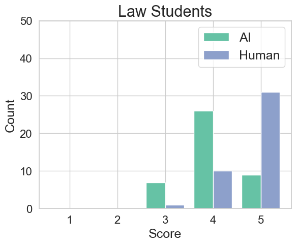

# AI撰写的文件，律师们总觉得不靠谱：探讨律师对LLM与人类作者文件的偏好差异

发布时间：2024年07月09日

`LLM应用` `人工智能`

> It Cannot Be Right If It Was Written by AI: On Lawyers' Preferences of Documents Perceived as Authored by an LLM vs a Human

# 摘要

> 大型语言模型（LLM）预示着一个未来，其中某些法律文件可能实现自动化生成。这不仅有望简化法律流程、降低服务成本，还能大幅提升司法可及性。尽管众多研究者致力于开发和评估基于LLM的法律应用，但鲜有研究探讨法律专业人士对AI生成内容的看法。这一视角至关重要，因为过度依赖或无端怀疑可能影响这些文件的法律效力。本研究深入探讨了75名律师对法律文件的感知，分析了他们基于文件来源（人工或AI）的不同评价。结果显示，律师们更偏爱人工制作的文件，尽管他们也期待未来文件的自动化生成。这些见解为法律界、政策制定者及立法者提供了宝贵的参考，有助于他们负责任地采纳新技术，并推动法律流程的现代化改革。

> Large Language Models (LLMs) enable a future in which certain types of legal documents may be generated automatically. This has a great potential to streamline legal processes, lower the cost of legal services, and dramatically increase access to justice. While many researchers focus their efforts on proposing and evaluating LLM-based applications supporting tasks in the legal domain, there is a notable lack of investigations into how legal professionals perceive content if they believe it has been generated by an LLM. Yet, this is a critical point as over-reliance or unfounded skepticism may influence whether such documents bring about appropriate legal consequences. This study is the necessary analysis in the context of the ongoing transition towards mature generative AI systems. Specifically, we examined whether the perception of legal documents' by lawyers (n=75) varies based on their assumed origin (human-crafted vs AI-generated). The participants evaluated the documents focusing on their correctness and language quality. Our analysis revealed a clear preference for documents perceived as crafted by a human over those believed to be generated by AI. At the same time, most of the participants are expecting the future in which documents will be generated automatically. These findings could be leveraged by legal practitioners, policy makers and legislators to implement and adopt legal document generation technology responsibly, and to fuel the necessary discussions into how legal processes should be updated to reflect the recent technological developments.

[Arxiv](https://arxiv.org/abs/2407.06798)