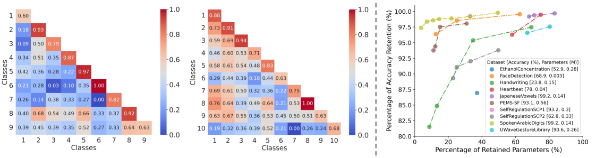

# LETS-C：借助语言嵌入技术，革新时间序列分类方法

发布时间：2024年07月09日

`LLM应用` `时间序列分析` `机器学习`

> LETS-C: Leveraging Language Embedding for Time Series Classification

# 摘要

> 近期，语言模型在处理时间序列数据方面展现出显著成效。特别是，通过微调预训练的大型语言模型（LLM）进行时间序列分类，已在多项基准测试中达到顶尖水平。但这些模型因庞大的参数规模（数百万可训练参数）而显得笨重。为此，我们提出新策略：采用语言嵌入模型处理时间序列，并结合卷积神经网络（CNN）与多层感知器（MLP）构成的简洁分类头。实验证明，LETS-C不仅在准确度上超越现有最佳模型，更以平均仅14.5%的参数量，实现了轻量化。这表明，结合语言编码器与高效分类头，是实现高效且轻巧时间序列分类的可行路径。

> Recent advancements in language modeling have shown promising results when applied to time series data. In particular, fine-tuning pre-trained large language models (LLMs) for time series classification tasks has achieved state-of-the-art (SOTA) performance on standard benchmarks. However, these LLM-based models have a significant drawback due to the large model size, with the number of trainable parameters in the millions. In this paper, we propose an alternative approach to leveraging the success of language modeling in the time series domain. Instead of fine-tuning LLMs, we utilize a language embedding model to embed time series and then pair the embeddings with a simple classification head composed of convolutional neural networks (CNN) and multilayer perceptron (MLP). We conducted extensive experiments on well-established time series classification benchmark datasets. We demonstrated LETS-C not only outperforms the current SOTA in classification accuracy but also offers a lightweight solution, using only 14.5% of the trainable parameters on average compared to the SOTA model. Our findings suggest that leveraging language encoders to embed time series data, combined with a simple yet effective classification head, offers a promising direction for achieving high-performance time series classification while maintaining a lightweight model architecture.

[Arxiv](https://arxiv.org/abs/2407.06533)