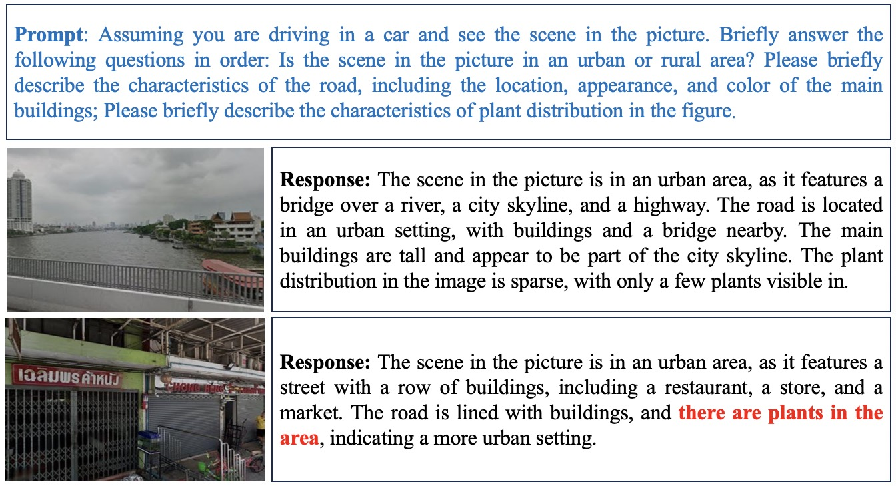
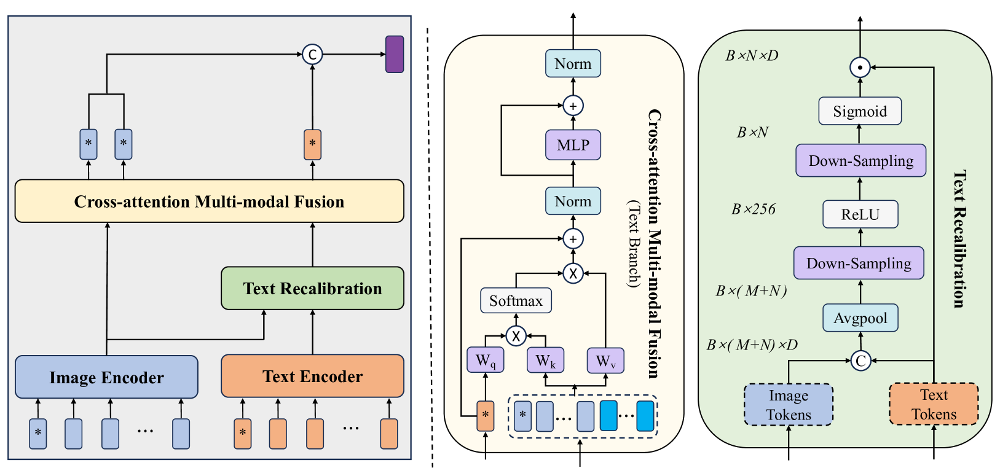
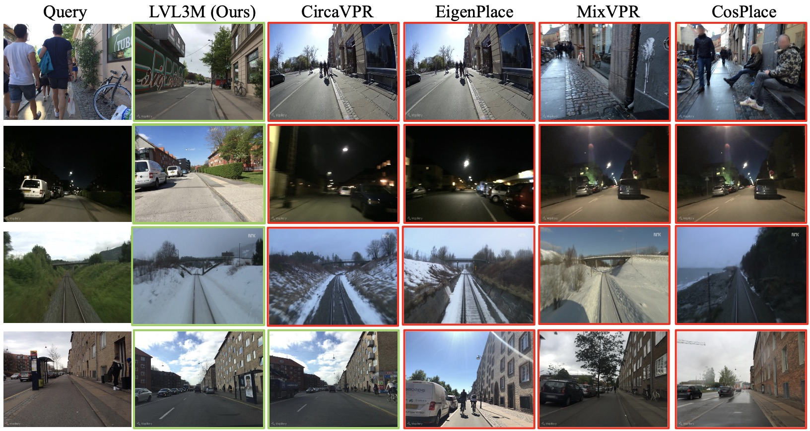
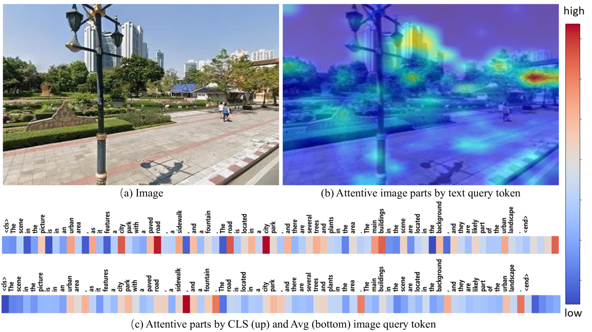
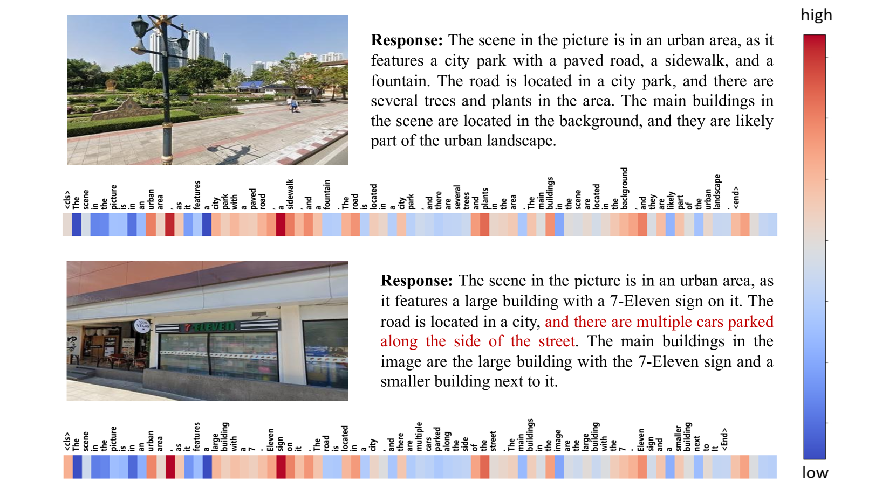
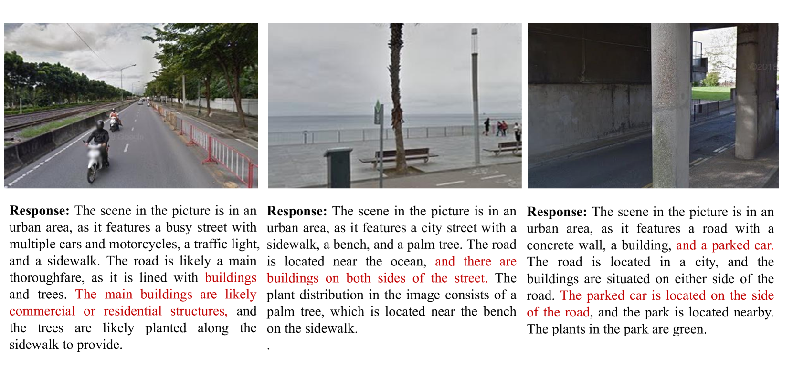
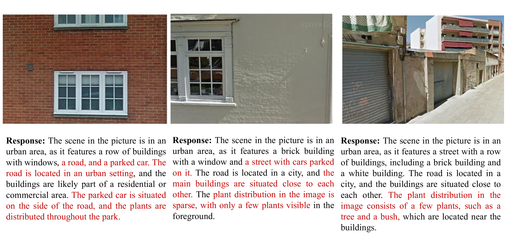

# 借助 LVLM 的多模态表示学习在视觉地点识别中的应用

发布时间：2024年07月09日

`LLM应用` `计算机视觉` `自动驾驶`

> LVLM-empowered Multi-modal Representation Learning for Visual Place Recognition

# 摘要

> 视觉地点识别（VPR）因视角和外观的显著变化而充满挑战。主流方法通过将深度特征转化为鲁健紧凑的全局表示来应对。然而，在复杂条件下，这些方法难以取得理想效果。我们另辟蹊径，尝试通过融合图像与场景描述的文本，构建更具辨别力的全局表示。这一创新基于两大动机：一是大型视觉-语言模型（LVLMs）在视觉指令跟随中展现出卓越能力，能高效生成图像描述；二是文本描述提供的高级场景理解对环境变化具有强鲁棒性。尽管前景光明，但高效融合多模态数据仍是一大挑战，且LVLMs生成的描述可能存在不准确性。为此，我们提出了一种创新的多模态VPR方案。该方案首先利用预训练的视觉与语言模型提取图像和文本特征，再通过特征组合器相互增强。特征组合器核心包括令牌级注意力块和交叉注意力融合模块，前者根据文本与图像的相关性自适应调整，后者高效跨模态传播信息。最终，增强的多模态特征被压缩成特征描述符，用于检索。实验表明，我们的方法在更小的图像描述符维度下，显著超越了现有技术。

> Visual place recognition (VPR) remains challenging due to significant viewpoint changes and appearance variations. Mainstream works tackle these challenges by developing various feature aggregation methods to transform deep features into robust and compact global representations. Unfortunately, satisfactory results cannot be achieved under challenging conditions. We start from a new perspective and attempt to build a discriminative global representations by fusing image data and text descriptions of the the visual scene. The motivation is twofold: (1) Current Large Vision-Language Models (LVLMs) demonstrate extraordinary emergent capability in visual instruction following, and thus provide an efficient and flexible manner in generating text descriptions of images; (2) The text descriptions, which provide high-level scene understanding, show strong robustness against environment variations. Although promising, leveraging LVLMs to build multi-modal VPR solutions remains challenging in efficient multi-modal fusion. Furthermore, LVLMs will inevitably produces some inaccurate descriptions, making it even harder. To tackle these challenges, we propose a novel multi-modal VPR solution. It first adapts pre-trained visual and language foundation models to VPR for extracting image and text features, which are then fed into the feature combiner to enhance each other. As the main component, the feature combiner first propose a token-wise attention block to adaptively recalibrate text tokens according to their relevance to the image data, and then develop an efficient cross-attention fusion module to propagate information across different modalities. The enhanced multi-modal features are compressed into the feature descriptor for performing retrieval. Experimental results show that our method outperforms state-of-the-art methods by a large margin with significantly smaller image descriptor dimension.

[Arxiv](https://arxiv.org/abs/2407.06730)