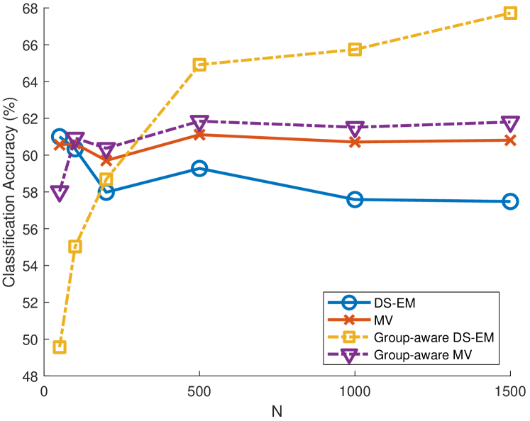

# 众包噪声标签学习：信号处理新视角

发布时间：2024年07月09日

`LLM应用` `人工智能` `机器学习`

> Learning From Crowdsourced Noisy Labels: A Signal Processing Perspective

# 摘要

> AI与ML的迅猛发展得益于海量精选数据集的普及。众包作为一种常见手段，将数据分发给众多标注者，其产出标签随后融合，支撑下游学习与推理任务。然而，由于标注者专业性或可靠性不足等原因，此过程常产生噪声标签。因此，众包的核心任务之一便是研发策略，有效缓解标签噪声对学习任务的负面影响。本文聚焦于从噪声众包标签中学习的最新进展，涵盖从经典统计模型到深度学习方法的关键众包模型及其方法论，强调分析洞察与算法创新。特别地，本文探讨了信号处理理论与方法，如张量与非负矩阵分解的可识别性，以及针对众包长期难题的新颖解决方案，揭示了信号处理视角如何引领该领域的前进。同时，本文还触及了强化学习中的人类反馈（RLHF）与直接偏好优化（DPO）等前沿议题，这些技术对于微调大型语言模型（LLMs）至关重要。

> One of the primary catalysts fueling advances in artificial intelligence (AI) and machine learning (ML) is the availability of massive, curated datasets. A commonly used technique to curate such massive datasets is crowdsourcing, where data are dispatched to multiple annotators. The annotator-produced labels are then fused to serve downstream learning and inference tasks. This annotation process often creates noisy labels due to various reasons, such as the limited expertise, or unreliability of annotators, among others. Therefore, a core objective in crowdsourcing is to develop methods that effectively mitigate the negative impact of such label noise on learning tasks. This feature article introduces advances in learning from noisy crowdsourced labels. The focus is on key crowdsourcing models and their methodological treatments, from classical statistical models to recent deep learning-based approaches, emphasizing analytical insights and algorithmic developments. In particular, this article reviews the connections between signal processing (SP) theory and methods, such as identifiability of tensor and nonnegative matrix factorization, and novel, principled solutions of longstanding challenges in crowdsourcing -- showing how SP perspectives drive the advancements of this field. Furthermore, this article touches upon emerging topics that are critical for developing cutting-edge AI/ML systems, such as crowdsourcing in reinforcement learning with human feedback (RLHF) and direct preference optimization (DPO) that are key techniques for fine-tuning large language models (LLMs).

[Arxiv](https://arxiv.org/abs/2407.06902)