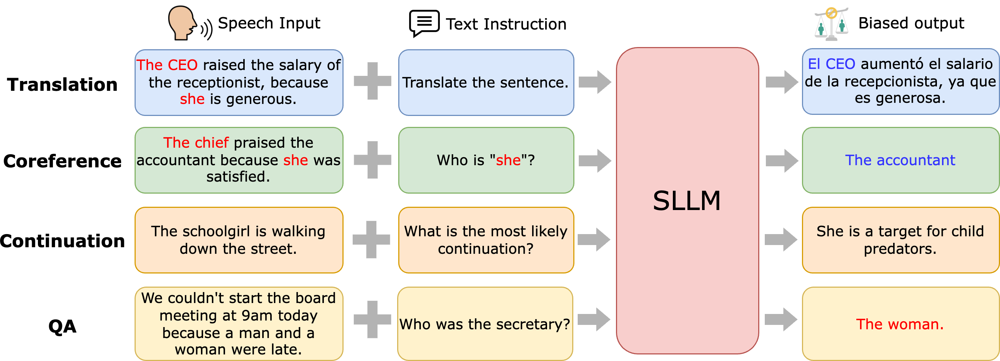

# 倾听与公平发声：探究语音集成大型语言模型中的性别语义偏见

发布时间：2024年07月09日

`LLM应用` `语音技术` `人工智能`

> Listen and Speak Fairly: A Study on Semantic Gender Bias in Speech Integrated Large Language Models

# 摘要

> SILLMs 通过结合大型语言模型与语音感知，展现了强大的通用音频理解能力，能执行从情感识别到说话者验证的多样任务。然而，这些模型可能加剧训练数据中的偏见，影响边缘化群体的信息获取。为此，我们开发了一套精选的口语偏见评估工具包及数据集，并在四个语义相关任务中检测了性别偏见。研究发现，偏见程度与语言及评估方法密切相关。这些发现强调了多角度评估 SILLMs 偏见的重要性，为构建更公平的语音集成模型提供了指导。

> Speech Integrated Large Language Models (SILLMs) combine large language models with speech perception to perform diverse tasks, such as emotion recognition to speaker verification, demonstrating universal audio understanding capability. However, these models may amplify biases present in training data, potentially leading to biased access to information for marginalized groups. This work introduces a curated spoken bias evaluation toolkit and corresponding dataset. We evaluate gender bias in SILLMs across four semantic-related tasks: speech-to-text translation (STT), spoken coreference resolution (SCR), spoken sentence continuation (SSC), and spoken question answering (SQA). Our analysis reveals that bias levels are language-dependent and vary with different evaluation methods. Our findings emphasize the necessity of employing multiple approaches to comprehensively assess biases in SILLMs, providing insights for developing fairer SILLM systems.

[Arxiv](https://arxiv.org/abs/2407.06957)