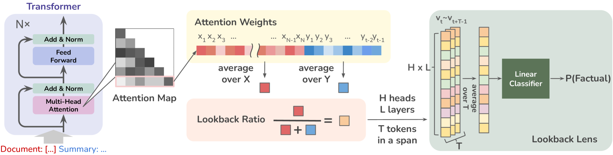
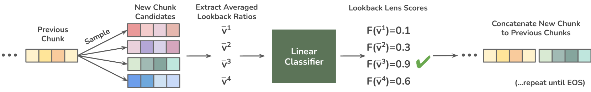
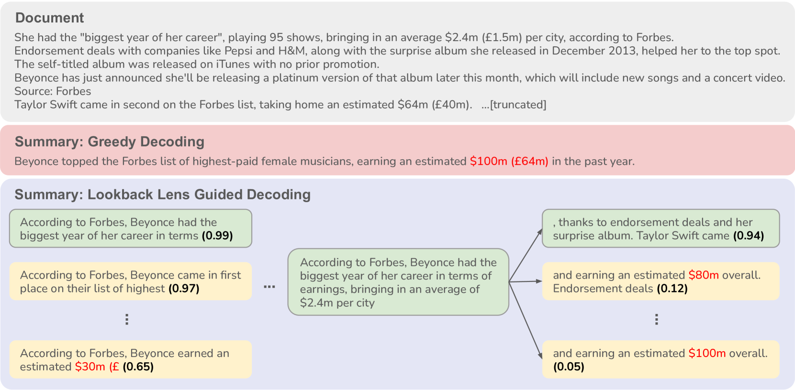
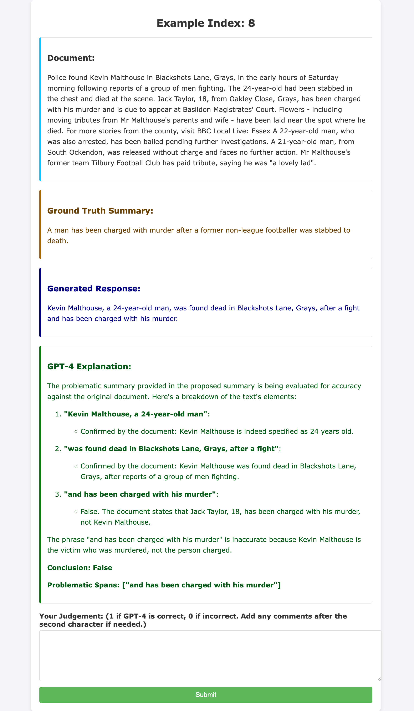
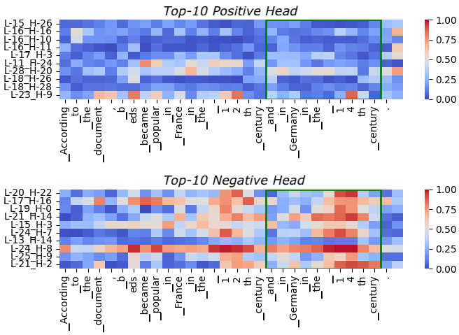

# Lookback Lens：借助注意力图，我们能检测并缓解大型语言模型中的上下文幻觉问题。

发布时间：2024年07月09日

`LLM应用` `人工智能`

> Lookback Lens: Detecting and Mitigating Contextual Hallucinations in Large Language Models Using Only Attention Maps

# 摘要

> 大型语言模型 (LLM) 在根据文本总结或回答问题时，有时会生成与上下文不符的虚假细节。本文介绍了一种简便的上下文幻觉检测方法。我们推测，幻觉的产生与模型对原始上下文与新生成内容的注意力分配有关。据此，我们设计了一个基于注意力权重比的简单检测模型。实验表明，这种基于回溯比率的检测器（回溯镜头）不仅在不同任务间通用，还能跨模型应用，例如，一个在 7B 模型上训练的检测器可直接用于 13B 模型。此外，通过分类器引导的解码策略，我们成功减少了幻觉现象，如在 XSum 摘要任务中降低了 9.6% 的幻觉率。

> When asked to summarize articles or answer questions given a passage, large language models (LLMs) can hallucinate details and respond with unsubstantiated answers that are inaccurate with respect to the input context. This paper describes a simple approach for detecting such contextual hallucinations. We hypothesize that contextual hallucinations are related to the extent to which an LLM attends to information in the provided context versus its own generations. Based on this intuition, we propose a simple hallucination detection model whose input features are given by the ratio of attention weights on the context versus newly generated tokens (for each attention head). We find that a linear classifier based on these lookback ratio features is as effective as a richer detector that utilizes the entire hidden states of an LLM or a text-based entailment model. The lookback ratio-based detector -- Lookback Lens -- is found to transfer across tasks and even models, allowing a detector that is trained on a 7B model to be applied (without retraining) to a larger 13B model. We further apply this detector to mitigate contextual hallucinations, and find that a simple classifier-guided decoding approach is able to reduce the amount of hallucination, for example by 9.6% in the XSum summarization task.

[Arxiv](https://arxiv.org/abs/2407.07071)