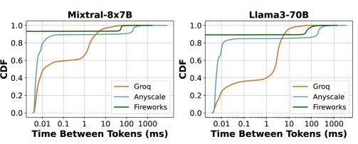

# Metron：全面评估 LLM 推理系统性能的框架

发布时间：2024年07月09日

`LLM应用` `软件开发` `用户体验`

> Metron: Holistic Performance Evaluation Framework for LLM Inference Systems

# 摘要

> 在生产环境中部署 LLM 成本高昂，推动了推理系统优化的发展。然而，现有评估指标（如 TTFT、TBT 等）未能全面反映 LLM 推理的复杂性，导致实时应用（如聊天和翻译）的用户体验评估不完整。本文首先揭示了当前评估指标的不足，随后提出 Metron 框架，引入流动性指数这一新指标，更精准地衡量 LLM 推理对用户体验的影响。最后，我们利用 Metron 对多个开源平台和模型服务进行了评估，并分析了各自的优劣。Metron 框架已开放源代码，供业界参考使用。

> Serving large language models (LLMs) in production can incur substantial costs, which has prompted recent advances in inference system optimizations. Today, these systems are evaluated against conventional latency and throughput metrics (eg. TTFT, TBT, Normalised Latency and TPOT). However, these metrics fail to fully capture the nuances of LLM inference, leading to an incomplete assessment of user-facing performance crucial for real-time applications such as chat and translation. In this paper, we first identify the pitfalls of current performance metrics in evaluating LLM inference systems. We then propose Metron, a comprehensive performance evaluation framework that includes fluidity-index -- a novel metric designed to reflect the intricacies of the LLM inference process and its impact on real-time user experience. Finally, we evaluate various existing open-source platforms and model-as-a-service offerings using Metron, discussing their strengths and weaknesses. Metron is available at https://github.com/project-metron/metron.

[Arxiv](https://arxiv.org/abs/2407.07000)