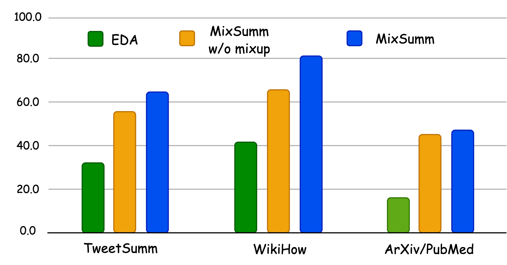

# MixSumm：利用 LLM 为低资源抽取式文本摘要提供主题基础的数据增强方法

发布时间：2024年07月09日

`LLM应用` `文本摘要` `数据增强`

> MixSumm: Topic-based Data Augmentation using LLMs for Low-resource Extractive Text Summarization

# 摘要

> 低资源抽取式文本摘要是一个关键但研究不足的领域。以往研究多聚焦于生成式摘要或直接利用大型模型如GPT-3生成摘要。我们提出MixSumm，通过提示开源模型LLaMA-3-70b生成混合多主题的文档，而非单一主题，进而训练摘要模型。我们采用ROUGE评分和基于LLaMA-3的无参考评估方法L-Eval来评估摘要质量。在包含TweetSumm、WikiHow和ArXiv/PubMed的挑战性基准测试中，我们的数据增强框架显著超越了现有提示方法。此外，实验还验证了从LLaMA-3-70b到小型BERT抽取式摘要器的知识有效转移。

> Low-resource extractive text summarization is a vital but heavily underexplored area of research. Prior literature either focuses on abstractive text summarization or prompts a large language model (LLM) like GPT-3 directly to generate summaries. In this work, we propose MixSumm for low-resource extractive text summarization. Specifically, MixSumm prompts an open-source LLM, LLaMA-3-70b, to generate documents that mix information from multiple topics as opposed to generating documents without mixup, and then trains a summarization model on the generated dataset. We use ROUGE scores and L-Eval, a reference-free LLaMA-3-based evaluation method to measure the quality of generated summaries. We conduct extensive experiments on a challenging text summarization benchmark comprising the TweetSumm, WikiHow, and ArXiv/PubMed datasets and show that our LLM-based data augmentation framework outperforms recent prompt-based approaches for low-resource extractive summarization. Additionally, our results also demonstrate effective knowledge distillation from LLaMA-3-70b to a small BERT-based extractive summarizer.

[Arxiv](https://arxiv.org/abs/2407.07341)