# 多模态自我指导：借助语言模型，合成抽象图像并进行视觉推理指导

发布时间：2024年07月09日

`LLM应用` `人工智能` `计算机视觉`

> Multimodal Self-Instruct: Synthetic Abstract Image and Visual Reasoning Instruction Using Language Model

# 摘要

> 当前大型多模态模型 (LMMs) 虽能理解自然场景和肖像，但对抽象图像如图表、地图的理解及视觉推理能力尚显稚嫩。它们在日常任务如读时钟、理解流程图或规划路线时往往力不从心。为此，我们设计了多模态自指导方法，结合大型语言模型与代码能力，合成日常场景中的抽象图像与视觉推理指令。我们创建的多模态基准包含 11,193 条指令，覆盖图表、表格等八种视觉场景，揭示了先进 LMMs 在抽象图像理解等方面的不足。通过使用合成数据微调 LMM，我们验证了数据质量，提升了图表理解与地图导航性能，并展示了在其他视觉推理任务中的潜力。代码已公开在 \url{https://github.com/zwq2018/Multi-modal-Self-instruct}。

> Although most current large multimodal models (LMMs) can already understand photos of natural scenes and portraits, their understanding of abstract images, e.g., charts, maps, or layouts, and visual reasoning capabilities remains quite rudimentary. They often struggle with simple daily tasks, such as reading time from a clock, understanding a flowchart, or planning a route using a road map. In light of this, we design a multi-modal self-instruct, utilizing large language models and their code capabilities to synthesize massive abstract images and visual reasoning instructions across daily scenarios. Our strategy effortlessly creates a multimodal benchmark with 11,193 instructions for eight visual scenarios: charts, tables, simulated maps, dashboards, flowcharts, relation graphs, floor plans, and visual puzzles. \textbf{This benchmark, constructed with simple lines and geometric elements, exposes the shortcomings of most advanced LMMs} like Claude-3.5-Sonnet and GPT-4o in abstract image understanding, spatial relations reasoning, and visual element induction. Besides, to verify the quality of our synthetic data, we fine-tune an LMM using 62,476 synthetic chart, table and road map instructions. The results demonstrate improved chart understanding and map navigation performance, and also demonstrate potential benefits for other visual reasoning tasks. Our code is available at: \url{https://github.com/zwq2018/Multi-modal-Self-instruct}.

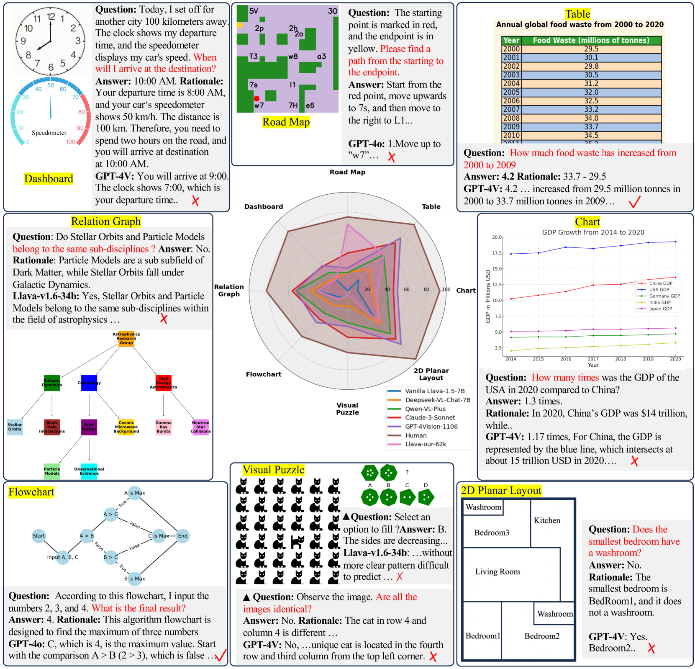

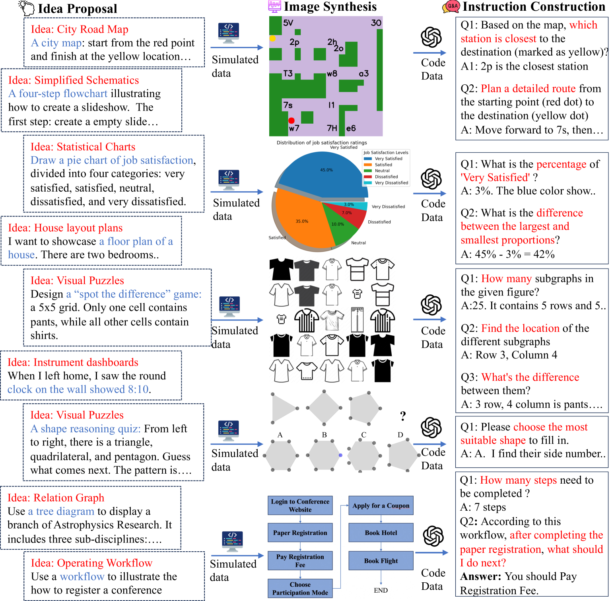

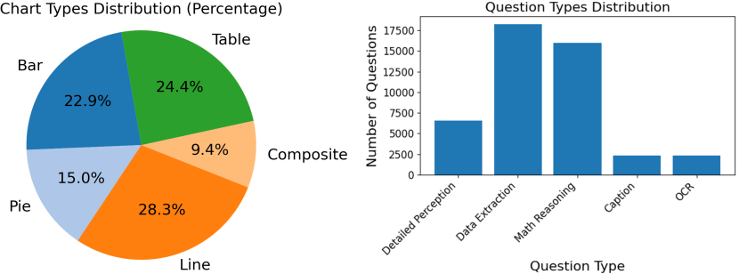

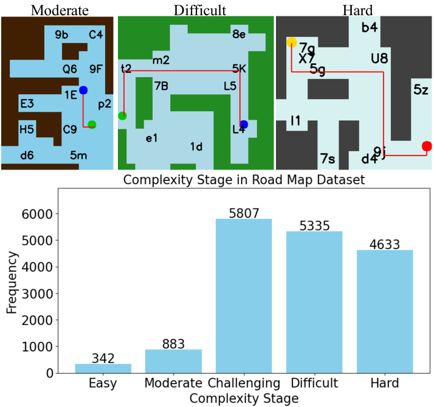

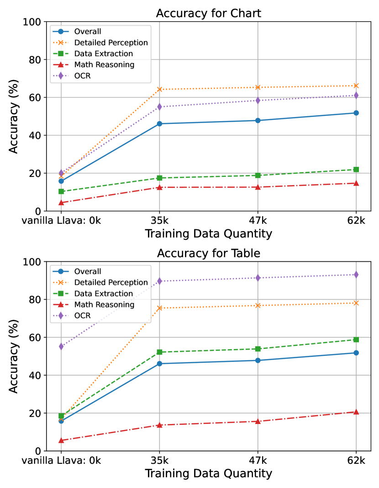

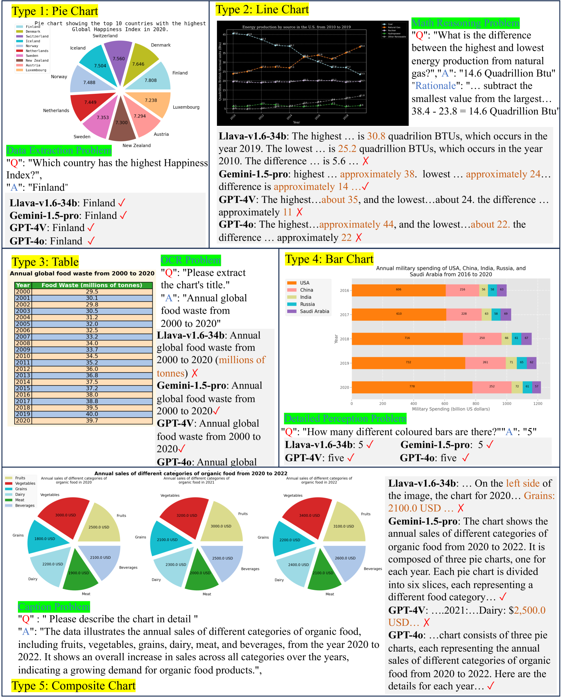

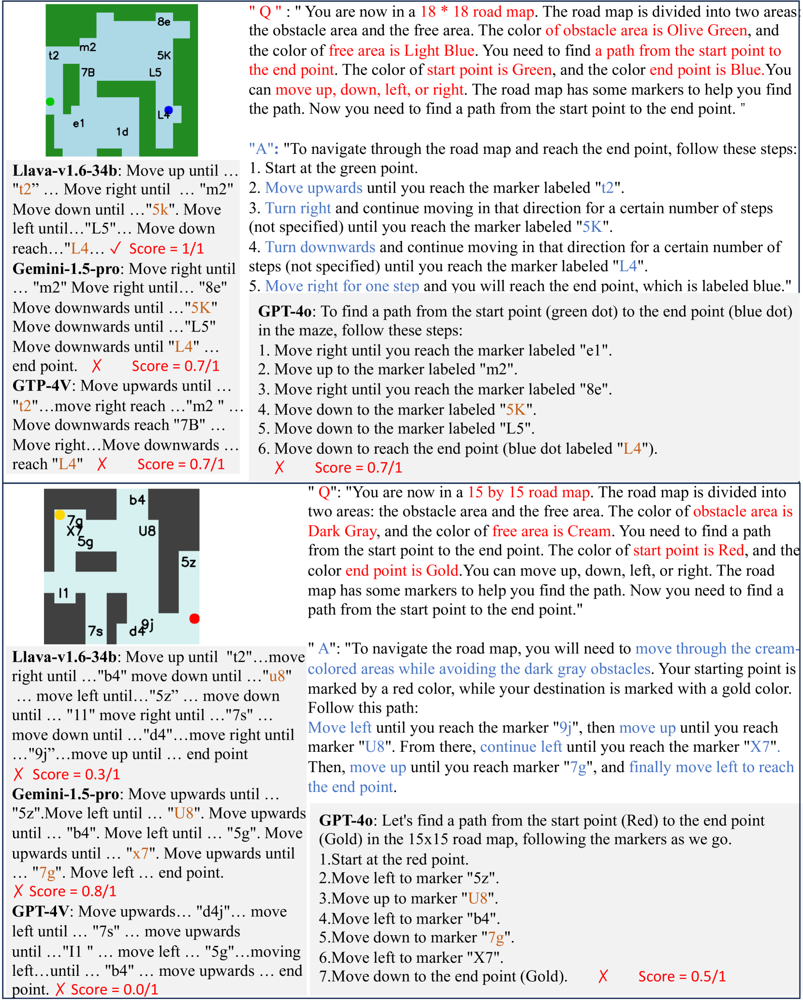

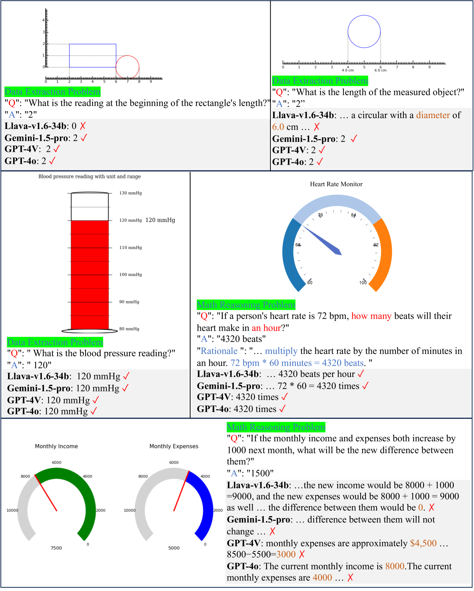

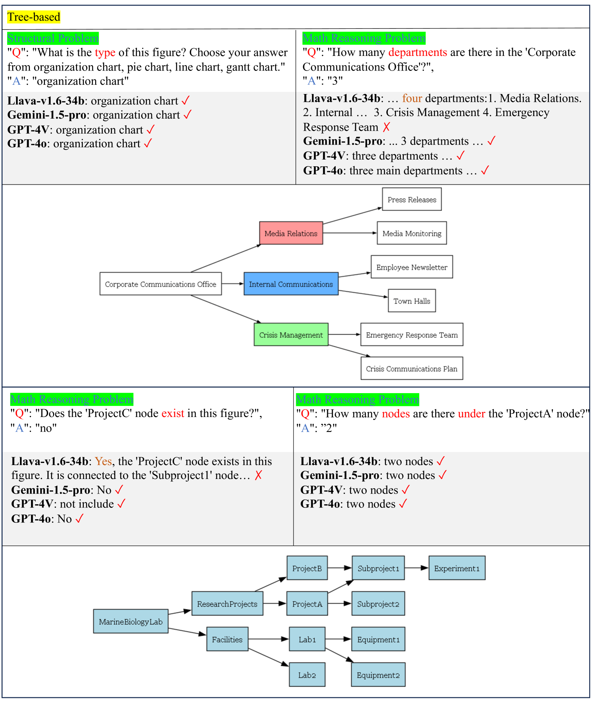

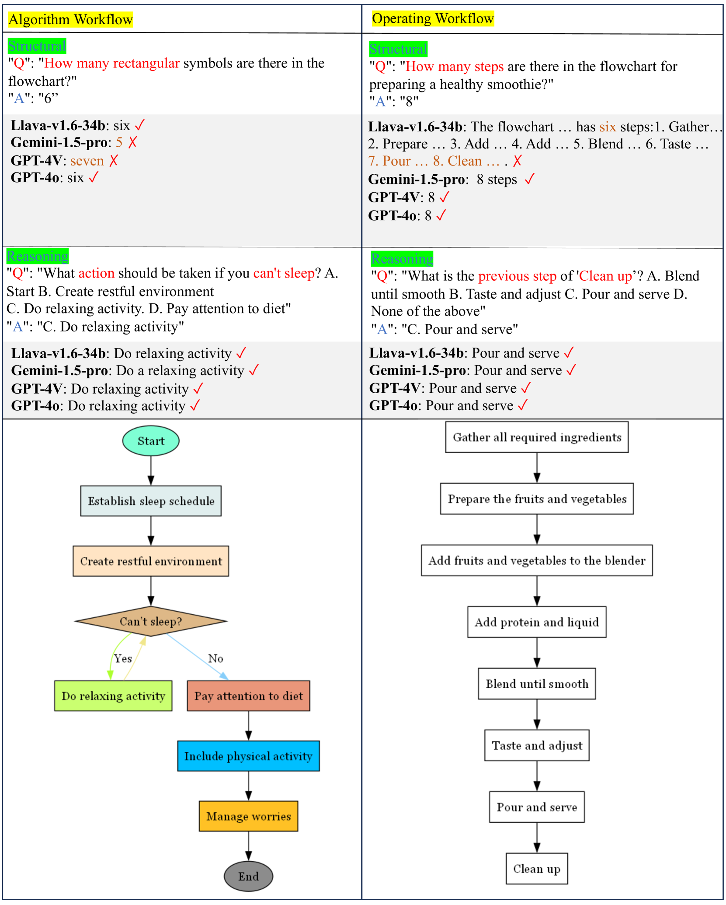

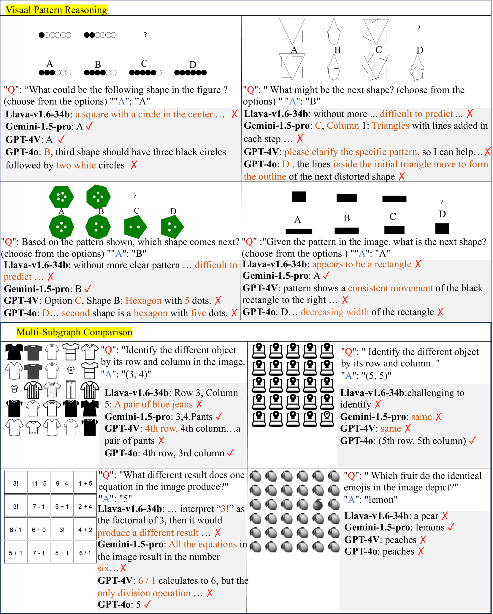

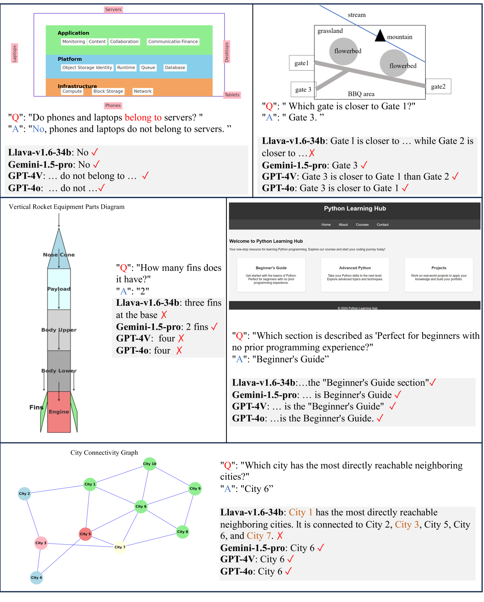

[Arxiv](https://arxiv.org/abs/2407.07053)