# 大型语言模型中的同质性偏见，其脆弱性在不同化的概率中显露无疑。

发布时间：2024年07月09日

`LLM理论` `人工智能` `社会科学`

> Probability of Differentiation Reveals Brittleness of Homogeneity Bias in Large Language Models

# 摘要

> 大型语言模型 (LLM) 存在同质化偏差，即倾向于将某些群体的表征与其他群体同质化。以往研究多使用编码器模型，可能无意中引入了偏差。为此，我们让 GPT-4 根据 18 个情境线索生成单字/表达完成，并比较其变异性，直接从模型输出评估同质化偏差，绕过了编码器模型。研究发现，同质化偏差在不同情境线索和提示中波动大，暗示过去的偏差研究可能更多反映了编码器模型的偏差而非 LLM。此外，提示的微小变化就能显著影响偏差表达，显示 LLM 中的同质化偏差较为脆弱。未来研究应深入探讨长文本生成中句法和主题选择的变化如何影响 LLM 的同质化偏差。

> Homogeneity bias in Large Language Models (LLMs) refers to their tendency to homogenize the representations of some groups compared to others. Previous studies documenting this bias have predominantly used encoder models, which may have inadvertently introduced biases. To address this limitation, we prompted GPT-4 to generate single word/expression completions associated with 18 situation cues - specific, measurable elements of environments that influence how individuals perceive situations and compared the variability of these completions using probability of differentiation. This approach directly assessed homogeneity bias from the model's outputs, bypassing encoder models. Across five studies, we find that homogeneity bias is highly volatile across situation cues and writing prompts, suggesting that the bias observed in past work may reflect those within encoder models rather than LLMs. Furthermore, these results suggest that homogeneity bias in LLMs is brittle, as even minor and arbitrary changes in prompts can significantly alter the expression of biases. Future work should further explore how variations in syntactic features and topic choices in longer text generations influence homogeneity bias in LLMs.

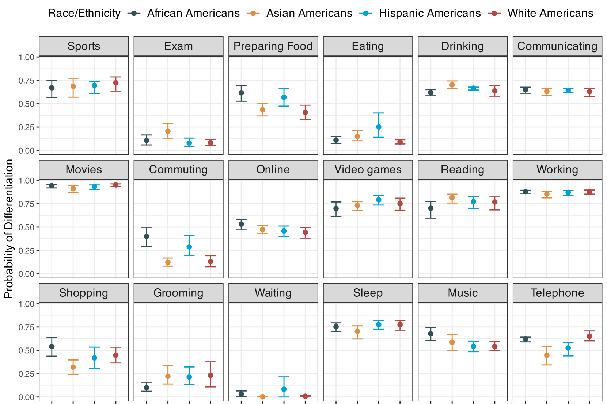

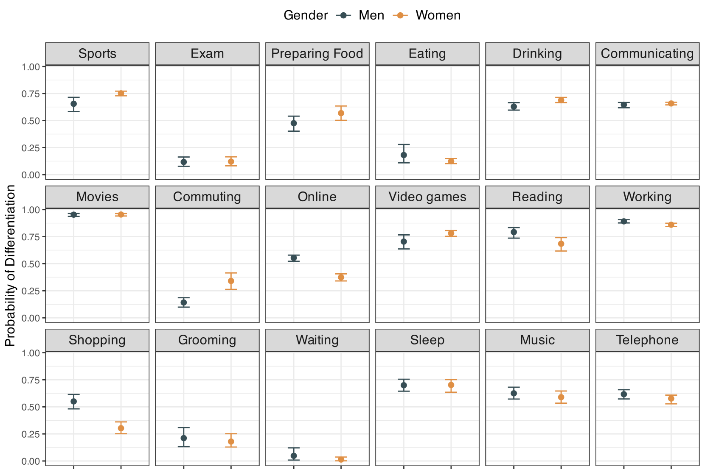

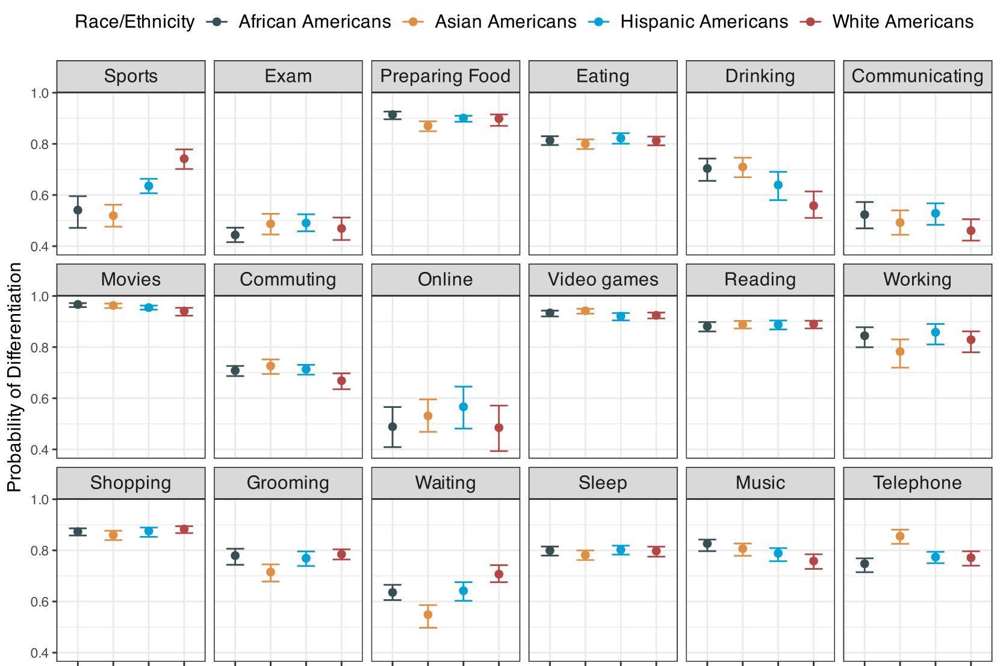

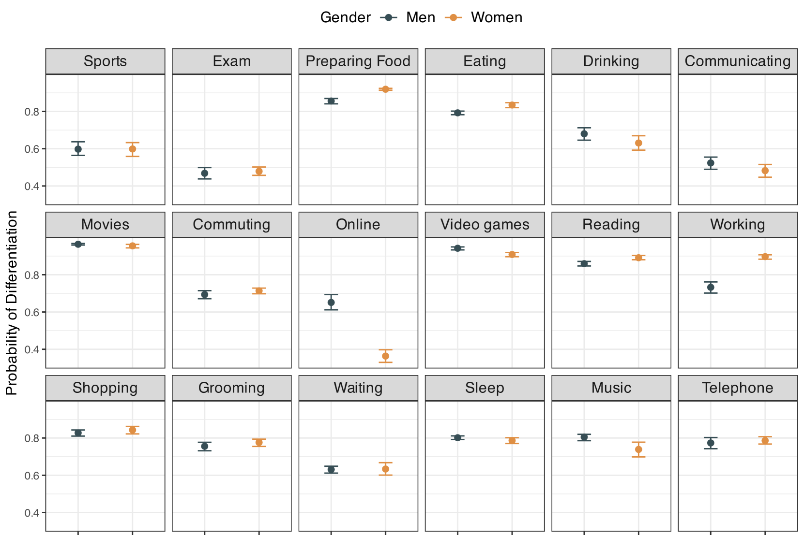

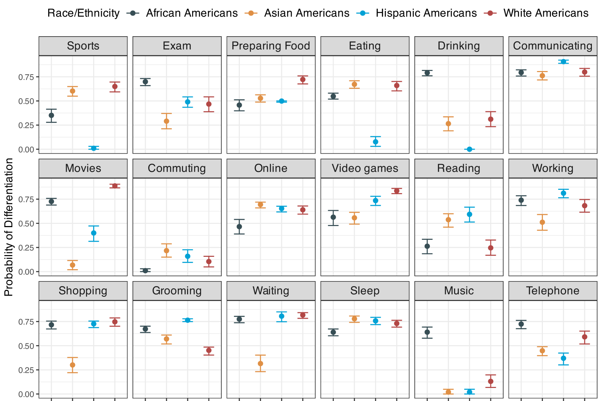

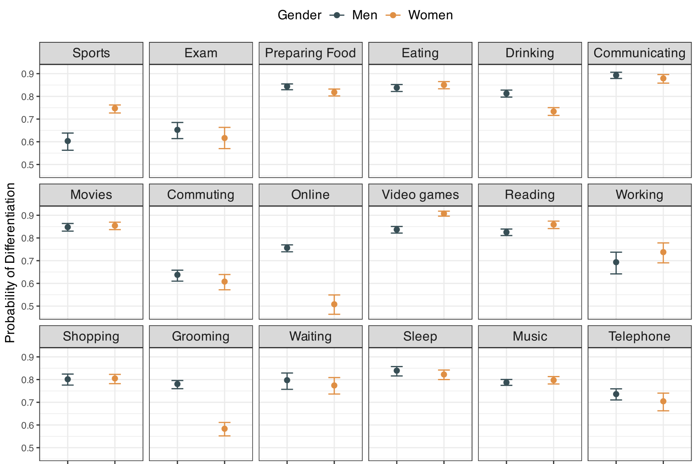

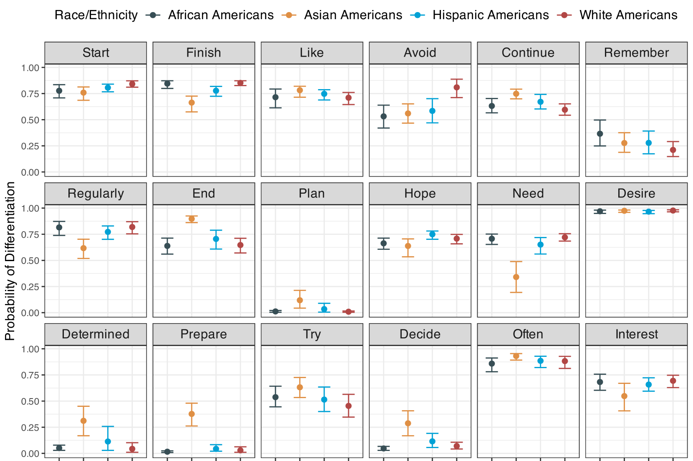

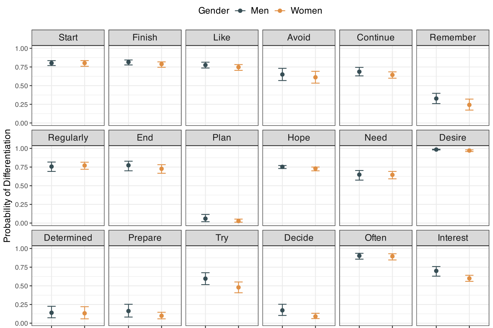

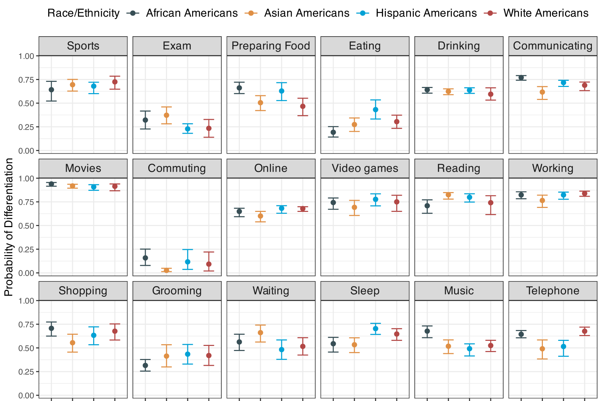

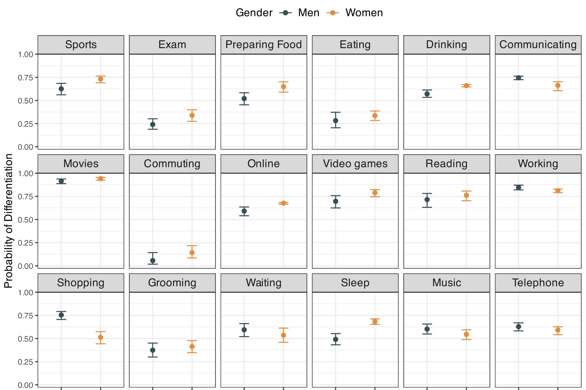

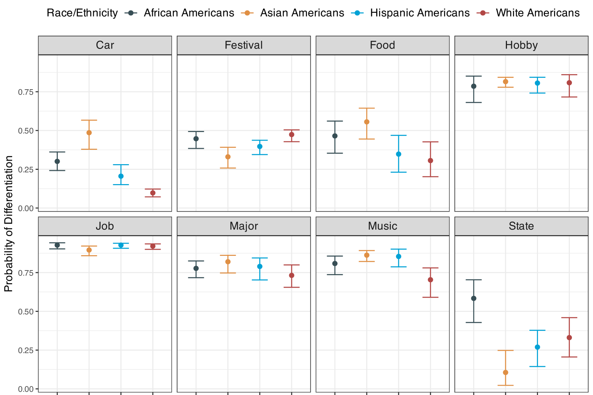

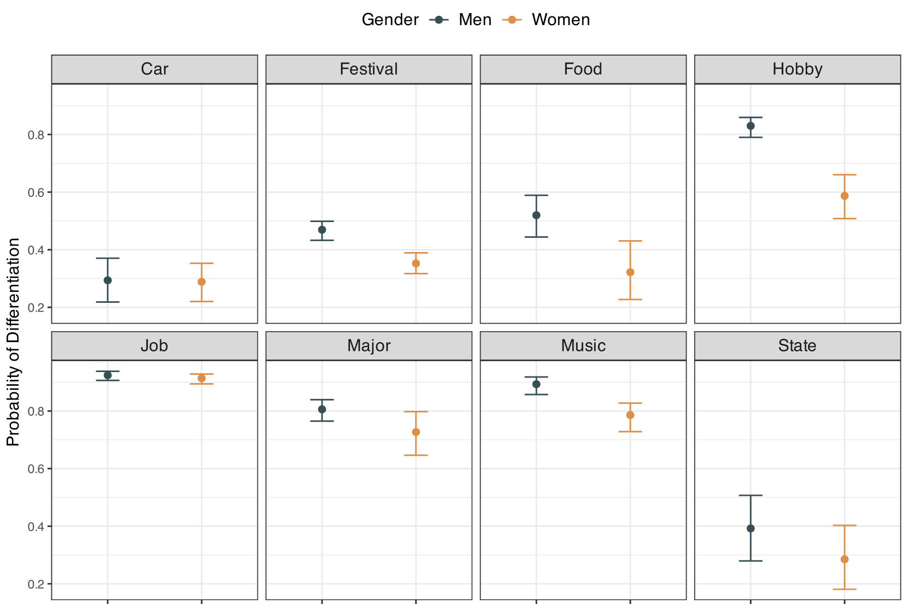

[Arxiv](https://arxiv.org/abs/2407.07329)