# 探索安全代码生成的提示技术：系统性研究

发布时间：2024年07月09日

`LLM应用` `软件开发` `网络安全`

> Prompting Techniques for Secure Code Generation: A Systematic Investigation

# 摘要

> 随着提示驱动编程的兴起，大型语言模型 (LLM) 在软件开发领域日益受到关注，使开发者能够通过自然语言指令编写代码。然而，这些模型生成安全代码的能力受到质疑，进而影响了提示生成软件的质量。为此，多种精心设计的提示技术应运而生，旨在从 LLM 中获取最佳响应。尽管如此，这些提示策略与安全代码生成之间的关系仍待深入探索。本研究旨在探讨不同提示技术对 LLM 生成的代码安全性的影响。我们首先进行了系统的文献回顾，筛选出适用于代码生成任务的提示技术，并在 GPT-3、GPT-3.5 和 GPT-4 模型上对其进行安全代码生成的评估。通过使用包含 150 个与安全相关的自然语言代码生成提示的数据集，我们的研究发现，通过分类和评估一系列提示技术，特别是在采用递归批评与改进 (RCI) 技术后，显著减少了测试 LLM 中的安全弱点，为 LLM 生成代码安全性的研究提供了重要见解。

> Large Language Models (LLMs) are gaining momentum in software development with prompt-driven programming enabling developers to create code from natural language (NL) instructions. However, studies have questioned their ability to produce secure code and, thereby, the quality of prompt-generated software. Alongside, various prompting techniques that carefully tailor prompts have emerged to elicit optimal responses from LLMs. Still, the interplay between such prompting strategies and secure code generation remains under-explored and calls for further investigations. OBJECTIVE: In this study, we investigate the impact of different prompting techniques on the security of code generated from NL instructions by LLMs. METHOD: First we perform a systematic literature review to identify the existing prompting techniques that can be used for code generation tasks. A subset of these techniques are evaluated on GPT-3, GPT-3.5, and GPT-4 models for secure code generation. For this, we used an existing dataset consisting of 150 NL security-relevant code-generation prompts. RESULTS: Our work (i) classifies potential prompting techniques for code generation (ii) adapts and evaluates a subset of the identified techniques for secure code generation tasks and (iii) observes a reduction in security weaknesses across the tested LLMs, especially after using an existing technique called Recursive Criticism and Improvement (RCI), contributing valuable insights to the ongoing discourse on LLM-generated code security.

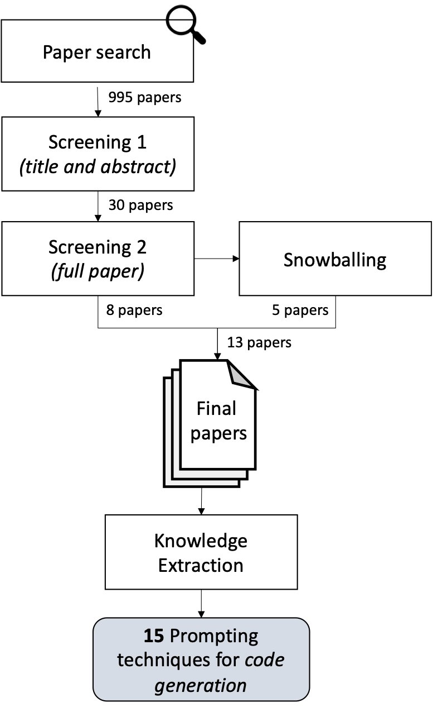

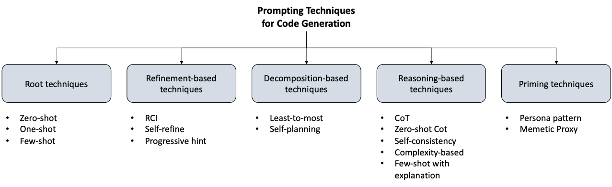

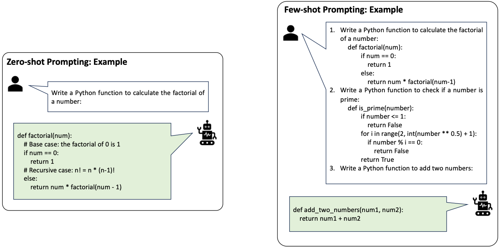

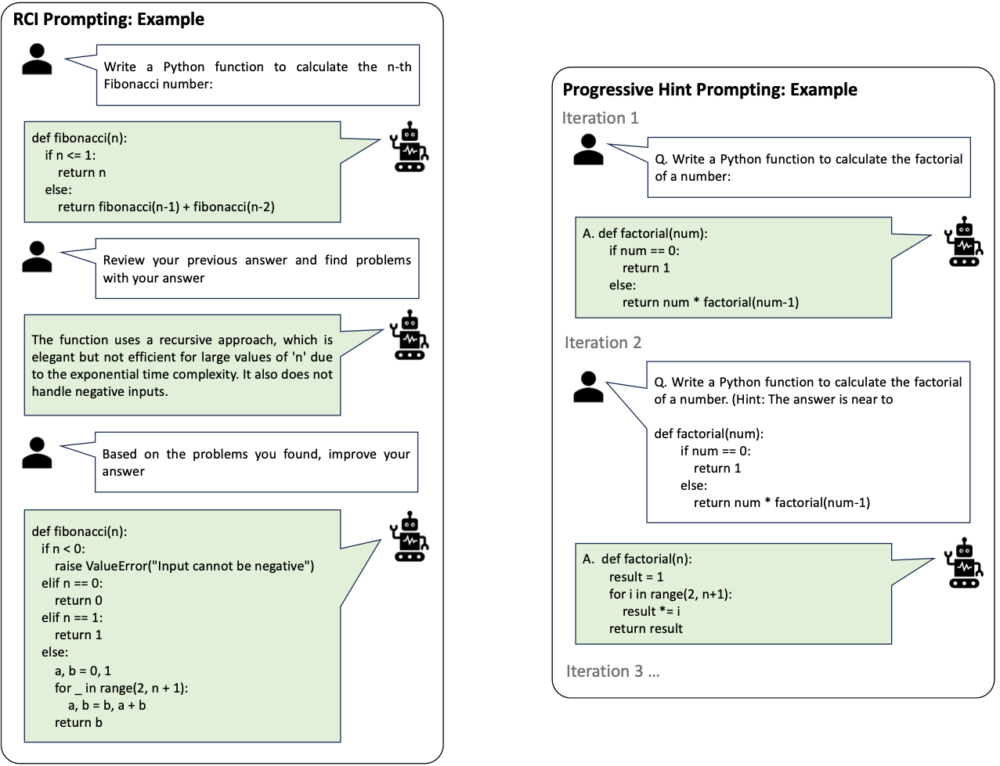

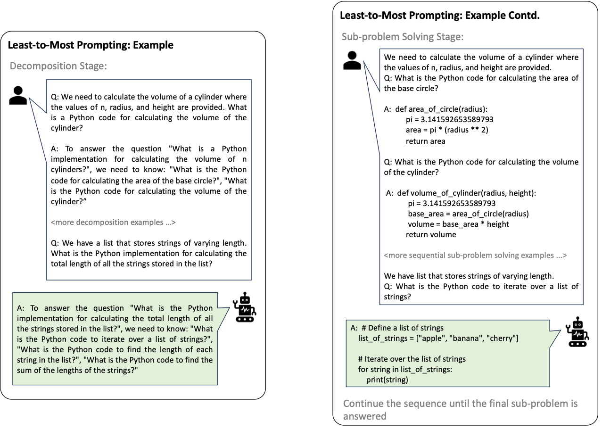

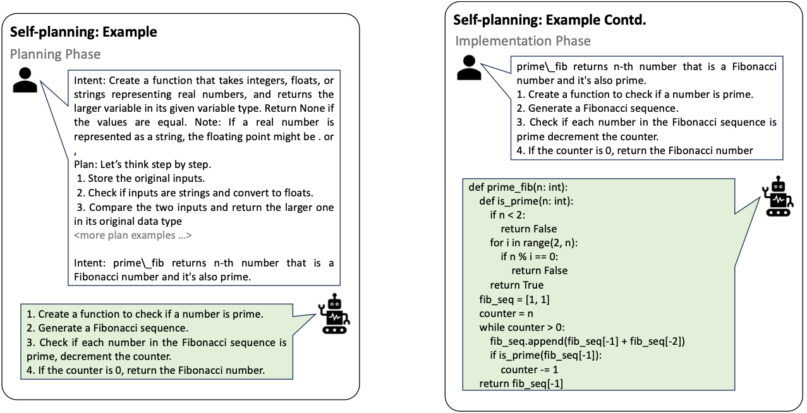

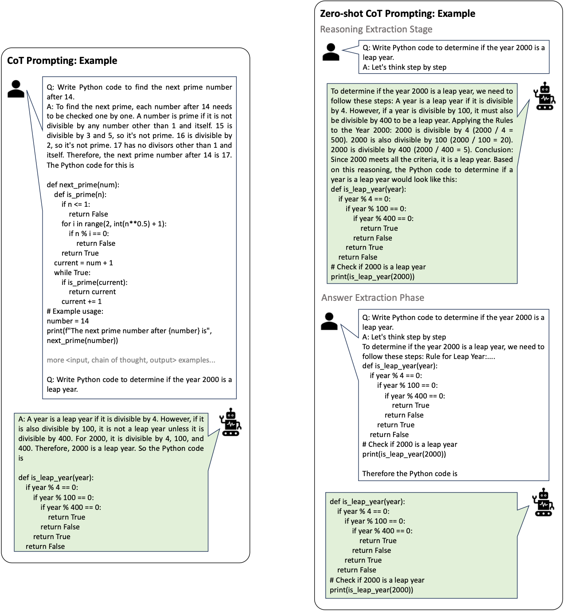

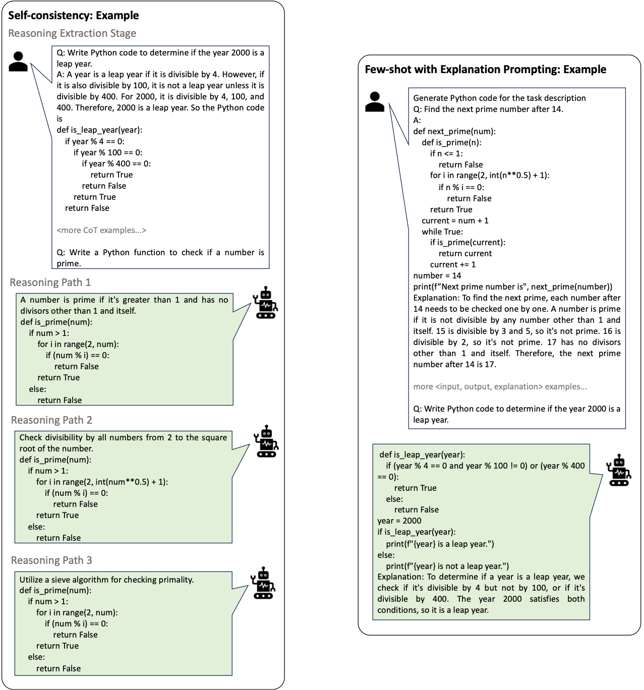

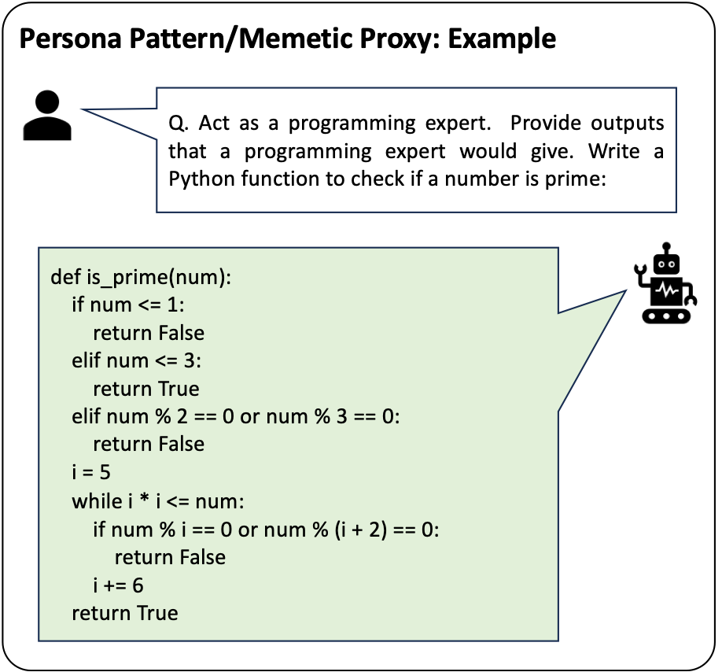

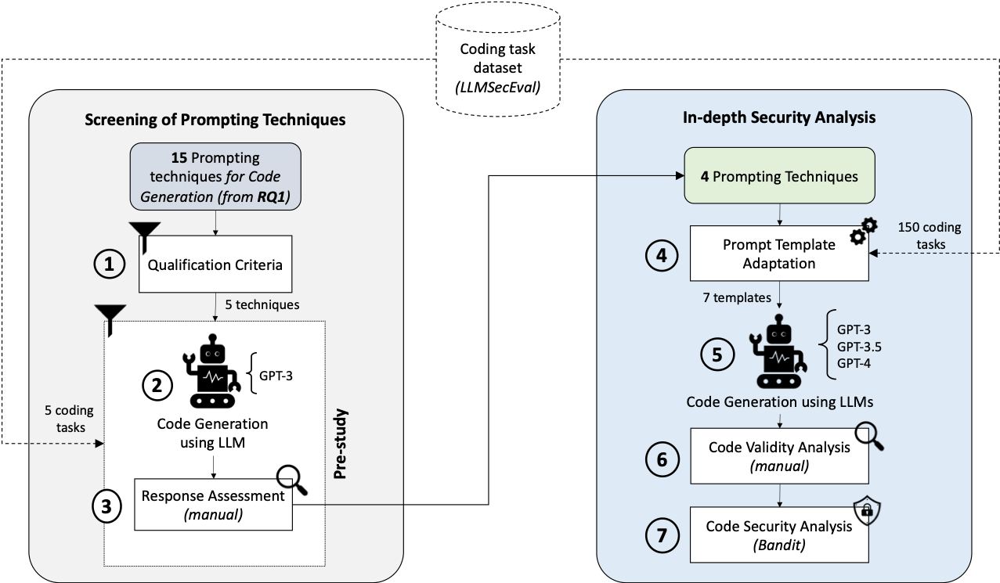

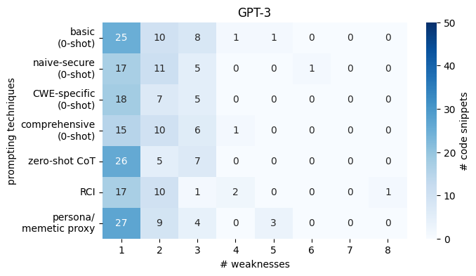

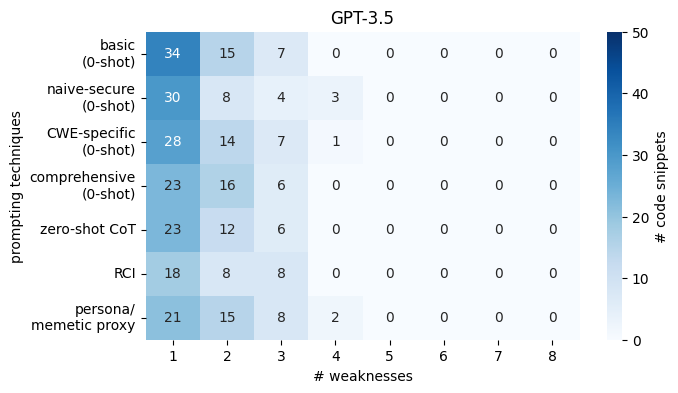

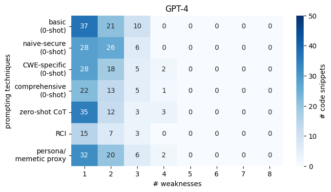

[Arxiv](https://arxiv.org/abs/2407.07064)