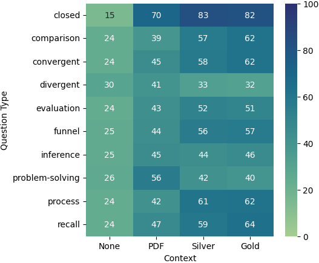

# 探究前沿大型语言模型在环境审查文件理解中的表现：RAG 与长上下文的对比研究

发布时间：2024年07月09日

`LLM应用` `环境政策`

> RAG vs. Long Context: Examining Frontier Large Language Models for Environmental Review Document Comprehension

# 摘要

> 大型语言模型（LLM）已广泛应用于多个领域的研究问题。其中，LLM 构建的问答系统能够服务于不同领域的用户。在流行和公共领域（如琐事和文学）中，基于 LLM 的问答系统已证明其有效性。然而，在需要专业知识的特定领域，其表现尚未得到充分验证。为此，我们创建了 NEPAQuAD1.0 基准，旨在评估 Claude Sonnet、Gemini 和 GPT-4 这三个前沿 LLM 在处理来自美国联邦政府根据《国家环境政策法》(NEPA) 编写的环境影响声明中的问题时的表现。我们特别关注 LLM 在不同情境下理解 NEPA 文件中法律、技术和合规信息的细微差别的能力。通过无上下文的问题测试 LLM 的 NEPA 知识，并评估其综合长文档上下文以辅助问答的能力。结果显示，RAG 驱动模型在回答准确性上显著优于长上下文模型，尤其是在处理封闭式问题时表现更佳。

> Large Language Models (LLMs) have been applied to many research problems across various domains. One of the applications of LLMs is providing question-answering systems that cater to users from different fields. The effectiveness of LLM-based question-answering systems has already been established at an acceptable level for users posing questions in popular and public domains such as trivia and literature. However, it has not often been established in niche domains that traditionally require specialized expertise. To this end, we construct the NEPAQuAD1.0 benchmark to evaluate the performance of three frontier LLMs -- Claude Sonnet, Gemini, and GPT-4 -- when answering questions originating from Environmental Impact Statements prepared by U.S. federal government agencies in accordance with the National Environmental Environmental Act (NEPA). We specifically measure the ability of LLMs to understand the nuances of legal, technical, and compliance-related information present in NEPA documents in different contextual scenarios. For example, we test the LLMs' internal prior NEPA knowledge by providing questions without any context, as well as assess how LLMs synthesize the contextual information present in long NEPA documents to facilitate the question/answering task. We compare the performance of the long context LLMs and RAG powered models in handling different types of questions (e.g., problem-solving, divergent). Our results suggest that RAG powered models significantly outperform the long context models in the answer accuracy regardless of the choice of the frontier LLM. Our further analysis reveals that many models perform better answering closed questions than divergent and problem-solving questions.

[Arxiv](https://arxiv.org/abs/2407.07321)