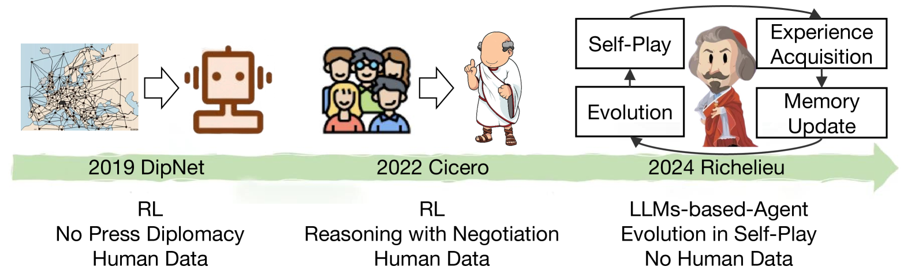
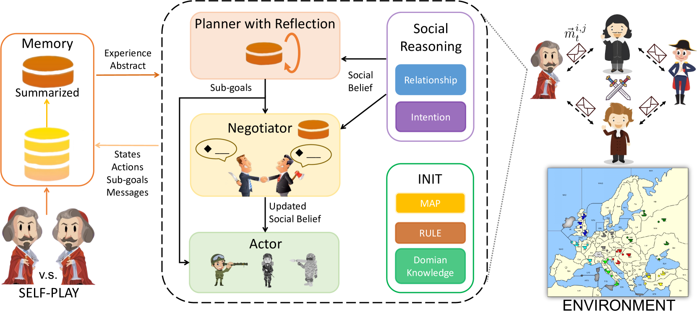
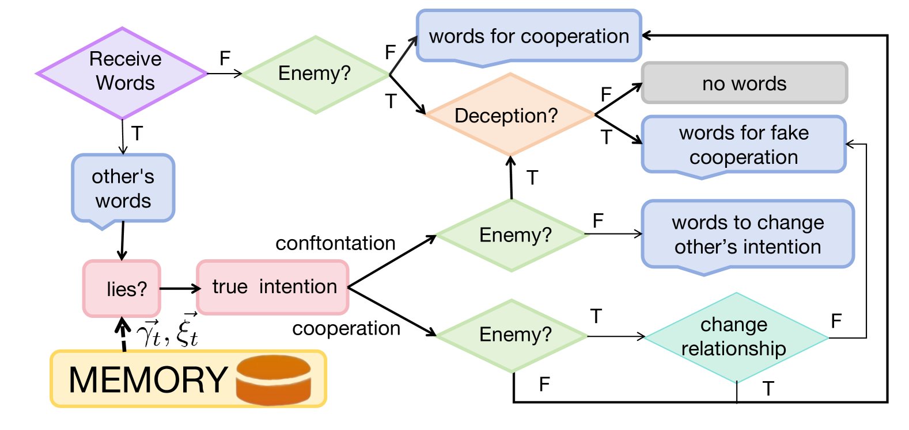
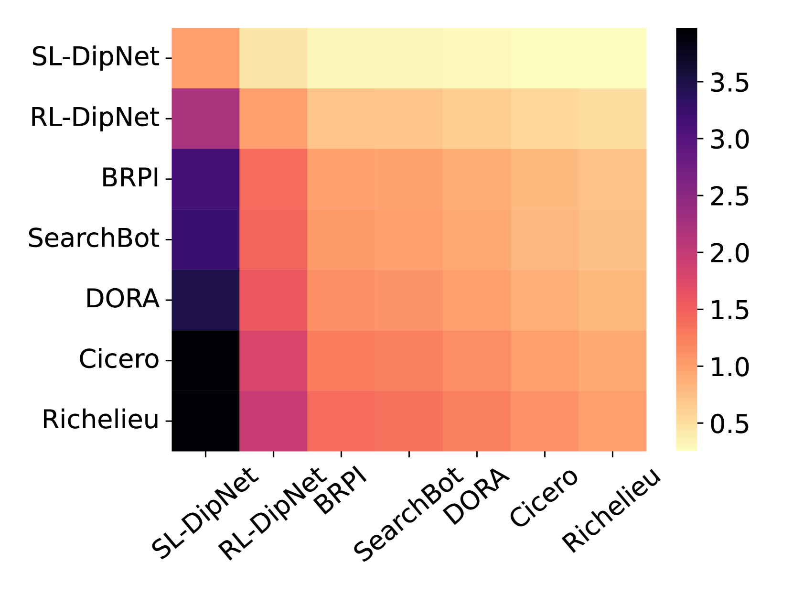
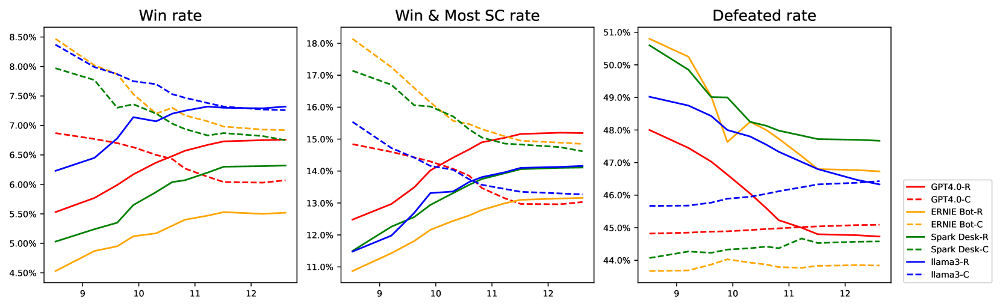
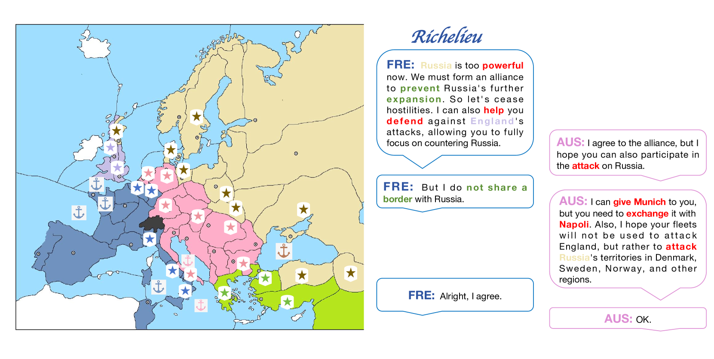
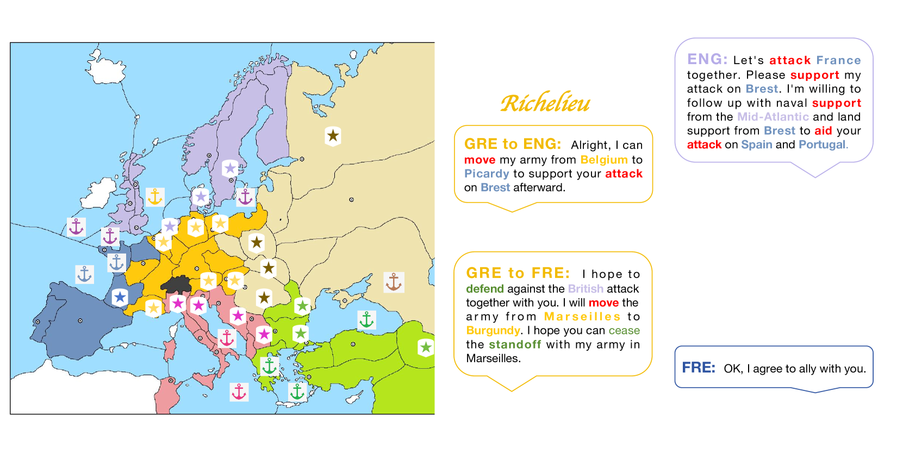

# Richelieu：自进化 LLM 驱动的 AI 外交智能体

发布时间：2024年07月09日

`Agent` `人工智能`

> Richelieu: Self-Evolving LLM-Based Agents for AI Diplomacy

# 摘要

> 外交，这一人类社会中的高深活动，涉及多方互动与复杂能力，如社会推理、谈判技巧和长期战略规划。尽管过往AI代理在多代理任务中展现了处理复杂游戏与广阔动作空间的能力，但外交的决策空间尤为庞大，尤其是在谈判阶段。近期，LLM代理虽在某些领域拓展了AI的边界，却仍难以应对复杂多代理环境中的长期规划。我们借助前沿LLM技术，首次尝试探索AI在高度综合多代理任务中的潜力，通过融合三大核心能力，打造更强大的社会代理：战略规划与反思、目标导向的社交谈判、以及通过自我对弈实现的无人在环自进化。

> Diplomacy is one of the most sophisticated activities in human society. The complex interactions among multiple parties/ agents involve various abilities like social reasoning, negotiation arts, and long-term strategy planning. Previous AI agents surely have proved their capability of handling multi-step games and larger action spaces on tasks involving multiple agents. However, diplomacy involves a staggering magnitude of decision spaces, especially considering the negotiation stage required. Recently, LLM agents have shown their potential for extending the boundary of previous agents on a couple of applications, however, it is still not enough to handle a very long planning period in a complex multi-agent environment. Empowered with cutting-edge LLM technology, we make the first stab to explore AI's upper bound towards a human-like agent for such a highly comprehensive multi-agent mission by combining three core and essential capabilities for stronger LLM-based societal agents: 1) strategic planner with memory and reflection; 2) goal-oriented negotiate with social reasoning; 3) augmenting memory by self-play games to self-evolving without any human in the loop.

[Arxiv](https://arxiv.org/abs/2407.06813)